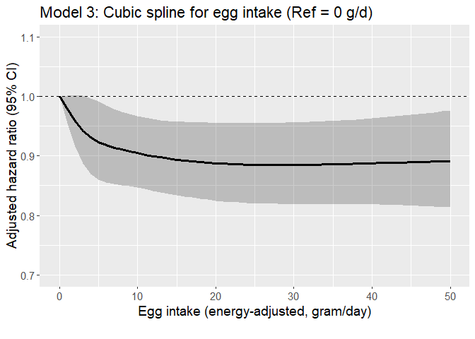

Egg CVD study (Afib as outcome)
================

## Aim

- Assess if the risk of developing CVD varies according to levels of
  meat intake among regular egg consumers with hyperlipidemia using the
  AHS-2 cohort linked with Medicare data

- Assess the interaction between race and egg intake on the incidence of
  CVD among those with hyperlipidemia.

## Datasets

- Medicare data
  - For details regarding Medicare data, see [AHS-2 Medicare
    Linkage](https://github.com/keijioda/ahs_medicare_linkage/blob/main/summary.md)
    repository.

  - Master Beneficiary Summary File (MBSF), 2008-2022

    - Contains beneficiary characteristics and enrollment information

  - Chronic Conditions file (CC), 2008-2022

    - Contains the first occurrence date of 27 or 30 specific chronic
      conditions
      - 27 chronic conditions for data 2008-2020
      - 30 chronic conditions for data 2021-2022
    - Used to identify prevalent/incident cases of cardio-vascular
      diseases and
    - to identify comorbidities

  - Both files include n = 46,897 unique subjects across years, after
    excluding

    - Gender/DOB mismatch with AHS-2 data
    - Dupulicate beneficiary IDs and SSNs
- For AHS-2 baseline data, including food-frequency questionnaire (FFQ),
  a guided multiple imputation was used to fill missing data ([Fraser &
  Yan, 2007](https://pubmed.ncbi.nlm.nih.gov/17259903/))
  - Five imputed data sets were generated for subsequent analyses (See
    the analysis section for more details)
  - For descriptive analysis, we present results from the first imputed
    data
- AHS-2 baseline imputed data \#1: n = 41,037
  - ~~Among this, n = 383 subjects were excluded because they opted out
    of the study~~
  - ~~After removing opt-outs, there were n = 87,668 subjects~~
  - Opt-outs were already excluded
- After merging Medicare and AHS-2 data, there were n = 41,037 subjects.

## Inclusion/exclusion criteria

- Medicare beneficiaries who did not reach the age of 65 between 2008
  and 2020 (e.g., younger beneficiaries with disabilities or end-stage
  renal disease) were excluded (n = 1105), resulting n = 39,932.

- Subjects with extreme BMI (\<16 or \>60), according to AHS
  questionnaire, were excluded (n = 82), resulting n = 39,850.

- Unverified dates of deaths

  - Medicare data include a variable (`VALID_DEATH_DT_SW`) indicating
    whether a beneficiary’s day of death has been verified by the Social
    Security Administration or the Railroad Retirement Board.
  - There were 23 unverified death dates. Excluding these resulted n =
    39,827.

- Prevalent cases of atrial fibrosis

  - If the first diagnosis was made on or before AHS-2 enrollment date,
    consider it as a prevalent case
  - n = 857 prevalent cases were exluded, resulting n = 38,970 subjects

## Outcome

- The outcome is atrial fibrosis
- Among n = 38,970 subjects, there were 6303 incident cases (16.2%) of
  atrial fibrosis
- Age at diagnosis was calculated using `ATRIAL_FIB_EVER` variable in
  the Chronic Condition Warehouse (CCW) data. This variable shows the
  date when the beneficiary first met the criteria after January 1,
  1999.
  - For 27 CCW chronic conditions algorithms, see
    [here](https://www2.ccwdata.org/documents/10280/19139421/ccw-chronic-condition-algorithms.pdf)
  - For 30 CCW chronic conditions algorithms, see
    [here](https://www2.ccwdata.org/web/guest/condition-categories-chronic)
- Among these incident atrial fibrosis cases, the mean (SD) age of
  diagnosis was 80.9 (8.0) years. The median age of diagnosis was 81.4
  years.

## Comorbidity

## Dietary variables

## Descriptive table

- The descriptive table by afib incidence:

|  | level | Overall | Non-case | Case | p | test |
|:---|:---|:---|:---|:---|:---|:---|
| n |  | 38970 | 32667 | 6303 |  |  |
| agecat (%) | 65-69 | 6680 (17.2) | 6397 (19.7) | 283 ( 4.5) | \<0.001 |  |
|  | 70-74 | 6946 (17.9) | 6401 (19.7) | 545 ( 8.7) |  |  |
|  | 75-79 | 6282 (16.2) | 5479 (16.9) | 803 (12.8) |  |  |
|  | 80-84 | 5601 (14.5) | 4619 (14.2) | 982 (15.6) |  |  |
|  | 85-89 | 4921 (12.7) | 3667 (11.3) | 1254 (19.9) |  |  |
|  | 90-94 | 4091 (10.6) | 2933 ( 9.0) | 1158 (18.4) |  |  |
|  | 95+ | 4220 (10.9) | 2948 ( 9.1) | 1272 (20.2) |  |  |
| bene_age_at_end_2020 (mean (SD)) |  | 80.76 (10.39) | 79.62 (10.16) | 86.67 (9.50) | \<0.001 |  |
| bene_sex_F (%) | M | 14064 (36.1) | 11470 (35.1) | 2594 (41.2) | \<0.001 |  |
|  | F | 24906 (63.9) | 21197 (64.9) | 3709 (58.8) |  |  |
| rti_race3 (%) | NH White | 28778 (73.8) | 23337 (71.4) | 5441 (86.3) | \<0.001 |  |
|  | Black | 7540 (19.3) | 6910 (21.2) | 630 (10.0) |  |  |
|  | Other | 2652 ( 6.8) | 2420 ( 7.4) | 232 ( 3.7) |  |  |
| marital (%) | Married | 28528 (73.2) | 24004 (73.5) | 4524 (71.8) | \<0.001 |  |
|  | Never | 1355 ( 3.5) | 1175 ( 3.6) | 180 ( 2.9) |  |  |
|  | Div/Wid | 9087 (23.3) | 7488 (22.9) | 1599 (25.4) |  |  |
| educyou (%) | HSch & below | 8354 (21.4) | 6879 (21.1) | 1475 (23.4) | \<0.001 |  |
|  | Some College | 15437 (39.6) | 13032 (39.9) | 2405 (38.2) |  |  |
|  | Bachelors + | 15179 (39.0) | 12756 (39.0) | 2423 (38.4) |  |  |
| vegstat (%) | Vegan | 3226 ( 8.3) | 2684 ( 8.2) | 542 ( 8.6) | \<0.001 |  |
|  | Lacto-ovo | 12513 (32.1) | 10280 (31.5) | 2233 (35.4) |  |  |
|  | Semi | 2163 ( 5.6) | 1767 ( 5.4) | 396 ( 6.3) |  |  |
|  | Pesco | 3728 ( 9.6) | 3176 ( 9.7) | 552 ( 8.8) |  |  |
|  | Non-veg | 17340 (44.5) | 14760 (45.2) | 2580 (40.9) |  |  |
| bmicat (%) | Normal | 14987 (38.5) | 12722 (38.9) | 2265 (35.9) | \<0.001 |  |
|  | Overweight | 14260 (36.6) | 12018 (36.8) | 2242 (35.6) |  |  |
|  | Obese | 9723 (24.9) | 7927 (24.3) | 1796 (28.5) |  |  |
| bmi (mean (SD)) |  | 27.23 (5.46) | 27.13 (5.40) | 27.74 (5.75) | \<0.001 |  |
| exercise (%) | None | 8538 (21.9) | 6835 (20.9) | 1703 (27.0) | \<0.001 |  |
|  | ≤0.5 hrs/wk | 9498 (24.4) | 8091 (24.8) | 1407 (22.3) |  |  |
|  | 0.5\<-2 hrs/wk | 10321 (26.5) | 8790 (26.9) | 1531 (24.3) |  |  |
|  | \>2 hrs/wk | 10613 (27.2) | 8951 (27.4) | 1662 (26.4) |  |  |
| sleephrs (%) | \<= 5 hrs | 3835 ( 9.8) | 3304 (10.1) | 531 ( 8.4) | \<0.001 |  |
|  | 6 hrs | 8523 (21.9) | 7269 (22.3) | 1254 (19.9) |  |  |
|  | 7 hrs | 14113 (36.2) | 11912 (36.5) | 2201 (34.9) |  |  |
|  | 8 hrs | 10283 (26.4) | 8395 (25.7) | 1888 (30.0) |  |  |
|  | \>= 9 hrs | 2216 ( 5.7) | 1787 ( 5.5) | 429 ( 6.8) |  |  |
| smokecat6 (%) | A_Never | 31005 (79.6) | 26010 (79.6) | 4995 (79.2) | \<0.001 |  |
|  | B_QuitYrs30Plus | 3319 ( 8.5) | 2659 ( 8.1) | 660 (10.5) |  |  |
|  | C_QuitYrs21To30 | 2008 ( 5.2) | 1705 ( 5.2) | 303 ( 4.8) |  |  |
|  | D_QuitYrs11To20 | 1365 ( 3.5) | 1169 ( 3.6) | 196 ( 3.1) |  |  |
|  | E_QuitYrs6To10 | 480 ( 1.2) | 414 ( 1.3) | 66 ( 1.0) |  |  |
|  | F_QuitYrsLesOneTo5YearsNcur | 793 ( 2.0) | 710 ( 2.2) | 83 ( 1.3) |  |  |
| alccat (%) | Never | 37052 (95.1) | 31003 (94.9) | 6049 (96.0) | \<0.001 |  |
|  | Current | 1918 ( 4.9) | 1664 ( 5.1) | 254 ( 4.0) |  |  |
| como_depress (%) | No | 38203 (98.0) | 32143 (98.4) | 6060 (96.1) | \<0.001 |  |
|  | Yes | 767 ( 2.0) | 524 ( 1.6) | 243 ( 3.9) |  |  |
| como_disab (%) | No | 33695 (86.5) | 29128 (89.2) | 4567 (72.5) | \<0.001 |  |
|  | Yes | 5275 (13.5) | 3539 (10.8) | 1736 (27.5) |  |  |
| como_diabetes (%) | No | 37629 (96.6) | 31728 (97.1) | 5901 (93.6) | \<0.001 |  |
|  | Yes | 1341 ( 3.4) | 939 ( 2.9) | 402 ( 6.4) |  |  |
| como_hypert (%) | No | 35157 (90.2) | 30154 (92.3) | 5003 (79.4) | \<0.001 |  |
|  | Yes | 3813 ( 9.8) | 2513 ( 7.7) | 1300 (20.6) |  |  |
| como_hyperl (%) | No | 35871 (92.0) | 30613 (93.7) | 5258 (83.4) | \<0.001 |  |
|  | Yes | 3099 ( 8.0) | 2054 ( 6.3) | 1045 (16.6) |  |  |
| como_resp (%) | No | 38073 (97.7) | 32062 (98.1) | 6011 (95.4) | \<0.001 |  |
|  | Yes | 897 ( 2.3) | 605 ( 1.9) | 292 ( 4.6) |  |  |
| como_anemia (%) | No | 36870 (94.6) | 31272 (95.7) | 5598 (88.8) | \<0.001 |  |
|  | Yes | 2100 ( 5.4) | 1395 ( 4.3) | 705 (11.2) |  |  |
| como_kidney (%) | No | 38629 (99.1) | 32431 (99.3) | 6198 (98.3) | \<0.001 |  |
|  | Yes | 341 ( 0.9) | 236 ( 0.7) | 105 ( 1.7) |  |  |
| como_hypoth (%) | No | 37635 (96.6) | 31772 (97.3) | 5863 (93.0) | \<0.001 |  |
|  | Yes | 1335 ( 3.4) | 895 ( 2.7) | 440 ( 7.0) |  |  |
| como_cancers (%) | No | 38187 (98.0) | 32134 (98.4) | 6053 (96.0) | \<0.001 |  |
|  | Yes | 783 ( 2.0) | 533 ( 1.6) | 250 ( 4.0) |  |  |
| eggs_gram_ea (mean (SD)) |  | 10.02 (16.01) | 10.02 (16.12) | 10.03 (15.45) | 0.960 |  |
| meat_gram_ea_4 (%) | None | 19461 (49.9) | 16136 (49.4) | 3325 (52.8) | \<0.001 |  |
|  | \<11 g/d | 6494 (16.7) | 5432 (16.6) | 1062 (16.8) |  |  |
|  | 11-\<33 g/d | 6622 (17.0) | 5616 (17.2) | 1006 (16.0) |  |  |
|  | 33+ g/d | 6393 (16.4) | 5483 (16.8) | 910 (14.4) |  |  |
| meat_gram_ea (mean (SD)) |  | 14.76 (26.11) | 15.07 (26.28) | 13.19 (25.18) | \<0.001 |  |
| fish_gram_ea_4 (%) | None | 18973 (48.7) | 15620 (47.8) | 3353 (53.2) | \<0.001 |  |
|  | \<9 g/d | 7049 (18.1) | 5889 (18.0) | 1160 (18.4) |  |  |
|  | 9-\<18 g/d | 6694 (17.2) | 5709 (17.5) | 985 (15.6) |  |  |
|  | 18+ g/d | 6254 (16.0) | 5449 (16.7) | 805 (12.8) |  |  |
| fish_gram_ea (mean (SD)) |  | 9.11 (16.36) | 9.41 (16.79) | 7.55 (13.80) | \<0.001 |  |
| alldairy2_gram_ea_4 (%) | None | 4444 (11.4) | 3704 (11.3) | 740 (11.7) | 0.033 |  |
|  | \<50 g/d | 11308 (29.0) | 9510 (29.1) | 1798 (28.5) |  |  |
|  | 50-\<180 g/d | 11556 (29.7) | 9758 (29.9) | 1798 (28.5) |  |  |
|  | 180+ g/d | 11662 (29.9) | 9695 (29.7) | 1967 (31.2) |  |  |
| alldairy2_gram_ea (mean (SD)) |  | 148.65 (186.52) | 147.76 (186.49) | 153.25 (186.61) | 0.032 |  |
| totalveg_gram_ea_4 (%) | \<185 g/d | 9886 (25.4) | 8326 (25.5) | 1560 (24.8) | 0.130 |  |
|  | 185-\<270 g/d | 9630 (24.7) | 8052 (24.6) | 1578 (25.0) |  |  |
|  | 270-\<380 g/d | 9762 (25.1) | 8122 (24.9) | 1640 (26.0) |  |  |
|  | 380+ g/d | 9692 (24.9) | 8167 (25.0) | 1525 (24.2) |  |  |
| totalveg_gram_ea (mean (SD)) |  | 302.26 (179.26) | 302.21 (179.06) | 302.54 (180.29) | 0.893 |  |
| fruits_gram_ea_4 (%) | \<170 g/d | 9863 (25.3) | 8405 (25.7) | 1458 (23.1) | \<0.001 |  |
|  | 170-\<280 g/d | 9674 (24.8) | 8068 (24.7) | 1606 (25.5) |  |  |
|  | 280-\<420 g/d | 9738 (25.0) | 8075 (24.7) | 1663 (26.4) |  |  |
|  | 420+ g/d | 9695 (24.9) | 8119 (24.9) | 1576 (25.0) |  |  |
| fruits_gram_ea (mean (SD)) |  | 321.25 (221.73) | 320.94 (223.62) | 322.85 (211.67) | 0.530 |  |
| refgrains_gram_ea_4 (%) | \<40 g/d | 10161 (26.1) | 8283 (25.4) | 1878 (29.8) | \<0.001 |  |
|  | 40-\<83 g/d | 9835 (25.2) | 8165 (25.0) | 1670 (26.5) |  |  |
|  | 83-\<150 g/d | 9616 (24.7) | 8123 (24.9) | 1493 (23.7) |  |  |
|  | 150+ g/d | 9358 (24.0) | 8096 (24.8) | 1262 (20.0) |  |  |
| refgrains_gram_ea (mean (SD)) |  | 113.52 (116.43) | 115.53 (117.27) | 103.12 (111.41) | \<0.001 |  |
| whole_mixed_grains_gram_ea_4 (%) | \<120 g/d | 10185 (26.1) | 8720 (26.7) | 1465 (23.2) | \<0.001 |  |
|  | 120-\<210 g/d | 9437 (24.2) | 7933 (24.3) | 1504 (23.9) |  |  |
|  | 219-\<350 g/d | 9576 (24.6) | 7966 (24.4) | 1610 (25.5) |  |  |
|  | 350+ g/d | 9772 (25.1) | 8048 (24.6) | 1724 (27.4) |  |  |
| whole_mixed_grains_gram_ea (mean (SD)) |  | 256.02 (188.80) | 253.54 (188.04) | 268.90 (192.16) | \<0.001 |  |
| nutsseeds_gram_ea_4 (%) | \<9 g/d | 9932 (25.5) | 8564 (26.2) | 1368 (21.7) | \<0.001 |  |
|  | 9-\<18 g/d | 9294 (23.8) | 7828 (24.0) | 1466 (23.3) |  |  |
|  | 18-\<32 g/d | 10015 (25.7) | 8350 (25.6) | 1665 (26.4) |  |  |
|  | 32+ g/d | 9729 (25.0) | 7925 (24.3) | 1804 (28.6) |  |  |
| nutsseeds_gram_ea (mean (SD)) |  | 23.31 (20.21) | 22.96 (20.14) | 25.14 (20.50) | \<0.001 |  |
| legumes_gram_ea_4 (%) | \<33 g/d | 9646 (24.8) | 8140 (24.9) | 1506 (23.9) | 0.063 |  |
|  | 33-\<60 g/d | 9491 (24.4) | 7883 (24.1) | 1608 (25.5) |  |  |
|  | 60-\<100 g/d | 10229 (26.2) | 8561 (26.2) | 1668 (26.5) |  |  |
|  | 100+ g/d | 9604 (24.6) | 8083 (24.7) | 1521 (24.1) |  |  |
| legumes_gram_ea (mean (SD)) |  | 77.26 (69.15) | 77.52 (69.72) | 75.89 (66.15) | 0.087 |  |

- The descriptive table by egg intake (4 groups):

|  | level | Overall | None | \<4.5 g/d | 4.5-\<16.5 g/d | 16.5+ g/d | p | test |
|:---|:---|:---|:---|:---|:---|:---|:---|:---|
| n |  | 38970 | 10505 | 9610 | 9523 | 9332 |  |  |
| AFIB_YN (%) | No | 32667 (83.8) | 8739 (83.2) | 8090 (84.2) | 8033 (84.4) | 7805 (83.6) | 0.100 |  |
|  | Yes | 6303 (16.2) | 1766 (16.8) | 1520 (15.8) | 1490 (15.6) | 1527 (16.4) |  |  |
| agecat (%) | 65-69 | 6680 (17.2) | 1644 (15.7) | 1651 (17.3) | 1725 (18.2) | 1660 (17.9) | \<0.001 |  |
|  | 70-74 | 6946 (17.9) | 1798 (17.2) | 1718 (18.0) | 1741 (18.4) | 1689 (18.2) |  |  |
|  | 75-79 | 6282 (16.2) | 1672 (16.0) | 1547 (16.2) | 1520 (16.1) | 1543 (16.6) |  |  |
|  | 80-84 | 5601 (14.5) | 1529 (14.6) | 1352 (14.1) | 1335 (14.1) | 1385 (14.9) |  |  |
|  | 85-89 | 4921 (12.7) | 1352 (12.9) | 1202 (12.6) | 1218 (12.9) | 1149 (12.4) |  |  |
|  | 90-94 | 4091 (10.6) | 1193 (11.4) | 1016 (10.6) | 945 (10.0) | 937 (10.1) |  |  |
|  | 95+ | 4220 (10.9) | 1260 (12.1) | 1075 (11.2) | 978 (10.3) | 907 ( 9.8) |  |  |
| bene_age_at_end_2020 (mean (SD)) |  | 80.76 (10.39) | 81.39 (10.51) | 80.83 (10.47) | 80.40 (10.33) | 80.33 (10.20) | \<0.001 |  |
| bene_sex_F (%) | M | 14064 (36.1) | 3723 (35.4) | 3040 (31.6) | 3743 (39.3) | 3558 (38.1) | \<0.001 |  |
|  | F | 24906 (63.9) | 6782 (64.6) | 6570 (68.4) | 5780 (60.7) | 5774 (61.9) |  |  |
| rti_race3 (%) | NH White | 28778 (73.8) | 7643 (72.8) | 6613 (68.8) | 7182 (75.4) | 7340 (78.7) | \<0.001 |  |
|  | Black | 7540 (19.3) | 2209 (21.0) | 2241 (23.3) | 1658 (17.4) | 1432 (15.3) |  |  |
|  | Other | 2652 ( 6.8) | 653 ( 6.2) | 756 ( 7.9) | 683 ( 7.2) | 560 ( 6.0) |  |  |
| marital (%) | Married | 28528 (73.2) | 7625 (72.6) | 6809 (70.9) | 7225 (75.9) | 6869 (73.6) | \<0.001 |  |
|  | Never | 1355 ( 3.5) | 427 ( 4.1) | 376 ( 3.9) | 254 ( 2.7) | 298 ( 3.2) |  |  |
|  | Div/Wid | 9087 (23.3) | 2453 (23.4) | 2425 (25.2) | 2044 (21.5) | 2165 (23.2) |  |  |
| educyou (%) | HSch & below | 8354 (21.4) | 2112 (20.1) | 2186 (22.7) | 1978 (20.8) | 2078 (22.3) | \<0.001 |  |
|  | Some College | 15437 (39.6) | 4001 (38.1) | 3770 (39.2) | 3748 (39.4) | 3918 (42.0) |  |  |
|  | Bachelors + | 15179 (39.0) | 4392 (41.8) | 3654 (38.0) | 3797 (39.9) | 3336 (35.7) |  |  |
| vegstat (%) | Vegan | 3226 ( 8.3) | 3226 (30.7) | 0 ( 0.0) | 0 ( 0.0) | 0 ( 0.0) | \<0.001 |  |
|  | Lacto-ovo | 12513 (32.1) | 4113 (39.2) | 3549 (36.9) | 2737 (28.7) | 2114 (22.7) |  |  |
|  | Semi | 2163 ( 5.6) | 387 ( 3.7) | 689 ( 7.2) | 586 ( 6.2) | 501 ( 5.4) |  |  |
|  | Pesco | 3728 ( 9.6) | 1070 (10.2) | 1034 (10.8) | 906 ( 9.5) | 718 ( 7.7) |  |  |
|  | Non-veg | 17340 (44.5) | 1709 (16.3) | 4338 (45.1) | 5294 (55.6) | 5999 (64.3) |  |  |
| bmicat (%) | Normal | 14987 (38.5) | 5488 (52.2) | 3740 (38.9) | 3175 (33.3) | 2584 (27.7) | \<0.001 |  |
|  | Overweight | 14260 (36.6) | 3331 (31.7) | 3629 (37.8) | 3747 (39.3) | 3553 (38.1) |  |  |
|  | Obese | 9723 (24.9) | 1686 (16.0) | 2241 (23.3) | 2601 (27.3) | 3195 (34.2) |  |  |
| bmi (mean (SD)) |  | 27.23 (5.46) | 25.61 (4.97) | 27.10 (5.29) | 27.75 (5.40) | 28.66 (5.74) | \<0.001 |  |
| exercise (%) | None | 8538 (21.9) | 2052 (19.5) | 2145 (22.3) | 2019 (21.2) | 2322 (24.9) | \<0.001 |  |
|  | ≤0.5 hrs/wk | 9498 (24.4) | 2188 (20.8) | 2329 (24.2) | 2493 (26.2) | 2488 (26.7) |  |  |
|  | 0.5\<-2 hrs/wk | 10321 (26.5) | 2816 (26.8) | 2519 (26.2) | 2579 (27.1) | 2407 (25.8) |  |  |
|  | \>2 hrs/wk | 10613 (27.2) | 3449 (32.8) | 2617 (27.2) | 2432 (25.5) | 2115 (22.7) |  |  |
| sleephrs (%) | \<= 5 hrs | 3835 ( 9.8) | 977 ( 9.3) | 1053 (11.0) | 887 ( 9.3) | 918 ( 9.8) | \<0.001 |  |
|  | 6 hrs | 8523 (21.9) | 2209 (21.0) | 2184 (22.7) | 2137 (22.4) | 1993 (21.4) |  |  |
|  | 7 hrs | 14113 (36.2) | 3849 (36.6) | 3379 (35.2) | 3506 (36.8) | 3379 (36.2) |  |  |
|  | 8 hrs | 10283 (26.4) | 2890 (27.5) | 2454 (25.5) | 2481 (26.1) | 2458 (26.3) |  |  |
|  | \>= 9 hrs | 2216 ( 5.7) | 580 ( 5.5) | 540 ( 5.6) | 512 ( 5.4) | 584 ( 6.3) |  |  |
| smokecat6 (%) | A_Never | 31005 (79.6) | 8646 (82.3) | 7838 (81.6) | 7518 (78.9) | 7003 (75.0) | \<0.001 |  |
|  | B_QuitYrs30Plus | 3319 ( 8.5) | 874 ( 8.3) | 714 ( 7.4) | 808 ( 8.5) | 923 ( 9.9) |  |  |
|  | C_QuitYrs21To30 | 2008 ( 5.2) | 507 ( 4.8) | 451 ( 4.7) | 508 ( 5.3) | 542 ( 5.8) |  |  |
|  | D_QuitYrs11To20 | 1365 ( 3.5) | 272 ( 2.6) | 319 ( 3.3) | 348 ( 3.7) | 426 ( 4.6) |  |  |
|  | E_QuitYrs6To10 | 480 ( 1.2) | 98 ( 0.9) | 99 ( 1.0) | 125 ( 1.3) | 158 ( 1.7) |  |  |
|  | F_QuitYrsLesOneTo5YearsNcur | 793 ( 2.0) | 108 ( 1.0) | 189 ( 2.0) | 216 ( 2.3) | 280 ( 3.0) |  |  |
| alccat (%) | Never | 37052 (95.1) | 10302 (98.1) | 9213 (95.9) | 8918 (93.6) | 8619 (92.4) | \<0.001 |  |
|  | Current | 1918 ( 4.9) | 203 ( 1.9) | 397 ( 4.1) | 605 ( 6.4) | 713 ( 7.6) |  |  |
| como_depress (%) | No | 38203 (98.0) | 10301 (98.1) | 9419 (98.0) | 9337 (98.0) | 9146 (98.0) | 0.992 |  |
|  | Yes | 767 ( 2.0) | 204 ( 1.9) | 191 ( 2.0) | 186 ( 2.0) | 186 ( 2.0) |  |  |
| como_disab (%) | No | 33695 (86.5) | 8935 (85.1) | 8315 (86.5) | 8305 (87.2) | 8140 (87.2) | \<0.001 |  |
|  | Yes | 5275 (13.5) | 1570 (14.9) | 1295 (13.5) | 1218 (12.8) | 1192 (12.8) |  |  |
| como_diabetes (%) | No | 37629 (96.6) | 10221 (97.3) | 9301 (96.8) | 9166 (96.3) | 8941 (95.8) | \<0.001 |  |
|  | Yes | 1341 ( 3.4) | 284 ( 2.7) | 309 ( 3.2) | 357 ( 3.7) | 391 ( 4.2) |  |  |
| como_hypert (%) | No | 35157 (90.2) | 9557 (91.0) | 8652 (90.0) | 8552 (89.8) | 8396 (90.0) | 0.021 |  |
|  | Yes | 3813 ( 9.8) | 948 ( 9.0) | 958 (10.0) | 971 (10.2) | 936 (10.0) |  |  |
| como_hyperl (%) | No | 35871 (92.0) | 9682 (92.2) | 8831 (91.9) | 8730 (91.7) | 8628 (92.5) | 0.215 |  |
|  | Yes | 3099 ( 8.0) | 823 ( 7.8) | 779 ( 8.1) | 793 ( 8.3) | 704 ( 7.5) |  |  |
| como_resp (%) | No | 38073 (97.7) | 10281 (97.9) | 9392 (97.7) | 9307 (97.7) | 9093 (97.4) | 0.238 |  |
|  | Yes | 897 ( 2.3) | 224 ( 2.1) | 218 ( 2.3) | 216 ( 2.3) | 239 ( 2.6) |  |  |
| como_anemia (%) | No | 36870 (94.6) | 9883 (94.1) | 9090 (94.6) | 9024 (94.8) | 8873 (95.1) | 0.016 |  |
|  | Yes | 2100 ( 5.4) | 622 ( 5.9) | 520 ( 5.4) | 499 ( 5.2) | 459 ( 4.9) |  |  |
| como_kidney (%) | No | 38629 (99.1) | 10428 (99.3) | 9527 (99.1) | 9445 (99.2) | 9229 (98.9) | 0.038 |  |
|  | Yes | 341 ( 0.9) | 77 ( 0.7) | 83 ( 0.9) | 78 ( 0.8) | 103 ( 1.1) |  |  |
| como_hypoth (%) | No | 37635 (96.6) | 10136 (96.5) | 9262 (96.4) | 9195 (96.6) | 9042 (96.9) | 0.239 |  |
|  | Yes | 1335 ( 3.4) | 369 ( 3.5) | 348 ( 3.6) | 328 ( 3.4) | 290 ( 3.1) |  |  |
| como_cancers (%) | No | 38187 (98.0) | 10282 (97.9) | 9413 (98.0) | 9349 (98.2) | 9143 (98.0) | 0.496 |  |
|  | Yes | 783 ( 2.0) | 223 ( 2.1) | 197 ( 2.0) | 174 ( 1.8) | 189 ( 2.0) |  |  |
| eggs_gram_ea (mean (SD)) |  | 10.02 (16.01) | 0.00 (0.00) | 3.10 (0.79) | 8.64 (3.36) | 29.84 (22.40) | \<0.001 |  |
| meat_gram_ea_4 (%) | None | 19461 (49.9) | 8408 (80.0) | 4580 (47.7) | 3643 (38.3) | 2830 (30.3) | \<0.001 |  |
|  | \<11 g/d | 6494 (16.7) | 991 ( 9.4) | 2028 (21.1) | 1899 (19.9) | 1576 (16.9) |  |  |
|  | 11-\<33 g/d | 6622 (17.0) | 635 ( 6.0) | 1780 (18.5) | 2050 (21.5) | 2157 (23.1) |  |  |
|  | 33+ g/d | 6393 (16.4) | 471 ( 4.5) | 1222 (12.7) | 1931 (20.3) | 2769 (29.7) |  |  |
| meat_gram_ea (mean (SD)) |  | 14.76 (26.11) | 4.50 (15.38) | 12.28 (21.63) | 18.21 (27.43) | 25.36 (32.90) | \<0.001 |  |
| fish_gram_ea_4 (%) | None | 18973 (48.7) | 7866 (74.9) | 4434 (46.1) | 3603 (37.8) | 3070 (32.9) | \<0.001 |  |
|  | \<9 g/d | 7049 (18.1) | 1075 (10.2) | 1978 (20.6) | 1951 (20.5) | 2045 (21.9) |  |  |
|  | 9-\<18 g/d | 6694 (17.2) | 792 ( 7.5) | 1726 (18.0) | 1995 (20.9) | 2181 (23.4) |  |  |
|  | 18+ g/d | 6254 (16.0) | 772 ( 7.3) | 1472 (15.3) | 1974 (20.7) | 2036 (21.8) |  |  |
| fish_gram_ea (mean (SD)) |  | 9.11 (16.36) | 4.58 (14.54) | 9.10 (16.27) | 11.18 (16.54) | 12.10 (17.08) | \<0.001 |  |
| alldairy2_gram_ea_4 (%) | None | 4444 (11.4) | 3674 (35.0) | 402 ( 4.2) | 210 ( 2.2) | 158 ( 1.7) | \<0.001 |  |
|  | \<50 g/d | 11308 (29.0) | 4044 (38.5) | 3300 (34.3) | 2161 (22.7) | 1803 (19.3) |  |  |
|  | 50-\<180 g/d | 11556 (29.7) | 1627 (15.5) | 3117 (32.4) | 3476 (36.5) | 3336 (35.7) |  |  |
|  | 180+ g/d | 11662 (29.9) | 1160 (11.0) | 2791 (29.0) | 3676 (38.6) | 4035 (43.2) |  |  |
| alldairy2_gram_ea (mean (SD)) |  | 148.65 (186.52) | 63.84 (139.20) | 149.89 (184.24) | 188.54 (194.11) | 202.13 (193.62) | \<0.001 |  |
| totalveg_gram_ea_4 (%) | \<185 g/d | 9886 (25.4) | 2068 (19.7) | 2556 (26.6) | 2578 (27.1) | 2684 (28.8) | \<0.001 |  |
|  | 185-\<270 g/d | 9630 (24.7) | 2341 (22.3) | 2329 (24.2) | 2514 (26.4) | 2446 (26.2) |  |  |
|  | 270-\<380 g/d | 9762 (25.1) | 2660 (25.3) | 2400 (25.0) | 2392 (25.1) | 2310 (24.8) |  |  |
|  | 380+ g/d | 9692 (24.9) | 3436 (32.7) | 2325 (24.2) | 2039 (21.4) | 1892 (20.3) |  |  |
| totalveg_gram_ea (mean (SD)) |  | 302.26 (179.26) | 342.06 (209.59) | 297.24 (174.80) | 285.02 (156.00) | 280.22 (160.77) | \<0.001 |  |
| fruits_gram_ea_4 (%) | \<170 g/d | 9863 (25.3) | 1566 (14.9) | 2316 (24.1) | 2730 (28.7) | 3251 (34.8) | \<0.001 |  |
|  | 170-\<280 g/d | 9674 (24.8) | 2083 (19.8) | 2337 (24.3) | 2623 (27.5) | 2631 (28.2) |  |  |
|  | 280-\<420 g/d | 9738 (25.0) | 2896 (27.6) | 2458 (25.6) | 2327 (24.4) | 2057 (22.0) |  |  |
|  | 420+ g/d | 9695 (24.9) | 3960 (37.7) | 2499 (26.0) | 1843 (19.4) | 1393 (14.9) |  |  |
| fruits_gram_ea (mean (SD)) |  | 321.25 (221.73) | 396.44 (245.81) | 329.52 (225.76) | 290.60 (197.92) | 259.35 (183.35) | \<0.001 |  |
| refgrains_gram_ea_4 (%) | \<40 g/d | 10161 (26.1) | 3892 (37.0) | 2348 (24.4) | 1934 (20.3) | 1987 (21.3) | \<0.001 |  |
|  | 40-\<83 g/d | 9835 (25.2) | 2435 (23.2) | 2461 (25.6) | 2517 (26.4) | 2422 (26.0) |  |  |
|  | 83-\<150 g/d | 9616 (24.7) | 2085 (19.8) | 2444 (25.4) | 2592 (27.2) | 2495 (26.7) |  |  |
|  | 150+ g/d | 9358 (24.0) | 2093 (19.9) | 2357 (24.5) | 2480 (26.0) | 2428 (26.0) |  |  |
| refgrains_gram_ea (mean (SD)) |  | 113.52 (116.43) | 98.16 (115.94) | 116.33 (118.29) | 120.68 (114.05) | 120.62 (115.87) | \<0.001 |  |
| whole_mixed_grains_gram_ea_4 (%) | \<120 g/d | 10185 (26.1) | 1595 (15.2) | 2499 (26.0) | 2854 (30.0) | 3237 (34.7) | \<0.001 |  |
|  | 120-\<210 g/d | 9437 (24.2) | 1924 (18.3) | 2373 (24.7) | 2616 (27.5) | 2524 (27.0) |  |  |
|  | 219-\<350 g/d | 9576 (24.6) | 2904 (27.6) | 2295 (23.9) | 2272 (23.9) | 2105 (22.6) |  |  |
|  | 350+ g/d | 9772 (25.1) | 4082 (38.9) | 2443 (25.4) | 1781 (18.7) | 1466 (15.7) |  |  |
| whole_mixed_grains_gram_ea (mean (SD)) |  | 256.02 (188.80) | 329.17 (213.28) | 256.45 (188.07) | 224.13 (164.32) | 205.80 (155.20) | \<0.001 |  |
| nutsseeds_gram_ea_4 (%) | \<9 g/d | 9932 (25.5) | 2027 (19.3) | 2600 (27.1) | 2547 (26.7) | 2758 (29.6) | \<0.001 |  |
|  | 9-\<18 g/d | 9294 (23.8) | 2009 (19.1) | 2364 (24.6) | 2462 (25.9) | 2459 (26.4) |  |  |
|  | 18-\<32 g/d | 10015 (25.7) | 2806 (26.7) | 2367 (24.6) | 2518 (26.4) | 2324 (24.9) |  |  |
|  | 32+ g/d | 9729 (25.0) | 3663 (34.9) | 2279 (23.7) | 1996 (21.0) | 1791 (19.2) |  |  |
| nutsseeds_gram_ea (mean (SD)) |  | 23.31 (20.21) | 28.10 (22.52) | 22.68 (20.13) | 21.55 (18.73) | 20.37 (17.95) | \<0.001 |  |
| legumes_gram_ea_4 (%) | \<33 g/d | 9646 (24.8) | 1886 (18.0) | 2355 (24.5) | 2499 (26.2) | 2906 (31.1) | \<0.001 |  |
|  | 33-\<60 g/d | 9491 (24.4) | 2216 (21.1) | 2412 (25.1) | 2412 (25.3) | 2451 (26.3) |  |  |
|  | 60-\<100 g/d | 10229 (26.2) | 2922 (27.8) | 2492 (25.9) | 2539 (26.7) | 2276 (24.4) |  |  |
|  | 100+ g/d | 9604 (24.6) | 3481 (33.1) | 2351 (24.5) | 2073 (21.8) | 1699 (18.2) |  |  |
| legumes_gram_ea (mean (SD)) |  | 77.26 (69.15) | 93.71 (82.36) | 77.37 (69.42) | 71.28 (59.19) | 64.70 (57.44) | \<0.001 |  |

## Cox models

- To examine risk factors associated with incident atrial fibrosis, we
  employed the Cox proportional hazards model with attained age as the
  time scale
  - Age at entry was calculated based on the return date of AHS-2
    questionnaire
  - Those who died during the follow-up were censored at the date of
    death verified in Medicare data
  - Those who were diagnosed with atrial fibrosis after the study
    enrollment were identified as incident cases and their age at
    diagnosis was calculated.
    - The mean follow-up years was 16.3 years (median 18.2 years)
    - The total person-years of follow-up was 635,549 years
  - The main exposure variable of interest was energy-adjusted egg
    intake, gram/day. Subjects were classified into 4 egg intake groups
    as shown in the descriptive table, and egg intake was entered into
    the models as categorical
    - This is because there was a non-linear association between egg
      intake and afib when egg intake was entered as continuous (see
      below)
  - All other dietary variables were entered into the models as
    continuous. Their hazard ratios were estimated for an increment of
    100 gram/day

<!-- -->

### Restricted cubic spline for egg intake

- In the output above, egg intake was entered into the models as
  categorical. In the following analysis, we used restricted cubic
  splines to model a nonlinear association between egg intake as
  continuous and atrial fibrosis.
  - The nonlinear terms of egg intake were significant (p = 0.0192)
  - To visualize this nonlinear association, we have plotted hazard
    ratio for egg intake (adjusting for all other covariates) with 95
    confidence intervals
  - The reference for egg intake was set to 0 gram/day to make
    comparisons easier with the table above

<!-- -->

- Hazard ratios at selected points of egg intake and their 95 CI are
  shown below:

| Egg intake (g/d) |   HR | Lower | Upper |
|-----------------:|-----:|------:|------:|
|                5 | 0.92 |  0.86 |  0.99 |
|               10 | 0.90 |  0.85 |  0.97 |
|               15 | 0.89 |  0.83 |  0.96 |
|               20 | 0.89 |  0.82 |  0.96 |
|               30 | 0.88 |  0.82 |  0.96 |
|               50 | 0.89 |  0.81 |  0.98 |

### Interaction between egg and meat intake

- There were no significant interactions between egg and meat intake (p
  = 0.96)

### Hyperlipidemia as time-dependent

- To examine if the effect of egg intake may be dependent on
  hyperlipidemia, we have used hyperlipidemia as a time-dependent
  variable in the Cox model (after removing prevalent hyperlipidemia
  status from the model)
  - There were no significant interactions between egg intake and
    time-dependent hyperlipidemia status (p = 0.78, Model 3)
