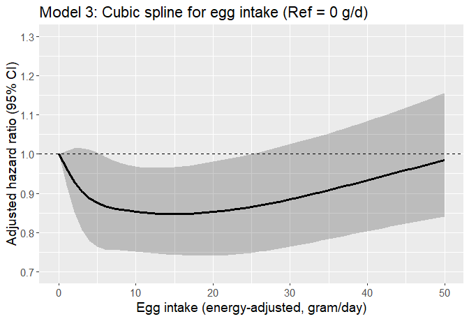

Egg CVD study (acute MI as outcome)
================

## Aim

- Assess if the risk of developing CVD varies according to levels of
  meat intake among regular egg consumers with hyperlipidemia using the
  AHS-2 cohort linked with Medicare data

- Assess the interaction between race and egg intake on the incidence of
  CVD among those with hyperlipidemia.

## Datasets

- Medicare data
  - For details regarding Medicare data, see [AHS-2 Medicare
    Linkage](https://github.com/keijioda/ahs_medicare_linkage/blob/main/summary.md)
    repository.

  - Master Beneficiary Summary File (MBSF), 2008-2022

    - Contains beneficiary characteristics and enrollment information

  - Chronic Conditions file (CC), 2008-2022

    - Contains the first occurrence date of 27 or 30 specific chronic
      conditions
      - 27 chronic conditions for data 2008-2020
      - 30 chronic conditions for data 2021-2022
    - Used to identify prevalent/incident cases of cardio-vascular
      diseases and
    - to identify comorbidities

  - Both files include n = 46,897 unique subjects across years, after
    excluding

    - Gender/DOB mismatch with AHS-2 data
    - Dupulicate beneficiary IDs and SSNs
- For AHS-2 baseline data, including food-frequency questionnaire (FFQ),
  a guided multiple imputation was used to fill missing data ([Fraser &
  Yan, 2007](https://pubmed.ncbi.nlm.nih.gov/17259903/))
  - Five imputed data sets were generated for subsequent analyses (See
    the analysis section for more details)
  - For descriptive analysis, we present results from the first imputed
    data
- AHS-2 baseline imputed data \#1: n = 41,037
  - ~~Among this, n = 383 subjects were excluded because they opted out
    of the study~~
  - ~~After removing opt-outs, there were n = 87,668 subjects~~
  - Opt-outs were already excluded
- After merging Medicare and AHS-2 data, there were n = 41,037 subjects.

## Inclusion/exclusion criteria

- Medicare beneficiaries who did not reach the age of 65 between 2008
  and 2020 (e.g., younger beneficiaries with disabilities or end-stage
  renal disease) were excluded (n = 1105), resulting n = 39,932.

- Subjects with extreme BMI (\<16 or \>60), according to AHS
  questionnaire, were excluded (n = 82), resulting n = 39,850.

- Unverified dates of deaths

  - Medicare data include a variable (`VALID_DEATH_DT_SW`) indicating
    whether a beneficiary’s day of death has been verified by the Social
    Security Administration or the Railroad Retirement Board.
  - There were 23 unverified death dates. Excluding these resulted n =
    39,827.

- Prevalent cases of acute MI

  - If the first diagnosis was made on or before AHS-2 enrollment date,
    consider it as a prevalent case
  - n = 157 prevalent cases were excluded, resulting n = 39,670 subjects

## Outcome

- The outcome is atrial fibrosis
- Among n = 39,670 subjects, there were 1700 incident cases (4.3%) of
  acute MI
- Age at diagnosis was calculated using `AMI_EVER` variable in the
  Chronic Condition Warehouse (CCW) data. This variable shows the date
  when the beneficiary first met the criteria after January 1, 1999.
  - For 27 CCW chronic conditions algorithms, see
    [here](https://www2.ccwdata.org/documents/10280/19139421/ccw-chronic-condition-algorithms.pdf)
  - For 30 CCW chronic conditions algorithms, see
    [here](https://www2.ccwdata.org/web/guest/condition-categories-chronic)
- Among these incident atrial fibrosis cases, the mean (SD) age of
  diagnosis was 80.9 (8.0) years. The median age of diagnosis was 81.4
  years.

## Comorbidity

## Dietary variables

## Descriptive table

- The descriptive table by acute MI incidence:

|  | level | Overall | Non-case | Case | p | test |
|:---|:---|:---|:---|:---|:---|:---|
| n |  | 39670 | 37970 | 1700 |  |  |
| agecat (%) | 65-69 | 6679 (16.9) | 6622 (17.5) | 57 ( 3.4) | \<0.001 |  |
|  | 70-74 | 6947 (17.6) | 6819 (18.1) | 128 ( 7.6) |  |  |
|  | 75-79 | 6290 (15.9) | 6084 (16.1) | 206 (12.2) |  |  |
|  | 80-84 | 5622 (14.3) | 5365 (14.2) | 257 (15.2) |  |  |
|  | 85-89 | 5029 (12.8) | 4712 (12.5) | 317 (18.7) |  |  |
|  | 90-94 | 4263 (10.8) | 3933 (10.4) | 330 (19.5) |  |  |
|  | 95+ | 4611 (11.7) | 4212 (11.2) | 399 (23.6) |  |  |
| bene_age_at_end_2020 (mean (SD)) |  | 81.02 (10.52) | 80.72 (10.46) | 87.70 (9.65) | \<0.001 |  |
| bene_sex_F (%) | M | 14356 (36.2) | 13597 (35.8) | 759 (44.6) | \<0.001 |  |
|  | F | 25314 (63.8) | 24373 (64.2) | 941 (55.4) |  |  |
| rti_race3 (%) | NH White | 29436 (74.2) | 28038 (73.8) | 1398 (82.2) | \<0.001 |  |
|  | Black | 7574 (19.1) | 7345 (19.3) | 229 (13.5) |  |  |
|  | Other | 2660 ( 6.7) | 2587 ( 6.8) | 73 ( 4.3) |  |  |
| marital (%) | Married | 28996 (73.1) | 27812 (73.2) | 1184 (69.6) | \<0.001 |  |
|  | Never | 1369 ( 3.5) | 1337 ( 3.5) | 32 ( 1.9) |  |  |
|  | Div/Wid | 9305 (23.5) | 8821 (23.2) | 484 (28.5) |  |  |
| educyou (%) | HSch & below | 8542 (21.5) | 8067 (21.2) | 475 (27.9) | \<0.001 |  |
|  | Some College | 15700 (39.6) | 15041 (39.6) | 659 (38.8) |  |  |
|  | Bachelors + | 15428 (38.9) | 14862 (39.1) | 566 (33.3) |  |  |
| vegstat (%) | Vegan | 3282 ( 8.3) | 3150 ( 8.3) | 132 ( 7.8) | 0.129 |  |
|  | Lacto-ovo | 12803 (32.3) | 12243 (32.2) | 560 (32.9) |  |  |
|  | Semi | 2205 ( 5.6) | 2089 ( 5.5) | 116 ( 6.8) |  |  |
|  | Pesco | 3800 ( 9.6) | 3633 ( 9.6) | 167 ( 9.8) |  |  |
|  | Non-veg | 17580 (44.3) | 16855 (44.4) | 725 (42.6) |  |  |
| bmicat (%) | Normal | 15330 (38.6) | 14743 (38.8) | 587 (34.5) | 0.002 |  |
|  | Overweight | 14456 (36.4) | 13803 (36.4) | 653 (38.4) |  |  |
|  | Obese | 9884 (24.9) | 9424 (24.8) | 460 (27.1) |  |  |
| bmi (mean (SD)) |  | 27.21 (5.47) | 27.19 (5.47) | 27.61 (5.45) | 0.002 |  |
| exercise (%) | None | 8818 (22.2) | 8295 (21.8) | 523 (30.8) | \<0.001 |  |
|  | ≤0.5 hrs/wk | 9609 (24.2) | 9240 (24.3) | 369 (21.7) |  |  |
|  | 0.5\<-2 hrs/wk | 10487 (26.4) | 10101 (26.6) | 386 (22.7) |  |  |
|  | \>2 hrs/wk | 10756 (27.1) | 10334 (27.2) | 422 (24.8) |  |  |
| sleephrs (%) | \<= 5 hrs | 3887 ( 9.8) | 3719 ( 9.8) | 168 ( 9.9) | \<0.001 |  |
|  | 6 hrs | 8639 (21.8) | 8266 (21.8) | 373 (21.9) |  |  |
|  | 7 hrs | 14340 (36.1) | 13792 (36.3) | 548 (32.2) |  |  |
|  | 8 hrs | 10529 (26.5) | 10052 (26.5) | 477 (28.1) |  |  |
|  | \>= 9 hrs | 2275 ( 5.7) | 2141 ( 5.6) | 134 ( 7.9) |  |  |
| smokecat6 (%) | A_Never | 31590 (79.6) | 30319 (79.8) | 1271 (74.8) | \<0.001 |  |
|  | B_QuitYrs30Plus | 3406 ( 8.6) | 3189 ( 8.4) | 217 (12.8) |  |  |
|  | C_QuitYrs21To30 | 2024 ( 5.1) | 1941 ( 5.1) | 83 ( 4.9) |  |  |
|  | D_QuitYrs11To20 | 1368 ( 3.4) | 1299 ( 3.4) | 69 ( 4.1) |  |  |
|  | E_QuitYrs6To10 | 485 ( 1.2) | 462 ( 1.2) | 23 ( 1.4) |  |  |
|  | F_QuitYrsLesOneTo5YearsNcur | 797 ( 2.0) | 760 ( 2.0) | 37 ( 2.2) |  |  |
| alccat (%) | Never | 37737 (95.1) | 36097 (95.1) | 1640 (96.5) | 0.010 |  |
|  | Current | 1933 ( 4.9) | 1873 ( 4.9) | 60 ( 3.5) |  |  |
| como_depress (%) | No | 38819 (97.9) | 37203 (98.0) | 1616 (95.1) | \<0.001 |  |
|  | Yes | 851 ( 2.1) | 767 ( 2.0) | 84 ( 4.9) |  |  |
| como_disab (%) | No | 33806 (85.2) | 32718 (86.2) | 1088 (64.0) | \<0.001 |  |
|  | Yes | 5864 (14.8) | 5252 (13.8) | 612 (36.0) |  |  |
| como_diabetes (%) | No | 38171 (96.2) | 36659 (96.5) | 1512 (88.9) | \<0.001 |  |
|  | Yes | 1499 ( 3.8) | 1311 ( 3.5) | 188 (11.1) |  |  |
| como_hypert (%) | No | 35367 (89.2) | 34165 (90.0) | 1202 (70.7) | \<0.001 |  |
|  | Yes | 4303 (10.8) | 3805 (10.0) | 498 (29.3) |  |  |
| como_hyperl (%) | No | 36222 (91.3) | 34942 (92.0) | 1280 (75.3) | \<0.001 |  |
|  | Yes | 3448 ( 8.7) | 3028 ( 8.0) | 420 (24.7) |  |  |
| como_resp (%) | No | 38620 (97.4) | 37031 (97.5) | 1589 (93.5) | \<0.001 |  |
|  | Yes | 1050 ( 2.6) | 939 ( 2.5) | 111 ( 6.5) |  |  |
| como_anemia (%) | No | 37267 (93.9) | 35830 (94.4) | 1437 (84.5) | \<0.001 |  |
|  | Yes | 2403 ( 6.1) | 2140 ( 5.6) | 263 (15.5) |  |  |
| como_kidney (%) | No | 39288 (99.0) | 37647 (99.1) | 1641 (96.5) | \<0.001 |  |
|  | Yes | 382 ( 1.0) | 323 ( 0.9) | 59 ( 3.5) |  |  |
| como_hypoth (%) | No | 38143 (96.2) | 36614 (96.4) | 1529 (89.9) | \<0.001 |  |
|  | Yes | 1527 ( 3.8) | 1356 ( 3.6) | 171 (10.1) |  |  |
| como_cancers (%) | No | 38781 (97.8) | 37179 (97.9) | 1602 (94.2) | \<0.001 |  |
|  | Yes | 889 ( 2.2) | 791 ( 2.1) | 98 ( 5.8) |  |  |
| eggs_gram_ea (mean (SD)) |  | 10.03 (16.01) | 9.99 (15.85) | 10.92 (19.10) | 0.019 |  |
| meat_gram_ea_4 (%) | None | 19879 (50.1) | 19020 (50.1) | 859 (50.5) | 0.218 |  |
|  | \<11 g/d | 6610 (16.7) | 6309 (16.6) | 301 (17.7) |  |  |
|  | 11-\<33 g/d | 6719 (16.9) | 6427 (16.9) | 292 (17.2) |  |  |
|  | 33+ g/d | 6462 (16.3) | 6214 (16.4) | 248 (14.6) |  |  |
| meat_gram_ea (mean (SD)) |  | 14.68 (26.04) | 14.73 (26.13) | 13.48 (23.88) | 0.053 |  |
| fish_gram_ea_4 (%) | None | 19376 (48.8) | 18520 (48.8) | 856 (50.4) | 0.001 |  |
|  | \<9 g/d | 7176 (18.1) | 6829 (18.0) | 347 (20.4) |  |  |
|  | 9-\<18 g/d | 6798 (17.1) | 6526 (17.2) | 272 (16.0) |  |  |
|  | 18+ g/d | 6320 (15.9) | 6095 (16.1) | 225 (13.2) |  |  |
| fish_gram_ea (mean (SD)) |  | 9.05 (16.29) | 9.11 (16.40) | 7.74 (13.52) | 0.001 |  |
| alldairy2_gram_ea_4 (%) | None | 4526 (11.4) | 4343 (11.4) | 183 (10.8) | 0.250 |  |
|  | \<50 g/d | 11477 (28.9) | 10963 (28.9) | 514 (30.2) |  |  |
|  | 50-\<180 g/d | 11741 (29.6) | 11267 (29.7) | 474 (27.9) |  |  |
|  | 180+ g/d | 11926 (30.1) | 11397 (30.0) | 529 (31.1) |  |  |
| alldairy2_gram_ea (mean (SD)) |  | 149.26 (187.11) | 149.01 (186.41) | 154.82 (202.13) | 0.210 |  |
| totalveg_gram_ea_4 (%) | \<185 g/d | 10036 (25.3) | 9598 (25.3) | 438 (25.8) | 0.381 |  |
|  | 185-\<270 g/d | 9807 (24.7) | 9416 (24.8) | 391 (23.0) |  |  |
|  | 270-\<380 g/d | 9966 (25.1) | 9535 (25.1) | 431 (25.4) |  |  |
|  | 380+ g/d | 9861 (24.9) | 9421 (24.8) | 440 (25.9) |  |  |
| totalveg_gram_ea (mean (SD)) |  | 302.40 (179.12) | 302.20 (179.09) | 306.73 (179.87) | 0.309 |  |
| fruits_gram_ea_4 (%) | \<170 g/d | 9969 (25.1) | 9555 (25.2) | 414 (24.4) | 0.482 |  |
|  | 170-\<280 g/d | 9846 (24.8) | 9422 (24.8) | 424 (24.9) |  |  |
|  | 280-\<420 g/d | 9940 (25.1) | 9528 (25.1) | 412 (24.2) |  |  |
|  | 420+ g/d | 9915 (25.0) | 9465 (24.9) | 450 (26.5) |  |  |
| fruits_gram_ea (mean (SD)) |  | 321.94 (221.62) | 321.69 (221.65) | 327.41 (220.81) | 0.298 |  |
| refgrains_gram_ea_4 (%) | \<40 g/d | 10391 (26.2) | 9874 (26.0) | 517 (30.4) | \<0.001 |  |
|  | 40-\<83 g/d | 10011 (25.2) | 9568 (25.2) | 443 (26.1) |  |  |
|  | 83-\<150 g/d | 9788 (24.7) | 9417 (24.8) | 371 (21.8) |  |  |
|  | 150+ g/d | 9480 (23.9) | 9111 (24.0) | 369 (21.7) |  |  |
| refgrains_gram_ea (mean (SD)) |  | 113.31 (116.50) | 113.67 (116.60) | 105.48 (113.97) | 0.005 |  |
| whole_mixed_grains_gram_ea_4 (%) | \<120 g/d | 10302 (26.0) | 9893 (26.1) | 409 (24.1) | 0.295 |  |
|  | 120-\<210 g/d | 9609 (24.2) | 9195 (24.2) | 414 (24.4) |  |  |
|  | 219-\<350 g/d | 9770 (24.6) | 9340 (24.6) | 430 (25.3) |  |  |
|  | 350+ g/d | 9989 (25.2) | 9542 (25.1) | 447 (26.3) |  |  |
| whole_mixed_grains_gram_ea (mean (SD)) |  | 256.46 (188.66) | 256.12 (188.52) | 264.08 (191.70) | 0.089 |  |
| nutsseeds_gram_ea_4 (%) | \<9 g/d | 10052 (25.3) | 9644 (25.4) | 408 (24.0) | 0.149 |  |
|  | 9-\<18 g/d | 9446 (23.8) | 9050 (23.8) | 396 (23.3) |  |  |
|  | 18-\<32 g/d | 10210 (25.7) | 9780 (25.8) | 430 (25.3) |  |  |
|  | 32+ g/d | 9962 (25.1) | 9496 (25.0) | 466 (27.4) |  |  |
| nutsseeds_gram_ea (mean (SD)) |  | 23.39 (20.26) | 23.36 (20.28) | 24.01 (19.73) | 0.195 |  |
| legumes_gram_ea_4 (%) | \<33 g/d | 9813 (24.7) | 9375 (24.7) | 438 (25.8) | 0.254 |  |
|  | 33-\<60 g/d | 9643 (24.3) | 9212 (24.3) | 431 (25.4) |  |  |
|  | 60-\<100 g/d | 10448 (26.3) | 10004 (26.3) | 444 (26.1) |  |  |
|  | 100+ g/d | 9766 (24.6) | 9379 (24.7) | 387 (22.8) |  |  |
| legumes_gram_ea (mean (SD)) |  | 77.28 (69.15) | 77.37 (69.22) | 75.29 (67.48) | 0.225 |  |

- The descriptive table by egg intake (4 groups):

|  | level | Overall | None | \<4.5 g/d | 4.5-\<16.5 g/d | 16.5+ g/d | p | test |
|:---|:---|:---|:---|:---|:---|:---|:---|:---|
| n |  | 39670 | 10704 | 9778 | 9652 | 9536 |  |  |
| AMI_YN (%) | No | 37970 (95.7) | 10220 (95.5) | 9382 (96.0) | 9256 (95.9) | 9112 (95.6) | 0.244 |  |
|  | Yes | 1700 ( 4.3) | 484 ( 4.5) | 396 ( 4.0) | 396 ( 4.1) | 424 ( 4.4) |  |  |
| agecat (%) | 65-69 | 6679 (16.9) | 1644 (15.4) | 1651 (17.0) | 1723 (18.0) | 1661 (17.5) | \<0.001 |  |
|  | 70-74 | 6947 (17.6) | 1799 (16.9) | 1718 (17.7) | 1740 (18.1) | 1690 (17.8) |  |  |
|  | 75-79 | 6290 (15.9) | 1674 (15.7) | 1546 (15.9) | 1520 (15.8) | 1550 (16.4) |  |  |
|  | 80-84 | 5622 (14.3) | 1533 (14.4) | 1352 (13.9) | 1339 (14.0) | 1398 (14.8) |  |  |
|  | 85-89 | 5029 (12.8) | 1385 (13.0) | 1221 (12.6) | 1236 (12.9) | 1187 (12.5) |  |  |
|  | 90-94 | 4263 (10.8) | 1241 (11.7) | 1060 (10.9) | 982 (10.2) | 980 (10.3) |  |  |
|  | 95+ | 4611 (11.7) | 1371 (12.9) | 1181 (12.1) | 1051 (11.0) | 1008 (10.6) |  |  |
| bene_age_at_end_2020 (mean (SD)) |  | 81.02 (10.52) | 81.66 (10.63) | 81.11 (10.62) | 80.62 (10.45) | 80.62 (10.34) | \<0.001 |  |
| bene_sex_F (%) | M | 14356 (36.2) | 3792 (35.4) | 3103 (31.7) | 3808 (39.5) | 3653 (38.3) | \<0.001 |  |
|  | F | 25314 (63.8) | 6912 (64.6) | 6675 (68.3) | 5844 (60.5) | 5883 (61.7) |  |  |
| rti_race3 (%) | NH White | 29436 (74.2) | 7832 (73.2) | 6766 (69.2) | 7304 (75.7) | 7534 (79.0) | \<0.001 |  |
|  | Black | 7574 (19.1) | 2219 (20.7) | 2251 (23.0) | 1664 (17.2) | 1440 (15.1) |  |  |
|  | Other | 2660 ( 6.7) | 653 ( 6.1) | 761 ( 7.8) | 684 ( 7.1) | 562 ( 5.9) |  |  |
| marital (%) | Married | 28996 (73.1) | 7752 (72.4) | 6921 (70.8) | 7308 (75.7) | 7015 (73.6) | \<0.001 |  |
|  | Never | 1369 ( 3.5) | 435 ( 4.1) | 380 ( 3.9) | 254 ( 2.6) | 300 ( 3.1) |  |  |
|  | Div/Wid | 9305 (23.5) | 2517 (23.5) | 2477 (25.3) | 2090 (21.7) | 2221 (23.3) |  |  |
| educyou (%) | HSch & below | 8542 (21.5) | 2164 (20.2) | 2232 (22.8) | 2014 (20.9) | 2132 (22.4) | \<0.001 |  |
|  | Some College | 15700 (39.6) | 4082 (38.1) | 3821 (39.1) | 3796 (39.3) | 4001 (42.0) |  |  |
|  | Bachelors + | 15428 (38.9) | 4458 (41.6) | 3725 (38.1) | 3842 (39.8) | 3403 (35.7) |  |  |
| vegstat (%) | Vegan | 3282 ( 8.3) | 3282 (30.7) | 0 ( 0.0) | 0 ( 0.0) | 0 ( 0.0) | \<0.001 |  |
|  | Lacto-ovo | 12803 (32.3) | 4227 (39.5) | 3628 (37.1) | 2779 (28.8) | 2169 (22.7) |  |  |
|  | Semi | 2205 ( 5.6) | 391 ( 3.7) | 703 ( 7.2) | 597 ( 6.2) | 514 ( 5.4) |  |  |
|  | Pesco | 3800 ( 9.6) | 1083 (10.1) | 1051 (10.7) | 926 ( 9.6) | 740 ( 7.8) |  |  |
|  | Non-veg | 17580 (44.3) | 1721 (16.1) | 4396 (45.0) | 5350 (55.4) | 6113 (64.1) |  |  |
| bmicat (%) | Normal | 15330 (38.6) | 5620 (52.5) | 3831 (39.2) | 3222 (33.4) | 2657 (27.9) | \<0.001 |  |
|  | Overweight | 14456 (36.4) | 3371 (31.5) | 3680 (37.6) | 3787 (39.2) | 3618 (37.9) |  |  |
|  | Obese | 9884 (24.9) | 1713 (16.0) | 2267 (23.2) | 2643 (27.4) | 3261 (34.2) |  |  |
| bmi (mean (SD)) |  | 27.21 (5.47) | 25.59 (4.97) | 27.07 (5.29) | 27.75 (5.41) | 28.65 (5.74) | \<0.001 |  |
| exercise (%) | None | 8818 (22.2) | 2124 (19.8) | 2213 (22.6) | 2079 (21.5) | 2402 (25.2) | \<0.001 |  |
|  | ≤0.5 hrs/wk | 9609 (24.2) | 2218 (20.7) | 2345 (24.0) | 2510 (26.0) | 2536 (26.6) |  |  |
|  | 0.5\<-2 hrs/wk | 10487 (26.4) | 2867 (26.8) | 2569 (26.3) | 2603 (27.0) | 2448 (25.7) |  |  |
|  | \>2 hrs/wk | 10756 (27.1) | 3495 (32.7) | 2651 (27.1) | 2460 (25.5) | 2150 (22.5) |  |  |
| sleephrs (%) | \<= 5 hrs | 3887 ( 9.8) | 985 ( 9.2) | 1070 (10.9) | 899 ( 9.3) | 933 ( 9.8) | \<0.001 |  |
|  | 6 hrs | 8639 (21.8) | 2245 (21.0) | 2206 (22.6) | 2157 (22.3) | 2031 (21.3) |  |  |
|  | 7 hrs | 14340 (36.1) | 3916 (36.6) | 3432 (35.1) | 3550 (36.8) | 3442 (36.1) |  |  |
|  | 8 hrs | 10529 (26.5) | 2961 (27.7) | 2516 (25.7) | 2525 (26.2) | 2527 (26.5) |  |  |
|  | \>= 9 hrs | 2275 ( 5.7) | 597 ( 5.6) | 554 ( 5.7) | 521 ( 5.4) | 603 ( 6.3) |  |  |
| smokecat6 (%) | A_Never | 31590 (79.6) | 8825 (82.4) | 7987 (81.7) | 7616 (78.9) | 7162 (75.1) | \<0.001 |  |
|  | B_QuitYrs30Plus | 3406 ( 8.6) | 894 ( 8.4) | 730 ( 7.5) | 826 ( 8.6) | 956 (10.0) |  |  |
|  | C_QuitYrs21To30 | 2024 ( 5.1) | 505 ( 4.7) | 454 ( 4.6) | 517 ( 5.4) | 548 ( 5.7) |  |  |
|  | D_QuitYrs11To20 | 1368 ( 3.4) | 272 ( 2.5) | 319 ( 3.3) | 349 ( 3.6) | 428 ( 4.5) |  |  |
|  | E_QuitYrs6To10 | 485 ( 1.2) | 98 ( 0.9) | 100 ( 1.0) | 128 ( 1.3) | 159 ( 1.7) |  |  |
|  | F_QuitYrsLesOneTo5YearsNcur | 797 ( 2.0) | 110 ( 1.0) | 188 ( 1.9) | 216 ( 2.2) | 283 ( 3.0) |  |  |
| alccat (%) | Never | 37737 (95.1) | 10502 (98.1) | 9378 (95.9) | 9042 (93.7) | 8815 (92.4) | \<0.001 |  |
|  | Current | 1933 ( 4.9) | 202 ( 1.9) | 400 ( 4.1) | 610 ( 6.3) | 721 ( 7.6) |  |  |
| como_depress (%) | No | 38819 (97.9) | 10475 (97.9) | 9571 (97.9) | 9454 (97.9) | 9319 (97.7) | 0.749 |  |
|  | Yes | 851 ( 2.1) | 229 ( 2.1) | 207 ( 2.1) | 198 ( 2.1) | 217 ( 2.3) |  |  |
| como_disab (%) | No | 33806 (85.2) | 8965 (83.8) | 8335 (85.2) | 8326 (86.3) | 8180 (85.8) | \<0.001 |  |
|  | Yes | 5864 (14.8) | 1739 (16.2) | 1443 (14.8) | 1326 (13.7) | 1356 (14.2) |  |  |
| como_diabetes (%) | No | 38171 (96.2) | 10390 (97.1) | 9426 (96.4) | 9263 (96.0) | 9092 (95.3) | \<0.001 |  |
|  | Yes | 1499 ( 3.8) | 314 ( 2.9) | 352 ( 3.6) | 389 ( 4.0) | 444 ( 4.7) |  |  |
| como_hypert (%) | No | 35367 (89.2) | 9630 (90.0) | 8695 (88.9) | 8588 (89.0) | 8454 (88.7) | 0.014 |  |
|  | Yes | 4303 (10.8) | 1074 (10.0) | 1083 (11.1) | 1064 (11.0) | 1082 (11.3) |  |  |
| como_hyperl (%) | No | 36222 (91.3) | 9787 (91.4) | 8918 (91.2) | 8794 (91.1) | 8723 (91.5) | 0.765 |  |
|  | Yes | 3448 ( 8.7) | 917 ( 8.6) | 860 ( 8.8) | 858 ( 8.9) | 813 ( 8.5) |  |  |
| como_resp (%) | No | 38620 (97.4) | 10447 (97.6) | 9520 (97.4) | 9410 (97.5) | 9243 (96.9) | 0.019 |  |
|  | Yes | 1050 ( 2.6) | 257 ( 2.4) | 258 ( 2.6) | 242 ( 2.5) | 293 ( 3.1) |  |  |
| como_anemia (%) | No | 37267 (93.9) | 9989 (93.3) | 9185 (93.9) | 9104 (94.3) | 8989 (94.3) | 0.009 |  |
|  | Yes | 2403 ( 6.1) | 715 ( 6.7) | 593 ( 6.1) | 548 ( 5.7) | 547 ( 5.7) |  |  |
| como_kidney (%) | No | 39288 (99.0) | 10615 (99.2) | 9689 (99.1) | 9569 (99.1) | 9415 (98.7) | 0.005 |  |
|  | Yes | 382 ( 1.0) | 89 ( 0.8) | 89 ( 0.9) | 83 ( 0.9) | 121 ( 1.3) |  |  |
| como_hypoth (%) | No | 38143 (96.2) | 10279 (96.0) | 9387 (96.0) | 9288 (96.2) | 9189 (96.4) | 0.510 |  |
|  | Yes | 1527 ( 3.8) | 425 ( 4.0) | 391 ( 4.0) | 364 ( 3.8) | 347 ( 3.6) |  |  |
| como_cancers (%) | No | 38781 (97.8) | 10450 (97.6) | 9551 (97.7) | 9464 (98.1) | 9316 (97.7) | 0.163 |  |
|  | Yes | 889 ( 2.2) | 254 ( 2.4) | 227 ( 2.3) | 188 ( 1.9) | 220 ( 2.3) |  |  |
| eggs_gram_ea (mean (SD)) |  | 10.03 (16.01) | 0.00 (0.00) | 3.10 (0.79) | 8.64 (3.36) | 29.80 (22.33) | \<0.001 |  |
| meat_gram_ea_4 (%) | None | 19879 (50.1) | 8591 (80.3) | 4676 (47.8) | 3705 (38.4) | 2907 (30.5) | \<0.001 |  |
|  | \<11 g/d | 6610 (16.7) | 1000 ( 9.3) | 2062 (21.1) | 1932 (20.0) | 1616 (16.9) |  |  |
|  | 11-\<33 g/d | 6719 (16.9) | 638 ( 6.0) | 1803 (18.4) | 2072 (21.5) | 2206 (23.1) |  |  |
|  | 33+ g/d | 6462 (16.3) | 475 ( 4.4) | 1237 (12.7) | 1943 (20.1) | 2807 (29.4) |  |  |
| meat_gram_ea (mean (SD)) |  | 14.68 (26.04) | 4.45 (15.28) | 12.21 (21.56) | 18.13 (27.42) | 25.19 (32.79) | \<0.001 |  |
| fish_gram_ea_4 (%) | None | 19376 (48.8) | 8042 (75.1) | 4534 (46.4) | 3655 (37.9) | 3145 (33.0) | \<0.001 |  |
|  | \<9 g/d | 7176 (18.1) | 1085 (10.1) | 2001 (20.5) | 1992 (20.6) | 2098 (22.0) |  |  |
|  | 9-\<18 g/d | 6798 (17.1) | 796 ( 7.4) | 1757 (18.0) | 2021 (20.9) | 2224 (23.3) |  |  |
|  | 18+ g/d | 6320 (15.9) | 781 ( 7.3) | 1486 (15.2) | 1984 (20.6) | 2069 (21.7) |  |  |
| fish_gram_ea (mean (SD)) |  | 9.05 (16.29) | 4.54 (14.44) | 9.05 (16.25) | 11.11 (16.46) | 12.04 (16.99) | \<0.001 |  |
| alldairy2_gram_ea_4 (%) | None | 4526 (11.4) | 3741 (34.9) | 410 ( 4.2) | 211 ( 2.2) | 164 ( 1.7) | \<0.001 |  |
|  | \<50 g/d | 11477 (28.9) | 4127 (38.6) | 3344 (34.2) | 2183 (22.6) | 1823 (19.1) |  |  |
|  | 50-\<180 g/d | 11741 (29.6) | 1656 (15.5) | 3162 (32.3) | 3529 (36.6) | 3394 (35.6) |  |  |
|  | 180+ g/d | 11926 (30.1) | 1180 (11.0) | 2862 (29.3) | 3729 (38.6) | 4155 (43.6) |  |  |
| alldairy2_gram_ea (mean (SD)) |  | 149.26 (187.11) | 63.90 (139.34) | 150.88 (185.30) | 188.70 (194.38) | 203.47 (194.21) | \<0.001 |  |
| totalveg_gram_ea_4 (%) | \<185 g/d | 10036 (25.3) | 2100 (19.6) | 2588 (26.5) | 2607 (27.0) | 2741 (28.7) | \<0.001 |  |
|  | 185-\<270 g/d | 9807 (24.7) | 2387 (22.3) | 2373 (24.3) | 2544 (26.4) | 2503 (26.2) |  |  |
|  | 270-\<380 g/d | 9966 (25.1) | 2719 (25.4) | 2453 (25.1) | 2435 (25.2) | 2359 (24.7) |  |  |
|  | 380+ g/d | 9861 (24.9) | 3498 (32.7) | 2364 (24.2) | 2066 (21.4) | 1933 (20.3) |  |  |
| totalveg_gram_ea (mean (SD)) |  | 302.40 (179.12) | 342.16 (209.53) | 297.47 (174.55) | 285.20 (155.90) | 280.22 (160.53) | \<0.001 |  |
| fruits_gram_ea_4 (%) | \<170 g/d | 9969 (25.1) | 1586 (14.8) | 2335 (23.9) | 2751 (28.5) | 3297 (34.6) | \<0.001 |  |
|  | 170-\<280 g/d | 9846 (24.8) | 2109 (19.7) | 2371 (24.2) | 2658 (27.5) | 2708 (28.4) |  |  |
|  | 280-\<420 g/d | 9940 (25.1) | 2962 (27.7) | 2502 (25.6) | 2364 (24.5) | 2112 (22.1) |  |  |
|  | 420+ g/d | 9915 (25.0) | 4047 (37.8) | 2570 (26.3) | 1879 (19.5) | 1419 (14.9) |  |  |
| fruits_gram_ea (mean (SD)) |  | 321.94 (221.62) | 397.09 (245.54) | 330.59 (225.63) | 291.45 (198.45) | 259.58 (182.62) | \<0.001 |  |
| refgrains_gram_ea_4 (%) | \<40 g/d | 10391 (26.2) | 3980 (37.2) | 2396 (24.5) | 1963 (20.3) | 2052 (21.5) | \<0.001 |  |
|  | 40-\<83 g/d | 10011 (25.2) | 2482 (23.2) | 2501 (25.6) | 2558 (26.5) | 2470 (25.9) |  |  |
|  | 83-\<150 g/d | 9788 (24.7) | 2125 (19.9) | 2493 (25.5) | 2620 (27.1) | 2550 (26.7) |  |  |
|  | 150+ g/d | 9480 (23.9) | 2117 (19.8) | 2388 (24.4) | 2511 (26.0) | 2464 (25.8) |  |  |
| refgrains_gram_ea (mean (SD)) |  | 113.31 (116.50) | 97.89 (115.79) | 116.24 (118.63) | 120.53 (113.94) | 120.33 (116.05) | \<0.001 |  |
| whole_mixed_grains_gram_ea_4 (%) | \<120 g/d | 10302 (26.0) | 1607 (15.0) | 2524 (25.8) | 2875 (29.8) | 3296 (34.6) | \<0.001 |  |
|  | 120-\<210 g/d | 9609 (24.2) | 1962 (18.3) | 2424 (24.8) | 2649 (27.4) | 2574 (27.0) |  |  |
|  | 219-\<350 g/d | 9770 (24.6) | 2951 (27.6) | 2336 (23.9) | 2316 (24.0) | 2167 (22.7) |  |  |
|  | 350+ g/d | 9989 (25.2) | 4184 (39.1) | 2494 (25.5) | 1812 (18.8) | 1499 (15.7) |  |  |
| whole_mixed_grains_gram_ea (mean (SD)) |  | 256.46 (188.66) | 329.65 (212.87) | 256.86 (188.01) | 224.60 (164.34) | 206.15 (155.10) | \<0.001 |  |
| nutsseeds_gram_ea_4 (%) | \<9 g/d | 10052 (25.3) | 2044 (19.1) | 2632 (26.9) | 2577 (26.7) | 2799 (29.4) | \<0.001 |  |
|  | 9-\<18 g/d | 9446 (23.8) | 2039 (19.0) | 2398 (24.5) | 2499 (25.9) | 2510 (26.3) |  |  |
|  | 18-\<32 g/d | 10210 (25.7) | 2854 (26.7) | 2423 (24.8) | 2552 (26.4) | 2381 (25.0) |  |  |
|  | 32+ g/d | 9962 (25.1) | 3767 (35.2) | 2325 (23.8) | 2024 (21.0) | 1846 (19.4) |  |  |
| nutsseeds_gram_ea (mean (SD)) |  | 23.39 (20.26) | 28.25 (22.61) | 22.73 (20.10) | 21.55 (18.73) | 20.47 (18.05) | \<0.001 |  |
| legumes_gram_ea_4 (%) | \<33 g/d | 9813 (24.7) | 1929 (18.0) | 2390 (24.4) | 2525 (26.2) | 2969 (31.1) | \<0.001 |  |
|  | 33-\<60 g/d | 9643 (24.3) | 2244 (21.0) | 2459 (25.1) | 2445 (25.3) | 2495 (26.2) |  |  |
|  | 60-\<100 g/d | 10448 (26.3) | 2989 (27.9) | 2552 (26.1) | 2577 (26.7) | 2330 (24.4) |  |  |
|  | 100+ g/d | 9766 (24.6) | 3542 (33.1) | 2377 (24.3) | 2105 (21.8) | 1742 (18.3) |  |  |
| legumes_gram_ea (mean (SD)) |  | 77.28 (69.15) | 93.77 (82.45) | 77.18 (69.12) | 71.41 (59.18) | 64.81 (57.66) | \<0.001 |  |

## Cox models

- To examine risk factors associated with incident acute MI, we employed
  the Cox proportional hazards model with attained age as the time scale
  - Age at entry was calculated based on the return date of AHS-2
    questionnaire
  - Those who died during the follow-up were censored at the date of
    death verified in Medicare data
  - Those who were diagnosed with atrial fibrosis after the study
    enrollment were identified as incident cases and their age at
    diagnosis was calculated.
    - The mean follow-up years was 16.8 years (median 18.5 years)
    - The total person-years of follow-up was 664,646 years
  - The main exposure variable of interest was energy-adjusted egg
    intake, gram/day. Subjects were classified into 4 egg intake groups
    as shown in the descriptive table, and egg intake was entered into
    the models as categorical
    - This is because there was a non-linear association between egg
      intake and afib when egg intake was entered as continuous (see
      below)
  - All other dietary variables were entered into the models as
    continuous. Their hazard ratios were estimated for an increment of
    100 gram/day

<!-- -->

### Restricted cubic spline for egg intake

- In the output above, egg intake was entered into the models as
  categorical. In the following analysis, we used restricted cubic
  splines to model a nonlinear association between egg intake as
  continuous and acute MI.
  - The nonlinear terms of egg intake were significant (p = 0.0052)
  - To visualize this nonlinear association, we have plotted hazard
    ratio for egg intake (adjusting for all other covariates) with 95
    confidence intervals
  - The reference for egg intake was set to 0 gram/day to make
    comparisons easier with the table above

<!-- -->

- Hazard ratios at selected points of egg intake and their 95 CI are
  shown below:

| Egg intake (g/d) |   HR | Lower | Upper |
|-----------------:|-----:|------:|------:|
|                5 | 0.88 |  0.76 |  1.00 |
|               10 | 0.85 |  0.75 |  0.97 |
|               15 | 0.85 |  0.74 |  0.97 |
|               20 | 0.85 |  0.74 |  0.98 |
|               30 | 0.88 |  0.76 |  1.02 |
|               50 | 0.99 |  0.84 |  1.16 |

### Interaction between egg and meat intake

- There were no significant interactions between egg and meat intake (p
  = 0.82)

### Hyperlipidemia as time-dependent

- To examine if the effect of egg intake may be dependent on
  hyperlipidemia, we have used hyperlipidemia as a time-dependent
  variable in the Cox model (after removing prevalent hyperlipidemia
  status from the model)
  - There were no significant interactions between egg intake and
    time-dependent hyperlipidemia status (p = 0.94, Model 3)
