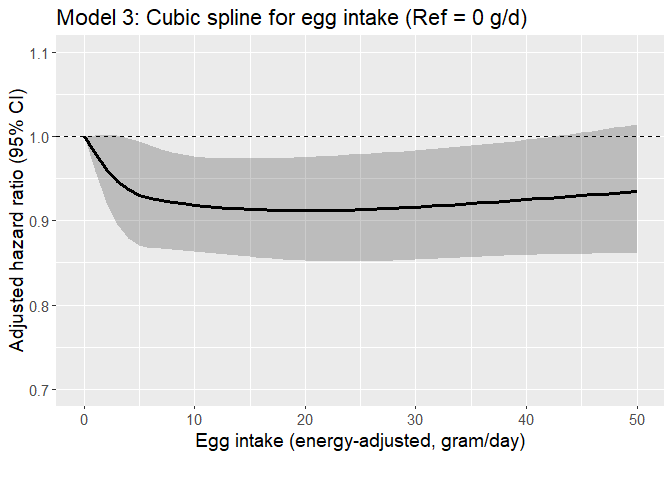
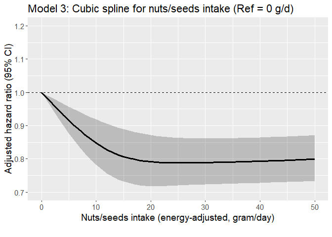

Egg CVD study (CHF as outcome)
================

## Aim

- Assess if the risk of developing CVD varies according to levels of
  meat intake among regular egg consumers with hyperlipidemia using the
  AHS-2 cohort linked with Medicare data

- Assess the interaction between race and egg intake on the incidence of
  CVD among those with hyperlipidemia.

## Datasets

- Medicare data
  - For details regarding Medicare data, see [AHS-2 Medicare
    Linkage](https://github.com/keijioda/ahs_medicare_linkage/blob/main/summary.md)
    repository.

  - Master Beneficiary Summary File (MBSF), 2008-2022

    - Contains beneficiary characteristics and enrollment information

  - Chronic Conditions file (CC), 2008-2022

    - Contains the first occurrence date of 27 or 30 specific chronic
      conditions
      - 27 chronic conditions for data 2008-2020
      - 30 chronic conditions for data 2021-2022
    - Used to identify prevalent/incident cases of cardio-vascular
      diseases and
    - to identify comorbidities

  - Both files include n = 46,897 unique subjects across years, after
    excluding

    - Gender/DOB mismatch with AHS-2 data
    - Dupulicate beneficiary IDs and SSNs
- For AHS-2 baseline data, including food-frequency questionnaire (FFQ),
  a guided multiple imputation was used to fill missing data ([Fraser &
  Yan, 2007](https://pubmed.ncbi.nlm.nih.gov/17259903/))
  - Five imputed data sets were generated for subsequent analyses (See
    the analysis section for more details)
  - For descriptive analysis, we present results from the first imputed
    data
- AHS-2 baseline imputed data \#1: n = 41,037
  - ~~Among this, n = 383 subjects were excluded because they opted out
    of the study~~
  - ~~After removing opt-outs, there were n = 87,668 subjects~~
  - Opt-outs were already excluded
- After merging Medicare and AHS-2 data, there were n = 41,037 subjects.

## Inclusion/exclusion criteria

- Medicare beneficiaries who did not reach the age of 65 between 2008
  and 2020 (e.g., younger beneficiaries with disabilities or end-stage
  renal disease) were excluded (n = 1105), resulting n = 39,932.

- Subjects with extreme BMI (\<16 or \>60), according to AHS
  questionnaire, were excluded (n = 82), resulting n = 39,850.

- Unverified dates of deaths

  - Medicare data include a variable (`VALID_DEATH_DT_SW`) indicating
    whether a beneficiary’s day of death has been verified by the Social
    Security Administration or the Railroad Retirement Board.
  - There were 23 unverified death dates. Excluding these resulted n =
    39,827.

- Prevalent cases of CHF

  - If the first diagnosis was made on or before AHS-2 enrollment date,
    consider it as a prevalent case
  - n = 1,238 prevalent cases were excluded, resulting n = 38,859
    subjects

## Outcome

- The outcome is CHF
- Among n = 38,589 subjects, there were 7,456 incident cases (19.3%) of
  CHF
- Age at diagnosis was calculated using `CHF_EVER` variable in the
  Chronic Condition Warehouse (CCW) data. This variable shows the date
  when the beneficiary first met the criteria after January 1, 1999.
  - For 27 CCW chronic conditions algorithms, see
    [here](https://www2.ccwdata.org/documents/10280/19139421/ccw-chronic-condition-algorithms.pdf)
  - For 30 CCW chronic conditions algorithms, see
    [here](https://www2.ccwdata.org/web/guest/condition-categories-chronic)
- Among these incident CHF cases, the mean (SD) age of diagnosis was
  81.6 (8.4) years. The median age of diagnosis was 82.2 years.

## Comorbidity

## Dietary variables

## Descriptive table

- The descriptive table by CHF incidence:

|  | level | Overall | Non-case | Case | p | test |
|:---|:---|:---|:---|:---|:---|:---|
| n |  | 38589 | 31133 | 7456 |  |  |
| agecat (%) | 65-69 | 6678 (17.4) | 6437 (20.8) | 241 ( 3.2) | \<0.001 |  |
|  | 70-74 | 6940 (18.1) | 6426 (20.8) | 514 ( 6.9) |  |  |
|  | 75-79 | 6264 (16.3) | 5503 (17.8) | 761 (10.2) |  |  |
|  | 80-84 | 5557 (14.5) | 4492 (14.5) | 1065 (14.3) |  |  |
|  | 85-89 | 4839 (12.6) | 3438 (11.1) | 1401 (18.8) |  |  |
|  | 90-94 | 4023 (10.5) | 2544 ( 8.2) | 1479 (19.9) |  |  |
|  | 95+ | 4059 (10.6) | 2081 ( 6.7) | 1978 (26.6) |  |  |
| bene_age_at_end_2020 (mean (SD)) |  | 80.63 (10.33) | 78.79 (9.63) | 88.34 (9.54) | \<0.001 |  |
| bene_sex_F (%) | M | 13967 (36.2) | 11072 (35.6) | 2895 (38.8) | \<0.001 |  |
|  | F | 24622 (63.8) | 20061 (64.4) | 4561 (61.2) |  |  |
| rti_race3 (%) | NH White | 28578 (74.1) | 22514 (72.3) | 6064 (81.3) | \<0.001 |  |
|  | Black | 7374 (19.1) | 6291 (20.2) | 1083 (14.5) |  |  |
|  | Other | 2637 ( 6.8) | 2328 ( 7.5) | 309 ( 4.1) |  |  |
| marital (%) | Married | 28417 (73.6) | 23399 (75.2) | 5018 (67.3) | \<0.001 |  |
|  | Never | 1332 ( 3.5) | 1115 ( 3.6) | 217 ( 2.9) |  |  |
|  | Div/Wid | 8840 (22.9) | 6619 (21.3) | 2221 (29.8) |  |  |
| educyou (%) | HSch & below | 8127 (21.1) | 6144 (19.7) | 1983 (26.6) | \<0.001 |  |
|  | Some College | 15310 (39.7) | 12364 (39.7) | 2946 (39.5) |  |  |
|  | Bachelors + | 15152 (39.3) | 12625 (40.6) | 2527 (33.9) |  |  |
| vegstat (%) | Vegan | 3211 ( 8.3) | 2619 ( 8.4) | 592 ( 7.9) | 0.002 |  |
|  | Lacto-ovo | 12483 (32.3) | 10020 (32.2) | 2463 (33.0) |  |  |
|  | Semi | 2138 ( 5.5) | 1672 ( 5.4) | 466 ( 6.2) |  |  |
|  | Pesco | 3711 ( 9.6) | 3052 ( 9.8) | 659 ( 8.8) |  |  |
|  | Non-veg | 17046 (44.2) | 13770 (44.2) | 3276 (43.9) |  |  |
| bmicat (%) | Normal | 14960 (38.8) | 12425 (39.9) | 2535 (34.0) | \<0.001 |  |
|  | Overweight | 14105 (36.6) | 11417 (36.7) | 2688 (36.1) |  |  |
|  | Obese | 9524 (24.7) | 7291 (23.4) | 2233 (29.9) |  |  |
| bmi (mean (SD)) |  | 27.19 (5.45) | 27.01 (5.34) | 27.95 (5.82) | \<0.001 |  |
| exercise (%) | None | 8290 (21.5) | 6057 (19.5) | 2233 (29.9) | \<0.001 |  |
|  | ≤0.5 hrs/wk | 9425 (24.4) | 7784 (25.0) | 1641 (22.0) |  |  |
|  | 0.5\<-2 hrs/wk | 10287 (26.7) | 8568 (27.5) | 1719 (23.1) |  |  |
|  | \>2 hrs/wk | 10587 (27.4) | 8724 (28.0) | 1863 (25.0) |  |  |
| sleephrs (%) | \<= 5 hrs | 3754 ( 9.7) | 3001 ( 9.6) | 753 (10.1) | \<0.001 |  |
|  | 6 hrs | 8418 (21.8) | 6901 (22.2) | 1517 (20.3) |  |  |
|  | 7 hrs | 14041 (36.4) | 11629 (37.4) | 2412 (32.3) |  |  |
|  | 8 hrs | 10215 (26.5) | 8024 (25.8) | 2191 (29.4) |  |  |
|  | \>= 9 hrs | 2161 ( 5.6) | 1578 ( 5.1) | 583 ( 7.8) |  |  |
| smokecat6 (%) | A_Never | 30773 (79.7) | 24956 (80.2) | 5817 (78.0) | \<0.001 |  |
|  | B_QuitYrs30Plus | 3254 ( 8.4) | 2465 ( 7.9) | 789 (10.6) |  |  |
|  | C_QuitYrs21To30 | 1979 ( 5.1) | 1637 ( 5.3) | 342 ( 4.6) |  |  |
|  | D_QuitYrs11To20 | 1335 ( 3.5) | 1075 ( 3.5) | 260 ( 3.5) |  |  |
|  | E_QuitYrs6To10 | 468 ( 1.2) | 370 ( 1.2) | 98 ( 1.3) |  |  |
|  | F_QuitYrsLesOneTo5YearsNcur | 780 ( 2.0) | 630 ( 2.0) | 150 ( 2.0) |  |  |
| alccat (%) | Never | 36687 (95.1) | 29512 (94.8) | 7175 (96.2) | \<0.001 |  |
|  | Current | 1902 ( 4.9) | 1621 ( 5.2) | 281 ( 3.8) |  |  |
| como_depress (%) | No | 37943 (98.3) | 30870 (99.2) | 7073 (94.9) | \<0.001 |  |
|  | Yes | 646 ( 1.7) | 263 ( 0.8) | 383 ( 5.1) |  |  |
| como_disab (%) | No | 33644 (87.2) | 28925 (92.9) | 4719 (63.3) | \<0.001 |  |
|  | Yes | 4945 (12.8) | 2208 ( 7.1) | 2737 (36.7) |  |  |
| como_diabetes (%) | No | 37466 (97.1) | 30734 (98.7) | 6732 (90.3) | \<0.001 |  |
|  | Yes | 1123 ( 2.9) | 399 ( 1.3) | 724 ( 9.7) |  |  |
| como_hypert (%) | No | 35171 (91.1) | 29775 (95.6) | 5396 (72.4) | \<0.001 |  |
|  | Yes | 3418 ( 8.9) | 1358 ( 4.4) | 2060 (27.6) |  |  |
| como_hyperl (%) | No | 35770 (92.7) | 29948 (96.2) | 5822 (78.1) | \<0.001 |  |
|  | Yes | 2819 ( 7.3) | 1185 ( 3.8) | 1634 (21.9) |  |  |
| como_resp (%) | No | 37864 (98.1) | 30849 (99.1) | 7015 (94.1) | \<0.001 |  |
|  | Yes | 725 ( 1.9) | 284 ( 0.9) | 441 ( 5.9) |  |  |
| como_anemia (%) | No | 36771 (95.3) | 30376 (97.6) | 6395 (85.8) | \<0.001 |  |
|  | Yes | 1818 ( 4.7) | 757 ( 2.4) | 1061 (14.2) |  |  |
| como_kidney (%) | No | 38351 (99.4) | 31044 (99.7) | 7307 (98.0) | \<0.001 |  |
|  | Yes | 238 ( 0.6) | 89 ( 0.3) | 149 ( 2.0) |  |  |
| como_hypoth (%) | No | 37368 (96.8) | 30615 (98.3) | 6753 (90.6) | \<0.001 |  |
|  | Yes | 1221 ( 3.2) | 518 ( 1.7) | 703 ( 9.4) |  |  |
| como_cancers (%) | No | 37872 (98.1) | 30802 (98.9) | 7070 (94.8) | \<0.001 |  |
|  | Yes | 717 ( 1.9) | 331 ( 1.1) | 386 ( 5.2) |  |  |
| eggs_gram_ea_5 (%) | None | 10428 (27.0) | 8419 (27.0) | 2009 (26.9) | 0.028 |  |
|  | \<4 g/d | 8325 (21.6) | 6706 (21.5) | 1619 (21.7) |  |  |
|  | 4-\<10 g/d | 7881 (20.4) | 6449 (20.7) | 1432 (19.2) |  |  |
|  | 10-\<23 g/d | 7141 (18.5) | 5717 (18.4) | 1424 (19.1) |  |  |
|  | 23+ g/d | 4814 (12.5) | 3842 (12.3) | 972 (13.0) |  |  |
| eggs_gram_ea (mean (SD)) |  | 9.99 (15.93) | 9.90 (15.90) | 10.37 (16.05) | 0.024 |  |
| meat_gram_ea (mean (SD)) |  | 14.67 (26.07) | 14.78 (26.03) | 14.21 (26.24) | 0.093 |  |
| fish_gram_ea (mean (SD)) |  | 9.05 (16.29) | 9.28 (16.72) | 8.05 (14.31) | \<0.001 |  |
| alldairy2_gram_ea (mean (SD)) |  | 148.09 (185.79) | 146.13 (184.56) | 156.24 (190.63) | \<0.001 |  |
| totalveg_gram_ea (mean (SD)) |  | 302.25 (178.90) | 302.40 (179.61) | 301.62 (175.88) | 0.733 |  |
| fruits_gram_ea (mean (SD)) |  | 321.78 (221.39) | 320.65 (222.70) | 326.48 (215.80) | 0.041 |  |
| refgrains_gram_ea (mean (SD)) |  | 113.35 (116.24) | 115.01 (116.15) | 106.43 (116.40) | \<0.001 |  |
| whole_mixed_grains_gram_ea (mean (SD)) |  | 256.34 (188.60) | 255.00 (188.15) | 261.94 (190.36) | 0.004 |  |
| nutsseeds_gram_ea (mean (SD)) |  | 23.43 (20.29) | 23.25 (20.04) | 24.16 (21.25) | 0.001 |  |
| legumes_gram_ea (mean (SD)) |  | 77.43 (68.93) | 78.31 (69.66) | 73.77 (65.66) | \<0.001 |  |

- The descriptive table by egg intake (5 groups):

|  | level | Overall | None | \<4 g/d | 4-\<10 g/d | 10-\<23 g/d | 23+ g/d | p | test |
|:---|:---|:---|:---|:---|:---|:---|:---|:---|:---|
| n |  | 38589 | 10428 | 8325 | 7881 | 7141 | 4814 |  |  |
| CHF_YN (%) | No | 31133 (80.7) | 8419 (80.7) | 6706 (80.6) | 6449 (81.8) | 5717 (80.1) | 3842 (79.8) | 0.028 |  |
|  | Yes | 7456 (19.3) | 2009 (19.3) | 1619 (19.4) | 1432 (18.2) | 1424 (19.9) | 972 (20.2) |  |  |
| agecat (%) | 65-69 | 6678 (17.4) | 1644 (15.9) | 1431 (17.3) | 1439 (18.4) | 1266 (17.8) | 898 (18.8) | \<0.001 |  |
|  | 70-74 | 6940 (18.1) | 1797 (17.3) | 1453 (17.5) | 1485 (19.0) | 1258 (17.7) | 947 (19.8) |  |  |
|  | 75-79 | 6264 (16.3) | 1665 (16.1) | 1338 (16.1) | 1299 (16.6) | 1109 (15.6) | 853 (17.9) |  |  |
|  | 80-84 | 5557 (14.5) | 1523 (14.7) | 1181 (14.3) | 1105 (14.1) | 1027 (14.5) | 721 (15.1) |  |  |
|  | 85-89 | 4839 (12.6) | 1337 (12.9) | 1049 (12.7) | 985 (12.6) | 903 (12.7) | 565 (11.8) |  |  |
|  | 90-94 | 4023 (10.5) | 1173 (11.3) | 891 (10.8) | 763 ( 9.8) | 755 (10.6) | 441 ( 9.2) |  |  |
|  | 95+ | 4059 (10.6) | 1232 (11.9) | 942 (11.4) | 749 ( 9.6) | 784 (11.0) | 352 ( 7.4) |  |  |
| bene_age_at_end_2020 (mean (SD)) |  | 80.63 (10.33) | 81.31 (10.47) | 80.90 (10.46) | 80.10 (10.16) | 80.77 (10.48) | 79.39 (9.65) | \<0.001 |  |
| bene_sex_F (%) | M | 13967 (36.2) | 3707 (35.5) | 2602 (31.3) | 3038 (38.5) | 2614 (36.6) | 2006 (41.7) | \<0.001 |  |
|  | F | 24622 (63.8) | 6721 (64.5) | 5723 (68.7) | 4843 (61.5) | 4527 (63.4) | 2808 (58.3) |  |  |
| rti_race3 (%) | NH White | 28578 (74.1) | 7607 (72.9) | 5787 (69.5) | 5880 (74.6) | 5489 (76.9) | 3815 (79.2) | \<0.001 |  |
|  | Black | 7374 (19.1) | 2174 (20.8) | 1876 (22.5) | 1427 (18.1) | 1162 (16.3) | 735 (15.3) |  |  |
|  | Other | 2637 ( 6.8) | 647 ( 6.2) | 662 ( 8.0) | 574 ( 7.3) | 490 ( 6.9) | 264 ( 5.5) |  |  |
| marital (%) | Married | 28417 (73.6) | 7599 (72.9) | 5983 (71.9) | 5940 (75.4) | 5372 (75.2) | 3523 (73.2) | \<0.001 |  |
|  | Never | 1332 ( 3.5) | 422 ( 4.0) | 320 ( 3.8) | 222 ( 2.8) | 207 ( 2.9) | 161 ( 3.3) |  |  |
|  | Div/Wid | 8840 (22.9) | 2407 (23.1) | 2022 (24.3) | 1719 (21.8) | 1562 (21.9) | 1130 (23.5) |  |  |
| educyou (%) | HSch & below | 8127 (21.1) | 2062 (19.8) | 1825 (21.9) | 1644 (20.9) | 1472 (20.6) | 1124 (23.3) | \<0.001 |  |
|  | Some College | 15310 (39.7) | 3980 (38.2) | 3255 (39.1) | 3088 (39.2) | 2907 (40.7) | 2080 (43.2) |  |  |
|  | Bachelors + | 15152 (39.3) | 4386 (42.1) | 3245 (39.0) | 3149 (40.0) | 2762 (38.7) | 1610 (33.4) |  |  |
| vegstat (%) | Vegan | 3211 ( 8.3) | 3211 (30.8) | 0 ( 0.0) | 0 ( 0.0) | 0 ( 0.0) | 0 ( 0.0) | \<0.001 |  |
|  | Lacto-ovo | 12483 (32.3) | 4110 (39.4) | 3203 (38.5) | 2387 (30.3) | 1845 (25.8) | 938 (19.5) |  |  |
|  | Semi | 2138 ( 5.5) | 381 ( 3.7) | 568 ( 6.8) | 550 ( 7.0) | 374 ( 5.2) | 265 ( 5.5) |  |  |
|  | Pesco | 3711 ( 9.6) | 1060 (10.2) | 904 (10.9) | 761 ( 9.7) | 666 ( 9.3) | 320 ( 6.6) |  |  |
|  | Non-veg | 17046 (44.2) | 1666 (16.0) | 3650 (43.8) | 4183 (53.1) | 4256 (59.6) | 3291 (68.4) |  |  |
| bmicat (%) | Normal | 14960 (38.8) | 5487 (52.6) | 3339 (40.1) | 2748 (34.9) | 2240 (31.4) | 1146 (23.8) | \<0.001 |  |
|  | Overweight | 14105 (36.6) | 3291 (31.6) | 3132 (37.6) | 3068 (38.9) | 2793 (39.1) | 1821 (37.8) |  |  |
|  | Obese | 9524 (24.7) | 1650 (15.8) | 1854 (22.3) | 2065 (26.2) | 2108 (29.5) | 1847 (38.4) |  |  |
| bmi (mean (SD)) |  | 27.19 (5.45) | 25.57 (4.94) | 26.93 (5.23) | 27.59 (5.37) | 28.00 (5.47) | 29.29 (5.89) | \<0.001 |  |
| exercise (%) | None | 8290 (21.5) | 2003 (19.2) | 1776 (21.3) | 1715 (21.8) | 1526 (21.4) | 1270 (26.4) | \<0.001 |  |
|  | ≤0.5 hrs/wk | 9425 (24.4) | 2174 (20.8) | 1958 (23.5) | 2115 (26.8) | 1872 (26.2) | 1306 (27.1) |  |  |
|  | 0.5\<-2 hrs/wk | 10287 (26.7) | 2810 (26.9) | 2238 (26.9) | 2090 (26.5) | 1967 (27.5) | 1182 (24.6) |  |  |
|  | \>2 hrs/wk | 10587 (27.4) | 3441 (33.0) | 2353 (28.3) | 1961 (24.9) | 1776 (24.9) | 1056 (21.9) |  |  |
| sleephrs (%) | \<= 5 hrs | 3754 ( 9.7) | 952 ( 9.1) | 870 (10.5) | 753 ( 9.6) | 677 ( 9.5) | 502 (10.4) | \<0.001 |  |
|  | 6 hrs | 8418 (21.8) | 2186 (21.0) | 1867 (22.4) | 1784 (22.6) | 1518 (21.3) | 1063 (22.1) |  |  |
|  | 7 hrs | 14041 (36.4) | 3840 (36.8) | 2972 (35.7) | 2895 (36.7) | 2628 (36.8) | 1706 (35.4) |  |  |
|  | 8 hrs | 10215 (26.5) | 2881 (27.6) | 2153 (25.9) | 2040 (25.9) | 1909 (26.7) | 1232 (25.6) |  |  |
|  | \>= 9 hrs | 2161 ( 5.6) | 569 ( 5.5) | 463 ( 5.6) | 409 ( 5.2) | 409 ( 5.7) | 311 ( 6.5) |  |  |
| smokecat6 (%) | A_Never | 30773 (79.7) | 8598 (82.5) | 6881 (82.7) | 6215 (78.9) | 5636 (78.9) | 3443 (71.5) | \<0.001 |  |
|  | B_QuitYrs30Plus | 3254 ( 8.4) | 863 ( 8.3) | 597 ( 7.2) | 671 ( 8.5) | 612 ( 8.6) | 511 (10.6) |  |  |
|  | C_QuitYrs21To30 | 1979 ( 5.1) | 499 ( 4.8) | 374 ( 4.5) | 396 ( 5.0) | 393 ( 5.5) | 317 ( 6.6) |  |  |
|  | D_QuitYrs11To20 | 1335 ( 3.5) | 266 ( 2.6) | 250 ( 3.0) | 306 ( 3.9) | 260 ( 3.6) | 253 ( 5.3) |  |  |
|  | E_QuitYrs6To10 | 468 ( 1.2) | 95 ( 0.9) | 75 ( 0.9) | 112 ( 1.4) | 85 ( 1.2) | 101 ( 2.1) |  |  |
|  | F_QuitYrsLesOneTo5YearsNcur | 780 ( 2.0) | 107 ( 1.0) | 148 ( 1.8) | 181 ( 2.3) | 155 ( 2.2) | 189 ( 3.9) |  |  |
| alccat (%) | Never | 36687 (95.1) | 10229 (98.1) | 7992 (96.0) | 7418 (94.1) | 6671 (93.4) | 4377 (90.9) | \<0.001 |  |
|  | Current | 1902 ( 4.9) | 199 ( 1.9) | 333 ( 4.0) | 463 ( 5.9) | 470 ( 6.6) | 437 ( 9.1) |  |  |
| como_depress (%) | No | 37943 (98.3) | 10257 (98.4) | 8177 (98.2) | 7761 (98.5) | 7017 (98.3) | 4731 (98.3) | 0.743 |  |
|  | Yes | 646 ( 1.7) | 171 ( 1.6) | 148 ( 1.8) | 120 ( 1.5) | 124 ( 1.7) | 83 ( 1.7) |  |  |
| como_disab (%) | No | 33644 (87.2) | 8928 (85.6) | 7247 (87.1) | 6961 (88.3) | 6195 (86.8) | 4313 (89.6) | \<0.001 |  |
|  | Yes | 4945 (12.8) | 1500 (14.4) | 1078 (12.9) | 920 (11.7) | 946 (13.2) | 501 (10.4) |  |  |
| como_diabetes (%) | No | 37466 (97.1) | 10197 (97.8) | 8099 (97.3) | 7643 (97.0) | 6893 (96.5) | 4634 (96.3) | \<0.001 |  |
|  | Yes | 1123 ( 2.9) | 231 ( 2.2) | 226 ( 2.7) | 238 ( 3.0) | 248 ( 3.5) | 180 ( 3.7) |  |  |
| como_hypert (%) | No | 35171 (91.1) | 9570 (91.8) | 7571 (90.9) | 7184 (91.2) | 6430 (90.0) | 4416 (91.7) | 0.001 |  |
|  | Yes | 3418 ( 8.9) | 858 ( 8.2) | 754 ( 9.1) | 697 ( 8.8) | 711 (10.0) | 398 ( 8.3) |  |  |
| como_hyperl (%) | No | 35770 (92.7) | 9668 (92.7) | 7708 (92.6) | 7289 (92.5) | 6586 (92.2) | 4519 (93.9) | 0.012 |  |
|  | Yes | 2819 ( 7.3) | 760 ( 7.3) | 617 ( 7.4) | 592 ( 7.5) | 555 ( 7.8) | 295 ( 6.1) |  |  |
| como_resp (%) | No | 37864 (98.1) | 10244 (98.2) | 8155 (98.0) | 7754 (98.4) | 6986 (97.8) | 4725 (98.2) | 0.081 |  |
|  | Yes | 725 ( 1.9) | 184 ( 1.8) | 170 ( 2.0) | 127 ( 1.6) | 155 ( 2.2) | 89 ( 1.8) |  |  |
| como_anemia (%) | No | 36771 (95.3) | 9878 (94.7) | 7928 (95.2) | 7544 (95.7) | 6789 (95.1) | 4632 (96.2) | \<0.001 |  |
|  | Yes | 1818 ( 4.7) | 550 ( 5.3) | 397 ( 4.8) | 337 ( 4.3) | 352 ( 4.9) | 182 ( 3.8) |  |  |
| como_kidney (%) | No | 38351 (99.4) | 10377 (99.5) | 8283 (99.5) | 7828 (99.3) | 7088 (99.3) | 4775 (99.2) | 0.047 |  |
|  | Yes | 238 ( 0.6) | 51 ( 0.5) | 42 ( 0.5) | 53 ( 0.7) | 53 ( 0.7) | 39 ( 0.8) |  |  |
| como_hypoth (%) | No | 37368 (96.8) | 10078 (96.6) | 8042 (96.6) | 7638 (96.9) | 6897 (96.6) | 4713 (97.9) | \<0.001 |  |
|  | Yes | 1221 ( 3.2) | 350 ( 3.4) | 283 ( 3.4) | 243 ( 3.1) | 244 ( 3.4) | 101 ( 2.1) |  |  |
| como_cancers (%) | No | 37872 (98.1) | 10227 (98.1) | 8155 (98.0) | 7752 (98.4) | 7002 (98.1) | 4736 (98.4) | 0.220 |  |
|  | Yes | 717 ( 1.9) | 201 ( 1.9) | 170 ( 2.0) | 129 ( 1.6) | 139 ( 1.9) | 78 ( 1.6) |  |  |
| eggs_gram_ea (mean (SD)) |  | 9.99 (15.93) | 0.00 (0.00) | 2.94 (0.71) | 6.37 (1.56) | 17.28 (3.64) | 38.95 (27.71) | \<0.001 |  |
| meat_gram_ea (mean (SD)) |  | 14.67 (26.07) | 4.43 (15.31) | 11.70 (21.14) | 16.91 (25.91) | 20.88 (29.05) | 29.12 (36.07) | \<0.001 |  |
| fish_gram_ea (mean (SD)) |  | 9.05 (16.29) | 4.51 (14.40) | 8.99 (16.46) | 10.36 (16.01) | 11.75 (16.28) | 12.82 (18.01) | \<0.001 |  |
| alldairy2_gram_ea (mean (SD)) |  | 148.09 (185.79) | 63.24 (138.60) | 150.11 (185.15) | 180.27 (192.53) | 201.69 (191.87) | 196.14 (191.46) | \<0.001 |  |
| totalveg_gram_ea (mean (SD)) |  | 302.25 (178.90) | 341.75 (208.53) | 302.99 (175.06) | 284.09 (160.76) | 284.91 (155.74) | 270.88 (160.42) | \<0.001 |  |
| fruits_gram_ea (mean (SD)) |  | 321.78 (221.39) | 397.14 (245.15) | 338.73 (228.31) | 294.31 (199.53) | 278.00 (187.50) | 239.11 (177.66) | \<0.001 |  |
| refgrains_gram_ea (mean (SD)) |  | 113.35 (116.24) | 98.16 (115.88) | 117.62 (119.26) | 118.44 (116.00) | 123.98 (115.62) | 114.78 (109.73) | \<0.001 |  |
| whole_mixed_grains_gram_ea (mean (SD)) |  | 256.34 (188.60) | 329.57 (212.83) | 264.08 (188.53) | 229.22 (171.58) | 214.19 (150.59) | 191.25 (154.69) | \<0.001 |  |
| nutsseeds_gram_ea (mean (SD)) |  | 23.43 (20.29) | 28.24 (22.63) | 23.48 (20.42) | 21.62 (19.03) | 20.98 (17.90) | 19.52 (17.92) | \<0.001 |  |
| legumes_gram_ea (mean (SD)) |  | 77.43 (68.93) | 93.90 (81.86) | 79.59 (70.67) | 70.80 (58.98) | 69.23 (57.37) | 61.07 (57.66) | \<0.001 |  |

## Cox models

- To examine risk factors associated with incident CHF, we employed the
  Cox proportional hazards model with attained age as the time scale
  - Age at entry was calculated based on the return date of AHS-2
    questionnaire
  - Those who died during the follow-up were censored at the date of
    death verified in Medicare data
  - Those who were diagnosed with CHF after the study enrollment were
    identified as incident cases and their age at diagnosis was
    calculated.
    - The mean follow-up years was 16.3 years (median 18.4 years)
    - The total person-years of follow-up was 628,430 years
  - The main exposure variable of interest was energy-adjusted egg
    intake, gram/day. Subjects were classified into 4 egg intake groups
    as shown in the descriptive table, and egg intake was entered into
    the models as categorical
    - This is because there was a non-linear association between egg
      intake and CHF when egg intake was entered as continuous (see
      below)
  - All other dietary variables were entered into the models as
    continuous. Their hazard ratios were estimated for an increment of
    100 gram/day

### Restricted cubic spline for dietary intake

- In the output above, egg intake was entered into the models as
  categorical. In the following analysis, we used restricted cubic
  splines to model a nonlinear association between egg intake as
  continuous and CHF.
  - The nonlinear terms of egg intake were significant (p = 0.0094)
  - To visualize this nonlinear association, we have plotted hazard
    ratio for egg intake (adjusting for all other covariates) with 95
    confidence intervals
  - The reference for egg intake was set to 0 gram/day to make
    comparisons easier with the table above

<!-- -->

- Hazard ratios at selected points of egg intake and their 95 CI are
  shown below:

| Egg intake (g/d) |   HR | Lower | Upper |
|-----------------:|-----:|------:|------:|
|                5 | 0.93 |  0.87 |  0.99 |
|               10 | 0.92 |  0.86 |  0.98 |
|               15 | 0.91 |  0.86 |  0.97 |
|               20 | 0.91 |  0.85 |  0.98 |
|               30 | 0.92 |  0.85 |  0.98 |
|               50 | 0.93 |  0.86 |  1.01 |

- When examined for non-linearity, nuts/seed intake also showed a
  significant non-linear association with IHD. The plot of adjusted HRs
  is shown below.

<!-- -->

| Nuts/seeds intake (g/d) |   HR | Lower | Upper |
|------------------------:|-----:|------:|------:|
|                      10 | 0.85 |  0.78 |  0.92 |
|                      20 | 0.79 |  0.72 |  0.87 |
|                      30 | 0.79 |  0.72 |  0.86 |
|                      40 | 0.79 |  0.73 |  0.86 |
|                      50 | 0.80 |  0.73 |  0.87 |

### Interaction between egg and meat intake

- There were no significant interactions between egg and meat intake (p
  = 0.44)

### Interaction between egg and race

- There were no significant interactions between egg and race (p = 0.74)

### Hyperlipidemia as time-dependent

- To examine if the effect of egg intake may be dependent on
  hyperlipidemia, we have used hyperlipidemia as a time-dependent
  variable in the Cox model (after removing prevalent hyperlipidemia
  status from the model)
  - There were no significant interactions between egg intake and
    time-dependent hyperlipidemia status (p = 0.94, Model 3)
