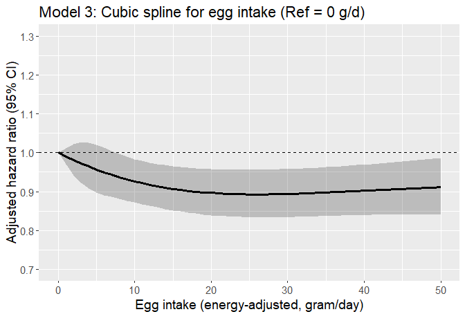

Egg CVD study (IHD as outcome)
================

## Aim

- Assess if the risk of developing CVD varies according to levels of
  meat intake among regular egg consumers with hyperlipidemia using the
  AHS-2 cohort linked with Medicare data

- Assess the interaction between race and egg intake on the incidence of
  CVD among those with hyperlipidemia.

## Datasets

- Medicare data
  - For details regarding Medicare data, see [AHS-2 Medicare
    Linkage](https://github.com/keijioda/ahs_medicare_linkage/blob/main/summary.md)
    repository.

  - Master Beneficiary Summary File (MBSF), 2008-2022

    - Contains beneficiary characteristics and enrollment information

  - Chronic Conditions file (CC), 2008-2022

    - Contains the first occurrence date of 27 or 30 specific chronic
      conditions
      - 27 chronic conditions for data 2008-2020
      - 30 chronic conditions for data 2021-2022
    - Used to identify prevalent/incident cases of cardio-vascular
      diseases and
    - to identify comorbidities

  - Both files include n = 46,897 unique subjects across years, after
    excluding

    - Gender/DOB mismatch with AHS-2 data
    - Dupulicate beneficiary IDs and SSNs
- For AHS-2 baseline data, including food-frequency questionnaire (FFQ),
  a guided multiple imputation was used to fill missing data ([Fraser &
  Yan, 2007](https://pubmed.ncbi.nlm.nih.gov/17259903/))
  - Five imputed data sets were generated for subsequent analyses (See
    the analysis section for more details)
  - For descriptive analysis, we present results from the first imputed
    data
- AHS-2 baseline imputed data \#1: n = 41,037
  - ~~Among this, n = 383 subjects were excluded because they opted out
    of the study~~
  - ~~After removing opt-outs, there were n = 87,668 subjects~~
  - Opt-outs were already excluded
- After merging Medicare and AHS-2 data, there were n = 41,037 subjects.

## Inclusion/exclusion criteria

- Medicare beneficiaries who did not reach the age of 65 between 2008
  and 2020 (e.g., younger beneficiaries with disabilities or end-stage
  renal disease) were excluded (n = 1105), resulting n = 39,932.

- Subjects with extreme BMI (\<16 or \>60), according to AHS
  questionnaire, were excluded (n = 82), resulting n = 39,850.

- Unverified dates of deaths

  - Medicare data include a variable (`VALID_DEATH_DT_SW`) indicating
    whether a beneficiary’s day of death has been verified by the Social
    Security Administration or the Railroad Retirement Board.
  - There were 23 unverified death dates. Excluding these resulted n =
    39,827.

- Prevalent cases of ischemic HD

  - If the first diagnosis was made on or before AHS-2 enrollment date,
    consider it as a prevalent case
  - n = 2,654 prevalent cases were excluded, resulting n = 37,173
    subjects

## Outcome

- The outcome is atrial fibrosis
- Among n = 37,173 subjects, there were 8,218 incident cases (22.1%) of
  ischemic HD
- Age at diagnosis was calculated using `ISCHEMICHEART_EVER` variable in
  the Chronic Condition Warehouse (CCW) data. This variable shows the
  date when the beneficiary first met the criteria after January 1,
  1999.
  - For 27 CCW chronic conditions algorithms, see
    [here](https://www2.ccwdata.org/documents/10280/19139421/ccw-chronic-condition-algorithms.pdf)
  - For 30 CCW chronic conditions algorithms, see
    [here](https://www2.ccwdata.org/web/guest/condition-categories-chronic)
- Among these incident atrial fibrosis cases, the mean (SD) age of
  diagnosis was 80.9 (8.0) years. The median age of diagnosis was 81.4
  years.

## Comorbidity

## Dietary variables

## Descriptive table

- The descriptive table by IHD incidence:

|  | level | Overall | Non-case | Case | p | test |
|:---|:---|:---|:---|:---|:---|:---|
| n |  | 37173 | 28955 | 8218 |  |  |
| agecat (%) | 65-69 | 6676 (18.1) | 6232 (21.7) | 444 ( 5.4) | \<0.001 |  |
|  | 70-74 | 6931 (18.8) | 6074 (21.1) | 857 (10.5) |  |  |
|  | 75-79 | 6244 (16.9) | 5093 (17.7) | 1151 (14.1) |  |  |
|  | 80-84 | 5467 (14.8) | 4070 (14.2) | 1397 (17.1) |  |  |
|  | 85-89 | 4577 (12.4) | 3113 (10.8) | 1464 (17.9) |  |  |
|  | 90-94 | 3597 ( 9.7) | 2229 ( 7.8) | 1368 (16.7) |  |  |
|  | 95+ | 3452 ( 9.3) | 1942 ( 6.8) | 1510 (18.4) |  |  |
| bene_age_at_end_2020 (mean (SD)) |  | 80.13 (10.11) | 78.57 (9.65) | 85.66 (9.76) | \<0.001 |  |
| bene_sex_F (%) | M | 13244 (35.6) | 9757 (33.7) | 3487 (42.4) | \<0.001 |  |
|  | F | 23929 (64.4) | 19198 (66.3) | 4731 (57.6) |  |  |
| rti_race3 (%) | NH White | 27375 (73.6) | 20775 (71.7) | 6600 (80.3) | \<0.001 |  |
|  | Black | 7207 (19.4) | 5950 (20.5) | 1257 (15.3) |  |  |
|  | Other | 2591 ( 7.0) | 2230 ( 7.7) | 361 ( 4.4) |  |  |
| marital (%) | Married | 27447 (73.8) | 21607 (74.6) | 5840 (71.1) | \<0.001 |  |
|  | Never | 1320 ( 3.6) | 1071 ( 3.7) | 249 ( 3.0) |  |  |
|  | Div/Wid | 8406 (22.6) | 6277 (21.7) | 2129 (25.9) |  |  |
| educyou (%) | HSch & below | 7712 (20.7) | 5686 (19.6) | 2026 (24.7) | \<0.001 |  |
|  | Some College | 14804 (39.8) | 11591 (40.0) | 3213 (39.1) |  |  |
|  | Bachelors + | 14657 (39.4) | 11678 (40.3) | 2979 (36.2) |  |  |
| vegstat (%) | Vegan | 3120 ( 8.4) | 2503 ( 8.6) | 617 ( 7.5) | \<0.001 |  |
|  | Lacto-ovo | 11999 (32.3) | 9388 (32.4) | 2611 (31.8) |  |  |
|  | Semi | 2051 ( 5.5) | 1559 ( 5.4) | 492 ( 6.0) |  |  |
|  | Pesco | 3534 ( 9.5) | 2792 ( 9.6) | 742 ( 9.0) |  |  |
|  | Non-veg | 16469 (44.3) | 12713 (43.9) | 3756 (45.7) |  |  |
| bmicat (%) | Normal | 14374 (38.7) | 11589 (40.0) | 2785 (33.9) | \<0.001 |  |
|  | Overweight | 13558 (36.5) | 10450 (36.1) | 3108 (37.8) |  |  |
|  | Obese | 9241 (24.9) | 6916 (23.9) | 2325 (28.3) |  |  |
| bmi (mean (SD)) |  | 27.21 (5.46) | 27.04 (5.43) | 27.80 (5.55) | \<0.001 |  |
| exercise (%) | None | 7843 (21.1) | 5644 (19.5) | 2199 (26.8) | \<0.001 |  |
|  | ≤0.5 hrs/wk | 9152 (24.6) | 7256 (25.1) | 1896 (23.1) |  |  |
|  | 0.5\<-2 hrs/wk | 9958 (26.8) | 7960 (27.5) | 1998 (24.3) |  |  |
|  | \>2 hrs/wk | 10220 (27.5) | 8095 (28.0) | 2125 (25.9) |  |  |
| sleephrs (%) | \<= 5 hrs | 3610 ( 9.7) | 2802 ( 9.7) | 808 ( 9.8) | \<0.001 |  |
|  | 6 hrs | 8131 (21.9) | 6379 (22.0) | 1752 (21.3) |  |  |
|  | 7 hrs | 13592 (36.6) | 10835 (37.4) | 2757 (33.5) |  |  |
|  | 8 hrs | 9817 (26.4) | 7456 (25.8) | 2361 (28.7) |  |  |
|  | \>= 9 hrs | 2023 ( 5.4) | 1483 ( 5.1) | 540 ( 6.6) |  |  |
| smokecat6 (%) | A_Never | 29720 (80.0) | 23380 (80.7) | 6340 (77.1) | \<0.001 |  |
|  | B_QuitYrs30Plus | 3025 ( 8.1) | 2153 ( 7.4) | 872 (10.6) |  |  |
|  | C_QuitYrs21To30 | 1927 ( 5.2) | 1506 ( 5.2) | 421 ( 5.1) |  |  |
|  | D_QuitYrs11To20 | 1290 ( 3.5) | 990 ( 3.4) | 300 ( 3.7) |  |  |
|  | E_QuitYrs6To10 | 454 ( 1.2) | 346 ( 1.2) | 108 ( 1.3) |  |  |
|  | F_QuitYrsLesOneTo5YearsNcur | 757 ( 2.0) | 580 ( 2.0) | 177 ( 2.2) |  |  |
| alccat (%) | Never | 35320 (95.0) | 27446 (94.8) | 7874 (95.8) | \<0.001 |  |
|  | Current | 1853 ( 5.0) | 1509 ( 5.2) | 344 ( 4.2) |  |  |
| como_depress (%) | No | 36704 (98.7) | 28736 (99.2) | 7968 (97.0) | \<0.001 |  |
|  | Yes | 469 ( 1.3) | 219 ( 0.8) | 250 ( 3.0) |  |  |
| como_disab (%) | No | 33346 (89.7) | 27227 (94.0) | 6119 (74.5) | \<0.001 |  |
|  | Yes | 3827 (10.3) | 1728 ( 6.0) | 2099 (25.5) |  |  |
| como_diabetes (%) | No | 36414 (98.0) | 28654 (99.0) | 7760 (94.4) | \<0.001 |  |
|  | Yes | 759 ( 2.0) | 301 ( 1.0) | 458 ( 5.6) |  |  |
| como_hypert (%) | No | 34784 (93.6) | 28005 (96.7) | 6779 (82.5) | \<0.001 |  |
|  | Yes | 2389 ( 6.4) | 950 ( 3.3) | 1439 (17.5) |  |  |
| como_hyperl (%) | No | 35355 (95.1) | 28198 (97.4) | 7157 (87.1) | \<0.001 |  |
|  | Yes | 1818 ( 4.9) | 757 ( 2.6) | 1061 (12.9) |  |  |
| como_resp (%) | No | 36628 (98.5) | 28728 (99.2) | 7900 (96.1) | \<0.001 |  |
|  | Yes | 545 ( 1.5) | 227 ( 0.8) | 318 ( 3.9) |  |  |
| como_anemia (%) | No | 35866 (96.5) | 28400 (98.1) | 7466 (90.8) | \<0.001 |  |
|  | Yes | 1307 ( 3.5) | 555 ( 1.9) | 752 ( 9.2) |  |  |
| como_kidney (%) | No | 37021 (99.6) | 28896 (99.8) | 8125 (98.9) | \<0.001 |  |
|  | Yes | 152 ( 0.4) | 59 ( 0.2) | 93 ( 1.1) |  |  |
| como_hypoth (%) | No | 36256 (97.5) | 28564 (98.6) | 7692 (93.6) | \<0.001 |  |
|  | Yes | 917 ( 2.5) | 391 ( 1.4) | 526 ( 6.4) |  |  |
| como_cancers (%) | No | 36632 (98.5) | 28725 (99.2) | 7907 (96.2) | \<0.001 |  |
|  | Yes | 541 ( 1.5) | 230 ( 0.8) | 311 ( 3.8) |  |  |
| eggs_gram_ea (mean (SD)) |  | 10.00 (15.94) | 9.91 (15.85) | 10.33 (16.25) | 0.034 |  |
| meat_gram_ea_4 (%) | None | 18647 (50.2) | 14679 (50.7) | 3968 (48.3) | \<0.001 |  |
|  | \<11 g/d | 6141 (16.5) | 4696 (16.2) | 1445 (17.6) |  |  |
|  | 11-\<33 g/d | 6284 (16.9) | 4816 (16.6) | 1468 (17.9) |  |  |
|  | 33+ g/d | 6101 (16.4) | 4764 (16.5) | 1337 (16.3) |  |  |
| meat_gram_ea (mean (SD)) |  | 14.76 (26.13) | 14.76 (26.27) | 14.76 (25.64) | 0.996 |  |
| fish_gram_ea_4 (%) | None | 18190 (48.9) | 14203 (49.1) | 3987 (48.5) | 0.056 |  |
|  | \<9 g/d | 6635 (17.8) | 5094 (17.6) | 1541 (18.8) |  |  |
|  | 9-\<18 g/d | 6342 (17.1) | 4931 (17.0) | 1411 (17.2) |  |  |
|  | 18+ g/d | 6006 (16.2) | 4727 (16.3) | 1279 (15.6) |  |  |
| fish_gram_ea (mean (SD)) |  | 9.12 (16.40) | 9.24 (16.85) | 8.67 (14.69) | 0.005 |  |
| alldairy2_gram_ea_4 (%) | None | 4287 (11.5) | 3421 (11.8) | 866 (10.5) | \<0.001 |  |
|  | \<50 g/d | 10841 (29.2) | 8474 (29.3) | 2367 (28.8) |  |  |
|  | 50-\<180 g/d | 11026 (29.7) | 8639 (29.8) | 2387 (29.0) |  |  |
|  | 180+ g/d | 11019 (29.6) | 8421 (29.1) | 2598 (31.6) |  |  |
| alldairy2_gram_ea (mean (SD)) |  | 147.35 (185.12) | 145.55 (184.95) | 153.72 (185.60) | \<0.001 |  |
| totalveg_gram_ea_4 (%) | \<185 g/d | 9430 (25.4) | 7263 (25.1) | 2167 (26.4) | 0.130 |  |
|  | 185-\<270 g/d | 9203 (24.8) | 7188 (24.8) | 2015 (24.5) |  |  |
|  | 270-\<380 g/d | 9311 (25.0) | 7281 (25.1) | 2030 (24.7) |  |  |
|  | 380+ g/d | 9229 (24.8) | 7223 (24.9) | 2006 (24.4) |  |  |
| totalveg_gram_ea (mean (SD)) |  | 302.29 (179.52) | 302.74 (178.74) | 300.70 (182.24) | 0.363 |  |
| fruits_gram_ea_4 (%) | \<170 g/d | 9413 (25.3) | 7334 (25.3) | 2079 (25.3) | 0.782 |  |
|  | 170-\<280 g/d | 9199 (24.7) | 7134 (24.6) | 2065 (25.1) |  |  |
|  | 280-\<420 g/d | 9300 (25.0) | 7271 (25.1) | 2029 (24.7) |  |  |
|  | 420+ g/d | 9261 (24.9) | 7216 (24.9) | 2045 (24.9) |  |  |
| fruits_gram_ea (mean (SD)) |  | 321.62 (222.27) | 322.25 (223.65) | 319.39 (217.35) | 0.304 |  |
| refgrains_gram_ea_4 (%) | \<40 g/d | 9656 (26.0) | 7284 (25.2) | 2372 (28.9) | \<0.001 |  |
|  | 40-\<83 g/d | 9427 (25.4) | 7281 (25.1) | 2146 (26.1) |  |  |
|  | 83-\<150 g/d | 9183 (24.7) | 7287 (25.2) | 1896 (23.1) |  |  |
|  | 150+ g/d | 8907 (24.0) | 7103 (24.5) | 1804 (22.0) |  |  |
| refgrains_gram_ea (mean (SD)) |  | 113.28 (115.57) | 115.01 (116.16) | 107.19 (113.28) | \<0.001 |  |
| whole_mixed_grains_gram_ea_4 (%) | \<120 g/d | 9741 (26.2) | 7668 (26.5) | 2073 (25.2) | 0.054 |  |
|  | 120-\<210 g/d | 9030 (24.3) | 7057 (24.4) | 1973 (24.0) |  |  |
|  | 219-\<350 g/d | 9118 (24.5) | 7056 (24.4) | 2062 (25.1) |  |  |
|  | 350+ g/d | 9284 (25.0) | 7174 (24.8) | 2110 (25.7) |  |  |
| whole_mixed_grains_gram_ea (mean (SD)) |  | 255.34 (188.41) | 254.10 (188.06) | 259.71 (189.58) | 0.017 |  |
| nutsseeds_gram_ea_4 (%) | \<9 g/d | 9413 (25.3) | 7360 (25.4) | 2053 (25.0) | 0.099 |  |
|  | 9-\<18 g/d | 8889 (23.9) | 6971 (24.1) | 1918 (23.3) |  |  |
|  | 18-\<32 g/d | 9553 (25.7) | 7449 (25.7) | 2104 (25.6) |  |  |
|  | 32+ g/d | 9318 (25.1) | 7175 (24.8) | 2143 (26.1) |  |  |
| nutsseeds_gram_ea (mean (SD)) |  | 23.36 (20.23) | 23.17 (20.01) | 24.06 (20.98) | \<0.001 |  |
| legumes_gram_ea_4 (%) | \<33 g/d | 9146 (24.6) | 7046 (24.3) | 2100 (25.6) | \<0.001 |  |
|  | 33-\<60 g/d | 9008 (24.2) | 6895 (23.8) | 2113 (25.7) |  |  |
|  | 60-\<100 g/d | 9816 (26.4) | 7707 (26.6) | 2109 (25.7) |  |  |
|  | 100+ g/d | 9203 (24.8) | 7307 (25.2) | 1896 (23.1) |  |  |
| legumes_gram_ea (mean (SD)) |  | 77.52 (69.31) | 78.10 (69.36) | 75.47 (69.07) | 0.002 |  |

- The descriptive table by egg intake (4 groups):

|  | level | Overall | None | \<4.5 g/d | 4.5-\<16.5 g/d | 16.5+ g/d | p | test |
|:---|:---|:---|:---|:---|:---|:---|:---|:---|
| n |  | 37173 | 10023 | 9173 | 9062 | 8915 |  |  |
| IHD_YN (%) | No | 28955 (77.9) | 7842 (78.2) | 7164 (78.1) | 7041 (77.7) | 6908 (77.5) | 0.577 |  |
|  | Yes | 8218 (22.1) | 2181 (21.8) | 2009 (21.9) | 2021 (22.3) | 2007 (22.5) |  |  |
| agecat (%) | 65-69 | 6676 (18.1) | 1644 (16.5) | 1653 (18.1) | 1721 (19.1) | 1658 (18.7) | \<0.001 |  |
|  | 70-74 | 6931 (18.8) | 1797 (18.0) | 1712 (18.8) | 1739 (19.3) | 1683 (19.0) |  |  |
|  | 75-79 | 6244 (16.9) | 1663 (16.7) | 1538 (16.9) | 1513 (16.8) | 1530 (17.3) |  |  |
|  | 80-84 | 5467 (14.8) | 1501 (15.1) | 1322 (14.5) | 1295 (14.4) | 1349 (15.2) |  |  |
|  | 85-89 | 4577 (12.4) | 1260 (12.6) | 1119 (12.3) | 1127 (12.5) | 1071 (12.1) |  |  |
|  | 90-94 | 3597 ( 9.7) | 1049 (10.5) | 900 ( 9.9) | 823 ( 9.1) | 825 ( 9.3) |  |  |
|  | 95+ | 3452 ( 9.3) | 1052 (10.6) | 880 ( 9.6) | 783 ( 8.7) | 737 ( 8.3) |  |  |
| bene_age_at_end_2020 (mean (SD)) |  | 80.13 (10.11) | 80.78 (10.27) | 80.20 (10.18) | 79.75 (10.03) | 79.73 (9.90) | \<0.001 |  |
| bene_sex_F (%) | M | 13244 (35.6) | 3509 (35.0) | 2884 (31.4) | 3503 (38.7) | 3348 (37.6) | \<0.001 |  |
|  | F | 23929 (64.4) | 6514 (65.0) | 6289 (68.6) | 5559 (61.3) | 5567 (62.4) |  |  |
| rti_race3 (%) | NH White | 27375 (73.6) | 7253 (72.4) | 6286 (68.5) | 6830 (75.4) | 7006 (78.6) | \<0.001 |  |
|  | Black | 7207 (19.4) | 2129 (21.2) | 2143 (23.4) | 1572 (17.3) | 1363 (15.3) |  |  |
|  | Other | 2591 ( 7.0) | 641 ( 6.4) | 744 ( 8.1) | 660 ( 7.3) | 546 ( 6.1) |  |  |
| marital (%) | Married | 27447 (73.8) | 7344 (73.3) | 6574 (71.7) | 6915 (76.3) | 6614 (74.2) | \<0.001 |  |
|  | Never | 1320 ( 3.6) | 416 ( 4.2) | 370 ( 4.0) | 247 ( 2.7) | 287 ( 3.2) |  |  |
|  | Div/Wid | 8406 (22.6) | 2263 (22.6) | 2229 (24.3) | 1900 (21.0) | 2014 (22.6) |  |  |
| educyou (%) | HSch & below | 7712 (20.7) | 1945 (19.4) | 2034 (22.2) | 1823 (20.1) | 1910 (21.4) | \<0.001 |  |
|  | Some College | 14804 (39.8) | 3845 (38.4) | 3605 (39.3) | 3583 (39.5) | 3771 (42.3) |  |  |
|  | Bachelors + | 14657 (39.4) | 4233 (42.2) | 3534 (38.5) | 3656 (40.3) | 3234 (36.3) |  |  |
| vegstat (%) | Vegan | 3120 ( 8.4) | 3120 (31.1) | 0 ( 0.0) | 0 ( 0.0) | 0 ( 0.0) | \<0.001 |  |
|  | Lacto-ovo | 11999 (32.3) | 3921 (39.1) | 3399 (37.1) | 2643 (29.2) | 2036 (22.8) |  |  |
|  | Semi | 2051 ( 5.5) | 360 ( 3.6) | 655 ( 7.1) | 555 ( 6.1) | 481 ( 5.4) |  |  |
|  | Pesco | 3534 ( 9.5) | 1007 (10.0) | 986 (10.7) | 860 ( 9.5) | 681 ( 7.6) |  |  |
|  | Non-veg | 16469 (44.3) | 1615 (16.1) | 4133 (45.1) | 5004 (55.2) | 5717 (64.1) |  |  |
| bmicat (%) | Normal | 14374 (38.7) | 5274 (52.6) | 3593 (39.2) | 3027 (33.4) | 2480 (27.8) | \<0.001 |  |
|  | Overweight | 13558 (36.5) | 3154 (31.5) | 3445 (37.6) | 3562 (39.3) | 3397 (38.1) |  |  |
|  | Obese | 9241 (24.9) | 1595 (15.9) | 2135 (23.3) | 2473 (27.3) | 3038 (34.1) |  |  |
| bmi (mean (SD)) |  | 27.21 (5.46) | 25.57 (4.97) | 27.07 (5.29) | 27.74 (5.39) | 28.64 (5.74) | \<0.001 |  |
| exercise (%) | None | 7843 (21.1) | 1881 (18.8) | 1982 (21.6) | 1852 (20.4) | 2128 (23.9) | \<0.001 |  |
|  | ≤0.5 hrs/wk | 9152 (24.6) | 2108 (21.0) | 2220 (24.2) | 2404 (26.5) | 2420 (27.1) |  |  |
|  | 0.5\<-2 hrs/wk | 9958 (26.8) | 2724 (27.2) | 2437 (26.6) | 2468 (27.2) | 2329 (26.1) |  |  |
|  | \>2 hrs/wk | 10220 (27.5) | 3310 (33.0) | 2534 (27.6) | 2338 (25.8) | 2038 (22.9) |  |  |
| sleephrs (%) | \<= 5 hrs | 3610 ( 9.7) | 914 ( 9.1) | 996 (10.9) | 840 ( 9.3) | 860 ( 9.6) | \<0.001 |  |
|  | 6 hrs | 8131 (21.9) | 2118 (21.1) | 2077 (22.6) | 2020 (22.3) | 1916 (21.5) |  |  |
|  | 7 hrs | 13592 (36.6) | 3700 (36.9) | 3251 (35.4) | 3388 (37.4) | 3253 (36.5) |  |  |
|  | 8 hrs | 9817 (26.4) | 2761 (27.5) | 2362 (25.7) | 2348 (25.9) | 2346 (26.3) |  |  |
|  | \>= 9 hrs | 2023 ( 5.4) | 530 ( 5.3) | 487 ( 5.3) | 466 ( 5.1) | 540 ( 6.1) |  |  |
| smokecat6 (%) | A_Never | 29720 (80.0) | 8275 (82.6) | 7521 (82.0) | 7180 (79.2) | 6744 (75.6) | \<0.001 |  |
|  | B_QuitYrs30Plus | 3025 ( 8.1) | 803 ( 8.0) | 651 ( 7.1) | 742 ( 8.2) | 829 ( 9.3) |  |  |
|  | C_QuitYrs21To30 | 1927 ( 5.2) | 486 ( 4.8) | 436 ( 4.8) | 488 ( 5.4) | 517 ( 5.8) |  |  |
|  | D_QuitYrs11To20 | 1290 ( 3.5) | 260 ( 2.6) | 299 ( 3.3) | 329 ( 3.6) | 402 ( 4.5) |  |  |
|  | E_QuitYrs6To10 | 454 ( 1.2) | 94 ( 0.9) | 94 ( 1.0) | 116 ( 1.3) | 150 ( 1.7) |  |  |
|  | F_QuitYrsLesOneTo5YearsNcur | 757 ( 2.0) | 105 ( 1.0) | 172 ( 1.9) | 207 ( 2.3) | 273 ( 3.1) |  |  |
| alccat (%) | Never | 35320 (95.0) | 9830 (98.1) | 8796 (95.9) | 8478 (93.6) | 8216 (92.2) | \<0.001 |  |
|  | Current | 1853 ( 5.0) | 193 ( 1.9) | 377 ( 4.1) | 584 ( 6.4) | 699 ( 7.8) |  |  |
| como_depress (%) | No | 36704 (98.7) | 9898 (98.8) | 9060 (98.8) | 8947 (98.7) | 8799 (98.7) | 0.978 |  |
|  | Yes | 469 ( 1.3) | 125 ( 1.2) | 113 ( 1.2) | 115 ( 1.3) | 116 ( 1.3) |  |  |
| como_disab (%) | No | 33346 (89.7) | 8844 (88.2) | 8244 (89.9) | 8200 (90.5) | 8058 (90.4) | \<0.001 |  |
|  | Yes | 3827 (10.3) | 1179 (11.8) | 929 (10.1) | 862 ( 9.5) | 857 ( 9.6) |  |  |
| como_diabetes (%) | No | 36414 (98.0) | 9861 (98.4) | 8992 (98.0) | 8878 (98.0) | 8683 (97.4) | \<0.001 |  |
|  | Yes | 759 ( 2.0) | 162 ( 1.6) | 181 ( 2.0) | 184 ( 2.0) | 232 ( 2.6) |  |  |
| como_hypert (%) | No | 34784 (93.6) | 9426 (94.0) | 8573 (93.5) | 8462 (93.4) | 8323 (93.4) | 0.162 |  |
|  | Yes | 2389 ( 6.4) | 597 ( 6.0) | 600 ( 6.5) | 600 ( 6.6) | 592 ( 6.6) |  |  |
| como_hyperl (%) | No | 35355 (95.1) | 9534 (95.1) | 8716 (95.0) | 8604 (94.9) | 8501 (95.4) | 0.603 |  |
|  | Yes | 1818 ( 4.9) | 489 ( 4.9) | 457 ( 5.0) | 458 ( 5.1) | 414 ( 4.6) |  |  |
| como_resp (%) | No | 36628 (98.5) | 9886 (98.6) | 9044 (98.6) | 8930 (98.5) | 8768 (98.4) | 0.395 |  |
|  | Yes | 545 ( 1.5) | 137 ( 1.4) | 129 ( 1.4) | 132 ( 1.5) | 147 ( 1.6) |  |  |
| como_anemia (%) | No | 35866 (96.5) | 9612 (95.9) | 8858 (96.6) | 8760 (96.7) | 8636 (96.9) | 0.002 |  |
|  | Yes | 1307 ( 3.5) | 411 ( 4.1) | 315 ( 3.4) | 302 ( 3.3) | 279 ( 3.1) |  |  |
| como_kidney (%) | No | 37021 (99.6) | 9992 (99.7) | 9131 (99.5) | 9025 (99.6) | 8873 (99.5) | 0.280 |  |
|  | Yes | 152 ( 0.4) | 31 ( 0.3) | 42 ( 0.5) | 37 ( 0.4) | 42 ( 0.5) |  |  |
| como_hypoth (%) | No | 36256 (97.5) | 9769 (97.5) | 8937 (97.4) | 8834 (97.5) | 8716 (97.8) | 0.432 |  |
|  | Yes | 917 ( 2.5) | 254 ( 2.5) | 236 ( 2.6) | 228 ( 2.5) | 199 ( 2.2) |  |  |
| como_cancers (%) | No | 36632 (98.5) | 9868 (98.5) | 9030 (98.4) | 8946 (98.7) | 8788 (98.6) | 0.352 |  |
|  | Yes | 541 ( 1.5) | 155 ( 1.5) | 143 ( 1.6) | 116 ( 1.3) | 127 ( 1.4) |  |  |
| eggs_gram_ea (mean (SD)) |  | 10.00 (15.94) | 0.00 (0.00) | 3.10 (0.79) | 8.63 (3.35) | 29.74 (22.25) | \<0.001 |  |
| meat_gram_ea_4 (%) | None | 18647 (50.2) | 8047 (80.3) | 4382 (47.8) | 3503 (38.7) | 2715 (30.5) | \<0.001 |  |
|  | \<11 g/d | 6141 (16.5) | 933 ( 9.3) | 1923 (21.0) | 1790 (19.8) | 1495 (16.8) |  |  |
|  | 11-\<33 g/d | 6284 (16.9) | 594 ( 5.9) | 1702 (18.6) | 1935 (21.4) | 2053 (23.0) |  |  |
|  | 33+ g/d | 6101 (16.4) | 449 ( 4.5) | 1166 (12.7) | 1834 (20.2) | 2652 (29.7) |  |  |
| meat_gram_ea (mean (SD)) |  | 14.76 (26.13) | 4.48 (15.44) | 12.31 (21.67) | 18.18 (27.50) | 25.37 (32.85) | \<0.001 |  |
| fish_gram_ea_4 (%) | None | 18190 (48.9) | 7532 (75.1) | 4239 (46.2) | 3473 (38.3) | 2946 (33.0) | \<0.001 |  |
|  | \<9 g/d | 6635 (17.8) | 999 (10.0) | 1878 (20.5) | 1823 (20.1) | 1935 (21.7) |  |  |
|  | 9-\<18 g/d | 6342 (17.1) | 751 ( 7.5) | 1636 (17.8) | 1889 (20.8) | 2066 (23.2) |  |  |
|  | 18+ g/d | 6006 (16.2) | 741 ( 7.4) | 1420 (15.5) | 1877 (20.7) | 1968 (22.1) |  |  |
| fish_gram_ea (mean (SD)) |  | 9.12 (16.40) | 4.58 (14.59) | 9.17 (16.42) | 11.06 (16.33) | 12.19 (17.23) | \<0.001 |  |
| alldairy2_gram_ea_4 (%) | None | 4287 (11.5) | 3547 (35.4) | 385 ( 4.2) | 205 ( 2.3) | 150 ( 1.7) | \<0.001 |  |
|  | \<50 g/d | 10841 (29.2) | 3880 (38.7) | 3163 (34.5) | 2079 (22.9) | 1719 (19.3) |  |  |
|  | 50-\<180 g/d | 11026 (29.7) | 1524 (15.2) | 2990 (32.6) | 3301 (36.4) | 3211 (36.0) |  |  |
|  | 180+ g/d | 11019 (29.6) | 1072 (10.7) | 2635 (28.7) | 3477 (38.4) | 3835 (43.0) |  |  |
| alldairy2_gram_ea (mean (SD)) |  | 147.35 (185.12) | 62.41 (137.93) | 148.40 (182.49) | 186.49 (190.75) | 202.00 (193.92) | \<0.001 |  |
| totalveg_gram_ea_4 (%) | \<185 g/d | 9430 (25.4) | 1961 (19.6) | 2437 (26.6) | 2459 (27.1) | 2573 (28.9) | \<0.001 |  |
|  | 185-\<270 g/d | 9203 (24.8) | 2237 (22.3) | 2234 (24.4) | 2393 (26.4) | 2339 (26.2) |  |  |
|  | 270-\<380 g/d | 9311 (25.0) | 2537 (25.3) | 2301 (25.1) | 2277 (25.1) | 2196 (24.6) |  |  |
|  | 380+ g/d | 9229 (24.8) | 3288 (32.8) | 2201 (24.0) | 1933 (21.3) | 1807 (20.3) |  |  |
| totalveg_gram_ea (mean (SD)) |  | 302.29 (179.52) | 342.90 (210.40) | 296.97 (175.05) | 284.90 (155.92) | 279.80 (160.27) | \<0.001 |  |
| fruits_gram_ea_4 (%) | \<170 g/d | 9413 (25.3) | 1488 (14.8) | 2201 (24.0) | 2609 (28.8) | 3115 (34.9) | \<0.001 |  |
|  | 170-\<280 g/d | 9199 (24.7) | 1977 (19.7) | 2223 (24.2) | 2478 (27.3) | 2521 (28.3) |  |  |
|  | 280-\<420 g/d | 9300 (25.0) | 2765 (27.6) | 2342 (25.5) | 2220 (24.5) | 1973 (22.1) |  |  |
|  | 420+ g/d | 9261 (24.9) | 3793 (37.8) | 2407 (26.2) | 1755 (19.4) | 1306 (14.6) |  |  |
| fruits_gram_ea (mean (SD)) |  | 321.62 (222.27) | 397.44 (246.18) | 330.98 (227.52) | 290.69 (198.19) | 258.17 (182.04) | \<0.001 |  |
| refgrains_gram_ea_4 (%) | \<40 g/d | 9656 (26.0) | 3709 (37.0) | 2215 (24.1) | 1828 (20.2) | 1904 (21.4) | \<0.001 |  |
|  | 40-\<83 g/d | 9427 (25.4) | 2323 (23.2) | 2369 (25.8) | 2398 (26.5) | 2337 (26.2) |  |  |
|  | 83-\<150 g/d | 9183 (24.7) | 1984 (19.8) | 2356 (25.7) | 2466 (27.2) | 2377 (26.7) |  |  |
|  | 150+ g/d | 8907 (24.0) | 2007 (20.0) | 2233 (24.3) | 2370 (26.2) | 2297 (25.8) |  |  |
| refgrains_gram_ea (mean (SD)) |  | 113.28 (115.57) | 98.13 (115.25) | 115.89 (116.50) | 121.10 (114.58) | 119.68 (114.39) | \<0.001 |  |
| whole_mixed_grains_gram_ea_4 (%) | \<120 g/d | 9741 (26.2) | 1520 (15.2) | 2400 (26.2) | 2721 (30.0) | 3100 (34.8) | \<0.001 |  |
|  | 120-\<210 g/d | 9030 (24.3) | 1835 (18.3) | 2268 (24.7) | 2505 (27.6) | 2422 (27.2) |  |  |
|  | 219-\<350 g/d | 9118 (24.5) | 2774 (27.7) | 2193 (23.9) | 2154 (23.8) | 1997 (22.4) |  |  |
|  | 350+ g/d | 9284 (25.0) | 3894 (38.9) | 2312 (25.2) | 1682 (18.6) | 1396 (15.7) |  |  |
| whole_mixed_grains_gram_ea (mean (SD)) |  | 255.34 (188.41) | 328.66 (213.04) | 255.30 (187.20) | 223.37 (163.80) | 205.43 (155.21) | \<0.001 |  |
| nutsseeds_gram_ea_4 (%) | \<9 g/d | 9413 (25.3) | 1916 (19.1) | 2457 (26.8) | 2414 (26.6) | 2626 (29.5) | \<0.001 |  |
|  | 9-\<18 g/d | 8889 (23.9) | 1932 (19.3) | 2252 (24.6) | 2352 (26.0) | 2353 (26.4) |  |  |
|  | 18-\<32 g/d | 9553 (25.7) | 2656 (26.5) | 2274 (24.8) | 2404 (26.5) | 2219 (24.9) |  |  |
|  | 32+ g/d | 9318 (25.1) | 3519 (35.1) | 2190 (23.9) | 1892 (20.9) | 1717 (19.3) |  |  |
| nutsseeds_gram_ea (mean (SD)) |  | 23.36 (20.23) | 28.15 (22.51) | 22.77 (20.12) | 21.56 (18.79) | 20.43 (18.01) | \<0.001 |  |
| legumes_gram_ea_4 (%) | \<33 g/d | 9146 (24.6) | 1790 (17.9) | 2222 (24.2) | 2365 (26.1) | 2769 (31.1) | \<0.001 |  |
|  | 33-\<60 g/d | 9008 (24.2) | 2092 (20.9) | 2298 (25.1) | 2289 (25.3) | 2329 (26.1) |  |  |
|  | 60-\<100 g/d | 9816 (26.4) | 2788 (27.8) | 2405 (26.2) | 2434 (26.9) | 2189 (24.6) |  |  |
|  | 100+ g/d | 9203 (24.8) | 3353 (33.5) | 2248 (24.5) | 1974 (21.8) | 1628 (18.3) |  |  |
| legumes_gram_ea (mean (SD)) |  | 77.52 (69.31) | 94.29 (83.01) | 77.57 (69.44) | 71.47 (59.10) | 64.75 (57.05) | \<0.001 |  |

## Cox models

- To examine risk factors associated with incident acute MI, we employed
  the Cox proportional hazards model with attained age as the time scale
  - Age at entry was calculated based on the return date of AHS-2
    questionnaire
  - Those who died during the follow-up were censored at the date of
    death verified in Medicare data
  - Those who were diagnosed with atrial fibrosis after the study
    enrollment were identified as incident cases and their age at
    diagnosis was calculated.
    - The mean follow-up years was 16.2 years (median 18.3 years)
    - The total person-years of follow-up was 601,694 years
  - The main exposure variable of interest was energy-adjusted egg
    intake, gram/day. Subjects were classified into 4 egg intake groups
    as shown in the descriptive table, and egg intake was entered into
    the models as categorical
    - This is because there was a non-linear association between egg
      intake and afib when egg intake was entered as continuous (see
      below)
  - All other dietary variables were entered into the models as
    continuous. Their hazard ratios were estimated for an increment of
    100 gram/day

<!-- -->

### Restricted cubic spline for egg intake

- In the output above, egg intake was entered into the models as
  categorical. In the following analysis, we used restricted cubic
  splines to model a nonlinear association between egg intake as
  continuous and IHD.
  - The nonlinear terms of egg intake were significant (p = 0.0094)
  - To visualize this nonlinear association, we have plotted hazard
    ratio for egg intake (adjusting for all other covariates) with 95
    confidence intervals
  - The reference for egg intake was set to 0 gram/day to make
    comparisons easier with the table above

<!-- -->

- Hazard ratios at selected points of egg intake and their 95 CI are
  shown below:

| Egg intake (g/d) |   HR | Lower | Upper |
|-----------------:|-----:|------:|------:|
|                5 | 0.97 |  0.91 |  1.04 |
|               10 | 0.94 |  0.89 |  1.00 |
|               15 | 0.92 |  0.87 |  0.98 |
|               20 | 0.91 |  0.86 |  0.98 |
|               30 | 0.91 |  0.85 |  0.98 |
|               50 | 0.93 |  0.86 |  1.00 |

### Interaction between egg and meat intake

- There were no significant interactions between egg and meat intake (p
  = 0.25)

### Hyperlipidemia as time-dependent

- To examine if the effect of egg intake may be dependent on
  hyperlipidemia, we have used hyperlipidemia as a time-dependent
  variable in the Cox model (after removing prevalent hyperlipidemia
  status from the model)
  - There were no significant interactions between egg intake and
    time-dependent hyperlipidemia status (p = 0.76, Model 3)
