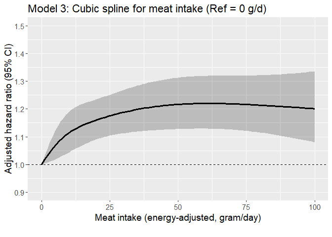
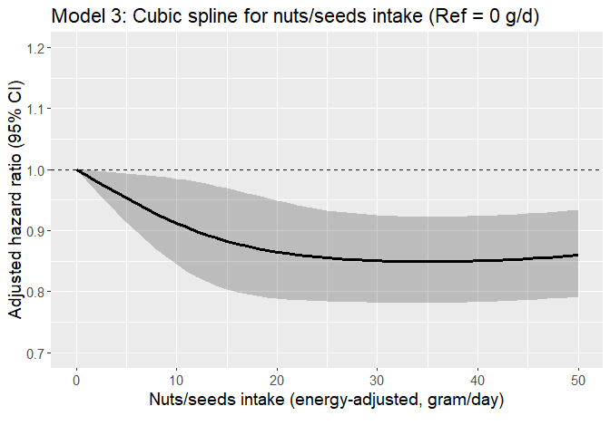

Egg CVD study (IHD as outcome)
================

## Aim

- Assess if the risk of developing CVD varies according to levels of
  meat intake among regular egg consumers with hyperlipidemia using the
  AHS-2 cohort linked with Medicare data

- Assess the interaction between race and egg intake on the incidence of
  CVD among those with hyperlipidemia.

## Datasets

- Medicare data
  - For details regarding Medicare data, see [AHS-2 Medicare
    Linkage](https://github.com/keijioda/ahs_medicare_linkage/blob/main/summary.md)
    repository.

  - Master Beneficiary Summary File (MBSF), 2008-2022

    - Contains beneficiary characteristics and enrollment information

  - Chronic Conditions file (CC), 2008-2022

    - Contains the first occurrence date of 27 or 30 specific chronic
      conditions
      - 27 chronic conditions for data 2008-2020
      - 30 chronic conditions for data 2021-2022
    - Used to identify prevalent/incident cases of cardio-vascular
      diseases and
    - to identify comorbidities

  - Both files include n = 46,897 unique subjects across years, after
    excluding

    - Gender/DOB mismatch with AHS-2 data
    - Dupulicate beneficiary IDs and SSNs
- For AHS-2 baseline data, including food-frequency questionnaire (FFQ),
  a guided multiple imputation was used to fill missing data ([Fraser &
  Yan, 2007](https://pubmed.ncbi.nlm.nih.gov/17259903/))
  - Five imputed data sets were generated for subsequent analyses (See
    the analysis section for more details)
  - For descriptive analysis, we present results from the first imputed
    data
- AHS-2 baseline imputed data \#1: n = 41,037
  - ~~Among this, n = 383 subjects were excluded because they opted out
    of the study~~
  - ~~After removing opt-outs, there were n = 87,668 subjects~~
  - Opt-outs were already excluded
- After merging Medicare and AHS-2 data, there were n = 41,037 subjects.

## Inclusion/exclusion criteria

- Medicare beneficiaries who did not reach the age of 65 between 2008
  and 2020 (e.g., younger beneficiaries with disabilities or end-stage
  renal disease) were excluded (n = 1105), resulting n = 39,932.

- Subjects with extreme BMI (\<16 or \>60), according to AHS
  questionnaire, were excluded (n = 82), resulting n = 39,850.

- Unverified dates of deaths

  - Medicare data include a variable (`VALID_DEATH_DT_SW`) indicating
    whether a beneficiary’s day of death has been verified by the Social
    Security Administration or the Railroad Retirement Board.
  - There were 23 unverified death dates. Excluding these resulted n =
    39,827.

- Prevalent cases of ischemic HD

  - If the first diagnosis was made on or before AHS-2 enrollment date,
    consider it as a prevalent case
  - n = 2,654 prevalent cases were excluded, resulting n = 37,173
    subjects

## Outcome

- The outcome is ischemic HD
- Among n = 37,173 subjects, there were 8,218 incident cases (22.1%) of
  ischemic HD
- Age at diagnosis was calculated using `ISCHEMICHEART_EVER` variable in
  the Chronic Condition Warehouse (CCW) data. This variable shows the
  date when the beneficiary first met the criteria after January 1,
  1999.
  - For 27 CCW chronic conditions algorithms, see
    [here](https://www2.ccwdata.org/documents/10280/19139421/ccw-chronic-condition-algorithms.pdf)
  - For 30 CCW chronic conditions algorithms, see
    [here](https://www2.ccwdata.org/web/guest/condition-categories-chronic)
- Among these incident IHD cases, the mean (SD) age of diagnosis was
  79.0 (8.4) years. The median age of diagnosis was 79.1 years.

## Comorbidity

## Dietary variables

## Descriptive table

- The descriptive table by IHD incidence:

|  | level | Overall | Non-case | Case | p | test |
|:---|:---|:---|:---|:---|:---|:---|
| n |  | 37173 | 28955 | 8218 |  |  |
| agecat (%) | 65-69 | 6676 (18.1) | 6232 (21.7) | 444 ( 5.4) | \<0.001 |  |
|  | 70-74 | 6931 (18.8) | 6074 (21.1) | 857 (10.5) |  |  |
|  | 75-79 | 6244 (16.9) | 5093 (17.7) | 1151 (14.1) |  |  |
|  | 80-84 | 5467 (14.8) | 4070 (14.2) | 1397 (17.1) |  |  |
|  | 85-89 | 4577 (12.4) | 3113 (10.8) | 1464 (17.9) |  |  |
|  | 90-94 | 3597 ( 9.7) | 2229 ( 7.8) | 1368 (16.7) |  |  |
|  | 95+ | 3452 ( 9.3) | 1942 ( 6.8) | 1510 (18.4) |  |  |
| bene_age_at_end_2020 (mean (SD)) |  | 80.13 (10.11) | 78.57 (9.65) | 85.66 (9.76) | \<0.001 |  |
| bene_sex_F (%) | M | 13244 (35.6) | 9757 (33.7) | 3487 (42.4) | \<0.001 |  |
|  | F | 23929 (64.4) | 19198 (66.3) | 4731 (57.6) |  |  |
| rti_race3 (%) | NH White | 27375 (73.6) | 20775 (71.7) | 6600 (80.3) | \<0.001 |  |
|  | Black | 7207 (19.4) | 5950 (20.5) | 1257 (15.3) |  |  |
|  | Other | 2591 ( 7.0) | 2230 ( 7.7) | 361 ( 4.4) |  |  |
| marital (%) | Married | 27447 (73.8) | 21607 (74.6) | 5840 (71.1) | \<0.001 |  |
|  | Never | 1320 ( 3.6) | 1071 ( 3.7) | 249 ( 3.0) |  |  |
|  | Div/Wid | 8406 (22.6) | 6277 (21.7) | 2129 (25.9) |  |  |
| educyou (%) | HSch & below | 7712 (20.7) | 5686 (19.6) | 2026 (24.7) | \<0.001 |  |
|  | Some College | 14804 (39.8) | 11591 (40.0) | 3213 (39.1) |  |  |
|  | Bachelors + | 14657 (39.4) | 11678 (40.3) | 2979 (36.2) |  |  |
| vegstat (%) | Vegan | 3120 ( 8.4) | 2503 ( 8.6) | 617 ( 7.5) | \<0.001 |  |
|  | Lacto-ovo | 11999 (32.3) | 9388 (32.4) | 2611 (31.8) |  |  |
|  | Semi | 2051 ( 5.5) | 1559 ( 5.4) | 492 ( 6.0) |  |  |
|  | Pesco | 3534 ( 9.5) | 2792 ( 9.6) | 742 ( 9.0) |  |  |
|  | Non-veg | 16469 (44.3) | 12713 (43.9) | 3756 (45.7) |  |  |
| bmicat (%) | Normal | 14374 (38.7) | 11589 (40.0) | 2785 (33.9) | \<0.001 |  |
|  | Overweight | 13558 (36.5) | 10450 (36.1) | 3108 (37.8) |  |  |
|  | Obese | 9241 (24.9) | 6916 (23.9) | 2325 (28.3) |  |  |
| bmi (mean (SD)) |  | 27.21 (5.46) | 27.04 (5.43) | 27.80 (5.55) | \<0.001 |  |
| exercise (%) | None | 7843 (21.1) | 5644 (19.5) | 2199 (26.8) | \<0.001 |  |
|  | ≤0.5 hrs/wk | 9152 (24.6) | 7256 (25.1) | 1896 (23.1) |  |  |
|  | 0.5\<-2 hrs/wk | 9958 (26.8) | 7960 (27.5) | 1998 (24.3) |  |  |
|  | \>2 hrs/wk | 10220 (27.5) | 8095 (28.0) | 2125 (25.9) |  |  |
| sleephrs (%) | \<= 5 hrs | 3610 ( 9.7) | 2802 ( 9.7) | 808 ( 9.8) | \<0.001 |  |
|  | 6 hrs | 8131 (21.9) | 6379 (22.0) | 1752 (21.3) |  |  |
|  | 7 hrs | 13592 (36.6) | 10835 (37.4) | 2757 (33.5) |  |  |
|  | 8 hrs | 9817 (26.4) | 7456 (25.8) | 2361 (28.7) |  |  |
|  | \>= 9 hrs | 2023 ( 5.4) | 1483 ( 5.1) | 540 ( 6.6) |  |  |
| smokecat6 (%) | A_Never | 29720 (80.0) | 23380 (80.7) | 6340 (77.1) | \<0.001 |  |
|  | B_QuitYrs30Plus | 3025 ( 8.1) | 2153 ( 7.4) | 872 (10.6) |  |  |
|  | C_QuitYrs21To30 | 1927 ( 5.2) | 1506 ( 5.2) | 421 ( 5.1) |  |  |
|  | D_QuitYrs11To20 | 1290 ( 3.5) | 990 ( 3.4) | 300 ( 3.7) |  |  |
|  | E_QuitYrs6To10 | 454 ( 1.2) | 346 ( 1.2) | 108 ( 1.3) |  |  |
|  | F_QuitYrsLesOneTo5YearsNcur | 757 ( 2.0) | 580 ( 2.0) | 177 ( 2.2) |  |  |
| alccat (%) | Never | 35320 (95.0) | 27446 (94.8) | 7874 (95.8) | \<0.001 |  |
|  | Current | 1853 ( 5.0) | 1509 ( 5.2) | 344 ( 4.2) |  |  |
| como_depress (%) | No | 36704 (98.7) | 28736 (99.2) | 7968 (97.0) | \<0.001 |  |
|  | Yes | 469 ( 1.3) | 219 ( 0.8) | 250 ( 3.0) |  |  |
| como_disab (%) | No | 33346 (89.7) | 27227 (94.0) | 6119 (74.5) | \<0.001 |  |
|  | Yes | 3827 (10.3) | 1728 ( 6.0) | 2099 (25.5) |  |  |
| como_diabetes (%) | No | 36414 (98.0) | 28654 (99.0) | 7760 (94.4) | \<0.001 |  |
|  | Yes | 759 ( 2.0) | 301 ( 1.0) | 458 ( 5.6) |  |  |
| como_hypert (%) | No | 34784 (93.6) | 28005 (96.7) | 6779 (82.5) | \<0.001 |  |
|  | Yes | 2389 ( 6.4) | 950 ( 3.3) | 1439 (17.5) |  |  |
| como_hyperl (%) | No | 35355 (95.1) | 28198 (97.4) | 7157 (87.1) | \<0.001 |  |
|  | Yes | 1818 ( 4.9) | 757 ( 2.6) | 1061 (12.9) |  |  |
| como_resp (%) | No | 36628 (98.5) | 28728 (99.2) | 7900 (96.1) | \<0.001 |  |
|  | Yes | 545 ( 1.5) | 227 ( 0.8) | 318 ( 3.9) |  |  |
| como_anemia (%) | No | 35866 (96.5) | 28400 (98.1) | 7466 (90.8) | \<0.001 |  |
|  | Yes | 1307 ( 3.5) | 555 ( 1.9) | 752 ( 9.2) |  |  |
| como_kidney (%) | No | 37021 (99.6) | 28896 (99.8) | 8125 (98.9) | \<0.001 |  |
|  | Yes | 152 ( 0.4) | 59 ( 0.2) | 93 ( 1.1) |  |  |
| como_hypoth (%) | No | 36256 (97.5) | 28564 (98.6) | 7692 (93.6) | \<0.001 |  |
|  | Yes | 917 ( 2.5) | 391 ( 1.4) | 526 ( 6.4) |  |  |
| como_cancers (%) | No | 36632 (98.5) | 28725 (99.2) | 7907 (96.2) | \<0.001 |  |
|  | Yes | 541 ( 1.5) | 230 ( 0.8) | 311 ( 3.8) |  |  |
| eggs_gram_ea_5 (%) | None | 10023 (27.0) | 7842 (27.1) | 2181 (26.5) | 0.492 |  |
|  | \<4 g/d | 8018 (21.6) | 6271 (21.7) | 1747 (21.3) |  |  |
|  | 4-\<10 g/d | 7614 (20.5) | 5936 (20.5) | 1678 (20.4) |  |  |
|  | 10-\<23 g/d | 6858 (18.4) | 5307 (18.3) | 1551 (18.9) |  |  |
|  | 23+ g/d | 4660 (12.5) | 3599 (12.4) | 1061 (12.9) |  |  |
| eggs_gram_ea (mean (SD)) |  | 10.00 (15.94) | 9.91 (15.85) | 10.33 (16.25) | 0.034 |  |
| meat_gram_ea (mean (SD)) |  | 14.76 (26.13) | 14.76 (26.27) | 14.76 (25.64) | 0.996 |  |
| fish_gram_ea (mean (SD)) |  | 9.12 (16.40) | 9.24 (16.85) | 8.67 (14.69) | 0.005 |  |
| alldairy2_gram_ea (mean (SD)) |  | 147.35 (185.12) | 145.55 (184.95) | 153.72 (185.60) | \<0.001 |  |
| totalveg_gram_ea (mean (SD)) |  | 302.29 (179.52) | 302.74 (178.74) | 300.70 (182.24) | 0.363 |  |
| fruits_gram_ea (mean (SD)) |  | 321.62 (222.27) | 322.25 (223.65) | 319.39 (217.35) | 0.304 |  |
| refgrains_gram_ea (mean (SD)) |  | 113.28 (115.57) | 115.01 (116.16) | 107.19 (113.28) | \<0.001 |  |
| whole_mixed_grains_gram_ea (mean (SD)) |  | 255.34 (188.41) | 254.10 (188.06) | 259.71 (189.58) | 0.017 |  |
| nutsseeds_gram_ea (mean (SD)) |  | 23.36 (20.23) | 23.17 (20.01) | 24.06 (20.98) | \<0.001 |  |
| legumes_gram_ea (mean (SD)) |  | 77.52 (69.31) | 78.10 (69.36) | 75.47 (69.07) | 0.002 |  |

- The descriptive table by egg intake (5 groups):

|  | level | Overall | None | \<4 g/d | 4-\<10 g/d | 10-\<23 g/d | 23+ g/d | p | test |
|:---|:---|:---|:---|:---|:---|:---|:---|:---|:---|
| n |  | 37173 | 10023 | 8018 | 7614 | 6858 | 4660 |  |  |
| IHD_YN (%) | No | 28955 (77.9) | 7842 (78.2) | 6271 (78.2) | 5936 (78.0) | 5307 (77.4) | 3599 (77.2) | 0.492 |  |
|  | Yes | 8218 (22.1) | 2181 (21.8) | 1747 (21.8) | 1678 (22.0) | 1551 (22.6) | 1061 (22.8) |  |  |
| agecat (%) | 65-69 | 6676 (18.1) | 1644 (16.5) | 1431 (17.9) | 1440 (19.1) | 1264 (18.5) | 897 (19.4) | \<0.001 |  |
|  | 70-74 | 6931 (18.8) | 1797 (18.0) | 1452 (18.2) | 1481 (19.6) | 1257 (18.4) | 944 (20.4) |  |  |
|  | 75-79 | 6244 (16.9) | 1663 (16.7) | 1333 (16.7) | 1295 (17.1) | 1110 (16.3) | 843 (18.2) |  |  |
|  | 80-84 | 5467 (14.8) | 1501 (15.1) | 1164 (14.6) | 1080 (14.3) | 1019 (14.9) | 703 (15.2) |  |  |
|  | 85-89 | 4577 (12.4) | 1260 (12.6) | 994 (12.5) | 938 (12.4) | 846 (12.4) | 539 (11.7) |  |  |
|  | 90-94 | 3597 ( 9.7) | 1049 (10.5) | 801 (10.0) | 683 ( 9.0) | 673 ( 9.9) | 391 ( 8.5) |  |  |
|  | 95+ | 3452 ( 9.3) | 1052 (10.6) | 803 (10.1) | 641 ( 8.5) | 650 ( 9.5) | 306 ( 6.6) |  |  |
| bene_age_at_end_2020 (mean (SD)) |  | 80.13 (10.11) | 80.78 (10.27) | 80.40 (10.26) | 79.64 (9.94) | 80.20 (10.20) | 79.01 (9.49) | \<0.001 |  |
| bene_sex_F (%) | M | 13244 (35.6) | 3509 (35.0) | 2479 (30.9) | 2865 (37.6) | 2473 (36.1) | 1918 (41.2) | \<0.001 |  |
|  | F | 23929 (64.4) | 6514 (65.0) | 5539 (69.1) | 4749 (62.4) | 4385 (63.9) | 2742 (58.8) |  |  |
| rti_race3 (%) | NH White | 27375 (73.6) | 7253 (72.4) | 5528 (68.9) | 5661 (74.3) | 5252 (76.6) | 3681 (79.0) | \<0.001 |  |
|  | Black | 7207 (19.4) | 2129 (21.2) | 1836 (22.9) | 1393 (18.3) | 1130 (16.5) | 719 (15.4) |  |  |
|  | Other | 2591 ( 7.0) | 641 ( 6.4) | 654 ( 8.2) | 560 ( 7.4) | 476 ( 6.9) | 260 ( 5.6) |  |  |
| marital (%) | Married | 27447 (73.8) | 7344 (73.3) | 5781 (72.1) | 5740 (75.4) | 5159 (75.2) | 3423 (73.5) | \<0.001 |  |
|  | Never | 1320 ( 3.6) | 416 ( 4.2) | 318 ( 4.0) | 226 ( 3.0) | 203 ( 3.0) | 157 ( 3.4) |  |  |
|  | Div/Wid | 8406 (22.6) | 2263 (22.6) | 1919 (23.9) | 1648 (21.6) | 1496 (21.8) | 1080 (23.2) |  |  |
| educyou (%) | HSch & below | 7712 (20.7) | 1945 (19.4) | 1742 (21.7) | 1575 (20.7) | 1385 (20.2) | 1065 (22.9) | \<0.001 |  |
|  | Some College | 14804 (39.8) | 3845 (38.4) | 3140 (39.2) | 2991 (39.3) | 2804 (40.9) | 2024 (43.4) |  |  |
|  | Bachelors + | 14657 (39.4) | 4233 (42.2) | 3136 (39.1) | 3048 (40.0) | 2669 (38.9) | 1571 (33.7) |  |  |
| vegstat (%) | Vegan | 3120 ( 8.4) | 3120 (31.1) | 0 ( 0.0) | 0 ( 0.0) | 0 ( 0.0) | 0 ( 0.0) | \<0.001 |  |
|  | Lacto-ovo | 11999 (32.3) | 3921 (39.1) | 3077 (38.4) | 2313 (30.4) | 1780 (26.0) | 908 (19.5) |  |  |
|  | Semi | 2051 ( 5.5) | 360 ( 3.6) | 545 ( 6.8) | 535 ( 7.0) | 359 ( 5.2) | 252 ( 5.4) |  |  |
|  | Pesco | 3534 ( 9.5) | 1007 (10.0) | 876 (10.9) | 722 ( 9.5) | 625 ( 9.1) | 304 ( 6.5) |  |  |
|  | Non-veg | 16469 (44.3) | 1615 (16.1) | 3520 (43.9) | 4044 (53.1) | 4094 (59.7) | 3196 (68.6) |  |  |
| bmicat (%) | Normal | 14374 (38.7) | 5274 (52.6) | 3207 (40.0) | 2661 (34.9) | 2124 (31.0) | 1108 (23.8) | \<0.001 |  |
|  | Overweight | 13558 (36.5) | 3154 (31.5) | 2994 (37.3) | 2955 (38.8) | 2693 (39.3) | 1762 (37.8) |  |  |
|  | Obese | 9241 (24.9) | 1595 (15.9) | 1817 (22.7) | 1998 (26.2) | 2041 (29.8) | 1790 (38.4) |  |  |
| bmi (mean (SD)) |  | 27.21 (5.46) | 25.57 (4.97) | 26.96 (5.25) | 27.60 (5.39) | 28.04 (5.48) | 29.28 (5.88) | \<0.001 |  |
| exercise (%) | None | 7843 (21.1) | 1881 (18.8) | 1676 (20.9) | 1635 (21.5) | 1435 (20.9) | 1216 (26.1) | \<0.001 |  |
|  | ≤0.5 hrs/wk | 9152 (24.6) | 2108 (21.0) | 1885 (23.5) | 2060 (27.1) | 1823 (26.6) | 1276 (27.4) |  |  |
|  | 0.5\<-2 hrs/wk | 9958 (26.8) | 2724 (27.2) | 2165 (27.0) | 2020 (26.5) | 1900 (27.7) | 1149 (24.7) |  |  |
|  | \>2 hrs/wk | 10220 (27.5) | 3310 (33.0) | 2292 (28.6) | 1899 (24.9) | 1700 (24.8) | 1019 (21.9) |  |  |
| sleephrs (%) | \<= 5 hrs | 3610 ( 9.7) | 914 ( 9.1) | 835 (10.4) | 727 ( 9.5) | 655 ( 9.6) | 479 (10.3) | 0.001 |  |
|  | 6 hrs | 8131 (21.9) | 2118 (21.1) | 1800 (22.4) | 1718 (22.6) | 1463 (21.3) | 1032 (22.1) |  |  |
|  | 7 hrs | 13592 (36.6) | 3700 (36.9) | 2872 (35.8) | 2813 (36.9) | 2543 (37.1) | 1664 (35.7) |  |  |
|  | 8 hrs | 9817 (26.4) | 2761 (27.5) | 2078 (25.9) | 1973 (25.9) | 1818 (26.5) | 1187 (25.5) |  |  |
|  | \>= 9 hrs | 2023 ( 5.4) | 530 ( 5.3) | 433 ( 5.4) | 383 ( 5.0) | 379 ( 5.5) | 298 ( 6.4) |  |  |
| smokecat6 (%) | A_Never | 29720 (80.0) | 8275 (82.6) | 6651 (83.0) | 6019 (79.1) | 5427 (79.1) | 3348 (71.8) | \<0.001 |  |
|  | B_QuitYrs30Plus | 3025 ( 8.1) | 803 ( 8.0) | 558 ( 7.0) | 617 ( 8.1) | 572 ( 8.3) | 475 (10.2) |  |  |
|  | C_QuitYrs21To30 | 1927 ( 5.2) | 486 ( 4.8) | 366 ( 4.6) | 393 ( 5.2) | 374 ( 5.5) | 308 ( 6.6) |  |  |
|  | D_QuitYrs11To20 | 1290 ( 3.5) | 260 ( 2.6) | 237 ( 3.0) | 299 ( 3.9) | 252 ( 3.7) | 242 ( 5.2) |  |  |
|  | E_QuitYrs6To10 | 454 ( 1.2) | 94 ( 0.9) | 72 ( 0.9) | 107 ( 1.4) | 82 ( 1.2) | 99 ( 2.1) |  |  |
|  | F_QuitYrsLesOneTo5YearsNcur | 757 ( 2.0) | 105 ( 1.0) | 134 ( 1.7) | 179 ( 2.4) | 151 ( 2.2) | 188 ( 4.0) |  |  |
| alccat (%) | Never | 35320 (95.0) | 9830 (98.1) | 7699 (96.0) | 7161 (94.1) | 6400 (93.3) | 4230 (90.8) | \<0.001 |  |
|  | Current | 1853 ( 5.0) | 193 ( 1.9) | 319 ( 4.0) | 453 ( 5.9) | 458 ( 6.7) | 430 ( 9.2) |  |  |
| como_depress (%) | No | 36704 (98.7) | 9898 (98.8) | 7914 (98.7) | 7525 (98.8) | 6764 (98.6) | 4603 (98.8) | 0.856 |  |
|  | Yes | 469 ( 1.3) | 125 ( 1.2) | 104 ( 1.3) | 89 ( 1.2) | 94 ( 1.4) | 57 ( 1.2) |  |  |
| como_disab (%) | No | 33346 (89.7) | 8844 (88.2) | 7193 (89.7) | 6893 (90.5) | 6145 (89.6) | 4271 (91.7) | \<0.001 |  |
|  | Yes | 3827 (10.3) | 1179 (11.8) | 825 (10.3) | 721 ( 9.5) | 713 (10.4) | 389 ( 8.3) |  |  |
| como_diabetes (%) | No | 36414 (98.0) | 9861 (98.4) | 7870 (98.2) | 7462 (98.0) | 6693 (97.6) | 4528 (97.2) | \<0.001 |  |
|  | Yes | 759 ( 2.0) | 162 ( 1.6) | 148 ( 1.8) | 152 ( 2.0) | 165 ( 2.4) | 132 ( 2.8) |  |  |
| como_hypert (%) | No | 34784 (93.6) | 9426 (94.0) | 7500 (93.5) | 7118 (93.5) | 6361 (92.8) | 4379 (94.0) | 0.013 |  |
|  | Yes | 2389 ( 6.4) | 597 ( 6.0) | 518 ( 6.5) | 496 ( 6.5) | 497 ( 7.2) | 281 ( 6.0) |  |  |
| como_hyperl (%) | No | 35355 (95.1) | 9534 (95.1) | 7619 (95.0) | 7229 (94.9) | 6502 (94.8) | 4471 (95.9) | 0.064 |  |
|  | Yes | 1818 ( 4.9) | 489 ( 4.9) | 399 ( 5.0) | 385 ( 5.1) | 356 ( 5.2) | 189 ( 4.1) |  |  |
| como_resp (%) | No | 36628 (98.5) | 9886 (98.6) | 7894 (98.5) | 7511 (98.6) | 6742 (98.3) | 4595 (98.6) | 0.368 |  |
|  | Yes | 545 ( 1.5) | 137 ( 1.4) | 124 ( 1.5) | 103 ( 1.4) | 116 ( 1.7) | 65 ( 1.4) |  |  |
| como_anemia (%) | No | 35866 (96.5) | 9612 (95.9) | 7739 (96.5) | 7366 (96.7) | 6617 (96.5) | 4532 (97.3) | 0.001 |  |
|  | Yes | 1307 ( 3.5) | 411 ( 4.1) | 279 ( 3.5) | 248 ( 3.3) | 241 ( 3.5) | 128 ( 2.7) |  |  |
| como_kidney (%) | No | 37021 (99.6) | 9992 (99.7) | 7991 (99.7) | 7572 (99.4) | 6831 (99.6) | 4635 (99.5) | 0.057 |  |
|  | Yes | 152 ( 0.4) | 31 ( 0.3) | 27 ( 0.3) | 42 ( 0.6) | 27 ( 0.4) | 25 ( 0.5) |  |  |
| como_hypoth (%) | No | 36256 (97.5) | 9769 (97.5) | 7804 (97.3) | 7423 (97.5) | 6680 (97.4) | 4580 (98.3) | 0.011 |  |
|  | Yes | 917 ( 2.5) | 254 ( 2.5) | 214 ( 2.7) | 191 ( 2.5) | 178 ( 2.6) | 80 ( 1.7) |  |  |
| como_cancers (%) | No | 36632 (98.5) | 9868 (98.5) | 7893 (98.4) | 7510 (98.6) | 6760 (98.6) | 4601 (98.7) | 0.591 |  |
|  | Yes | 541 ( 1.5) | 155 ( 1.5) | 125 ( 1.6) | 104 ( 1.4) | 98 ( 1.4) | 59 ( 1.3) |  |  |
| eggs_gram_ea (mean (SD)) |  | 10.00 (15.94) | 0.00 (0.00) | 2.94 (0.71) | 6.37 (1.56) | 17.27 (3.64) | 38.89 (27.72) | \<0.001 |  |
| meat_gram_ea (mean (SD)) |  | 14.76 (26.13) | 4.48 (15.44) | 11.75 (21.21) | 16.95 (25.92) | 21.04 (29.19) | 29.22 (35.96) | \<0.001 |  |
| fish_gram_ea (mean (SD)) |  | 9.12 (16.40) | 4.58 (14.59) | 9.11 (16.71) | 10.32 (15.80) | 11.80 (16.39) | 12.98 (18.19) | \<0.001 |  |
| alldairy2_gram_ea (mean (SD)) |  | 147.35 (185.12) | 62.41 (137.93) | 149.07 (184.65) | 179.81 (191.61) | 200.52 (189.77) | 195.84 (192.52) | \<0.001 |  |
| totalveg_gram_ea (mean (SD)) |  | 302.29 (179.52) | 342.90 (210.40) | 302.39 (174.90) | 284.41 (161.11) | 283.90 (155.12) | 271.08 (160.94) | \<0.001 |  |
| fruits_gram_ea (mean (SD)) |  | 321.62 (222.27) | 397.44 (246.18) | 340.00 (230.63) | 294.88 (200.72) | 276.02 (186.32) | 237.69 (176.45) | \<0.001 |  |
| refgrains_gram_ea (mean (SD)) |  | 113.28 (115.57) | 98.13 (115.25) | 117.27 (118.12) | 118.76 (115.83) | 123.58 (114.44) | 114.90 (109.81) | \<0.001 |  |
| whole_mixed_grains_gram_ea (mean (SD)) |  | 255.34 (188.41) | 328.66 (213.04) | 263.11 (188.30) | 228.01 (170.94) | 213.45 (150.71) | 190.55 (154.04) | \<0.001 |  |
| nutsseeds_gram_ea (mean (SD)) |  | 23.36 (20.23) | 28.15 (22.51) | 23.43 (20.38) | 21.56 (19.06) | 20.94 (17.85) | 19.49 (17.93) | \<0.001 |  |
| legumes_gram_ea (mean (SD)) |  | 77.52 (69.31) | 94.29 (83.01) | 79.70 (70.85) | 70.77 (58.96) | 69.13 (57.35) | 61.03 (57.26) | \<0.001 |  |

## Cox models

- To examine risk factors associated with incident acute MI, we employed
  the Cox proportional hazards model with attained age as the time scale
  - Age at entry was calculated based on the return date of AHS-2
    questionnaire
  - Those who died during the follow-up were censored at the date of
    death verified in Medicare data
  - Those who were diagnosed with IHD after the study enrollment were
    identified as incident cases and their age at diagnosis was
    calculated.
    - The mean follow-up years was 16.2 years (median 18.3 years)
    - The total person-years of follow-up was 601,694 years
  - The main exposure variable of interest was energy-adjusted egg
    intake, gram/day. Subjects were classified into 4 egg intake groups
    as shown in the descriptive table, and egg intake was entered into
    the models as categorical
    - This is because there was a non-linear association between egg
      intake and IHD when egg intake was entered as continuous (see
      below)
  - All other dietary variables were entered into the models as
    continuous. Their hazard ratios were estimated for an increment of
    100 gram/day

### Restricted cubic spline for dietary intake

- In the output above, egg intake was entered into the models as
  categorical. In the following analysis, we used restricted cubic
  splines to model a nonlinear association between egg intake as
  continuous and IHD.
  - The nonlinear terms of egg intake were significant (p = 0.0094)
  - To visualize this nonlinear association, we have plotted hazard
    ratio for egg intake (adjusting for all other covariates) with 95
    confidence intervals
  - The reference for egg intake was set to 0 gram/day to make
    comparisons easier with the table above

<!-- -->

- Hazard ratios at selected points of egg intake and their 95 CI are
  shown below:

| Egg intake (g/d) |   HR | Lower | Upper |
|-----------------:|-----:|------:|------:|
|                5 | 0.96 |  0.90 |  1.02 |
|               10 | 0.93 |  0.87 |  0.98 |
|               15 | 0.91 |  0.85 |  0.97 |
|               20 | 0.90 |  0.84 |  0.96 |
|               30 | 0.89 |  0.83 |  0.96 |
|               50 | 0.91 |  0.84 |  0.99 |

- When examined for non-linearity, meat and nuts/seed intake also showed
  significant non-linear associations with IHD. The plots of adjusted
  HRs are shown below.

<!-- -->

| Meat intake (g/d) |   HR | Lower | Upper |
|------------------:|-----:|------:|------:|
|                25 | 1.18 |  1.10 |  1.25 |
|                50 | 1.22 |  1.13 |  1.31 |
|                75 | 1.22 |  1.12 |  1.32 |
|               100 | 1.20 |  1.08 |  1.34 |
|               200 | 1.14 |  0.85 |  1.53 |

<!-- -->

| Nuts/seeds intake (g/d) |   HR | Lower | Upper |
|------------------------:|-----:|------:|------:|
|                      10 | 0.91 |  0.84 |  0.99 |
|                      20 | 0.87 |  0.79 |  0.95 |
|                      30 | 0.85 |  0.78 |  0.93 |
|                      40 | 0.85 |  0.78 |  0.92 |
|                      50 | 0.86 |  0.79 |  0.93 |

### Interaction between egg and meat intake

- There were no significant interactions between egg and meat intake (p
  = 0.20)

### Interaction between egg and race

- There were no significant interactions between egg and RTI race (p =
  0.07)

### Hyperlipidemia as time-dependent

- To examine if the effect of egg intake may be dependent on
  hyperlipidemia, we have used hyperlipidemia as a time-dependent
  variable in the Cox model (after removing prevalent hyperlipidemia
  status from the model)
  - There were no significant interactions between egg intake and
    time-dependent hyperlipidemia status (p = 0.55, Model 3)
