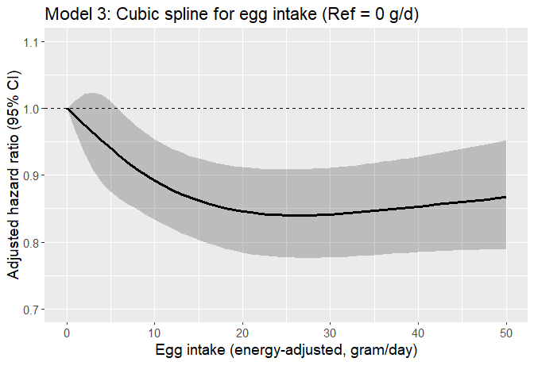

Egg CVD study (stroke/TIA as outcome)
================

## Aim

- Assess if the risk of developing CVD varies according to levels of
  meat intake among regular egg consumers with hyperlipidemia using the
  AHS-2 cohort linked with Medicare data

- Assess the interaction between race and egg intake on the incidence of
  CVD among those with hyperlipidemia.

## Datasets

- Medicare data
  - For details regarding Medicare data, see [AHS-2 Medicare
    Linkage](https://github.com/keijioda/ahs_medicare_linkage/blob/main/summary.md)
    repository.

  - Master Beneficiary Summary File (MBSF), 2008-2022

    - Contains beneficiary characteristics and enrollment information

  - Chronic Conditions file (CC), 2008-2022

    - Contains the first occurrence date of 27 or 30 specific chronic
      conditions
      - 27 chronic conditions for data 2008-2020
      - 30 chronic conditions for data 2021-2022
    - Used to identify prevalent/incident cases of cardio-vascular
      diseases and
    - to identify comorbidities

  - Both files include n = 46,897 unique subjects across years, after
    excluding

    - Gender/DOB mismatch with AHS-2 data
    - Dupulicate beneficiary IDs and SSNs
- For AHS-2 baseline data, including food-frequency questionnaire (FFQ),
  a guided multiple imputation was used to fill missing data ([Fraser &
  Yan, 2007](https://pubmed.ncbi.nlm.nih.gov/17259903/))
  - Five imputed data sets were generated for subsequent analyses (See
    the analysis section for more details)
  - For descriptive analysis, we present results from the first imputed
    data
- AHS-2 baseline imputed data \#1: n = 41,037
  - ~~Among this, n = 383 subjects were excluded because they opted out
    of the study~~
  - ~~After removing opt-outs, there were n = 87,668 subjects~~
  - Opt-outs were already excluded
- After merging Medicare and AHS-2 data, there were n = 41,037 subjects.

## Inclusion/exclusion criteria

- Medicare beneficiaries who did not reach the age of 65 between 2008
  and 2020 (e.g., younger beneficiaries with disabilities or end-stage
  renal disease) were excluded (n = 1105), resulting n = 39,932.

- Subjects with extreme BMI (\<16 or \>60), according to AHS
  questionnaire, were excluded (n = 82), resulting n = 39,850.

- Unverified dates of deaths

  - Medicare data include a variable (`VALID_DEATH_DT_SW`) indicating
    whether a beneficiary’s day of death has been verified by the Social
    Security Administration or the Railroad Retirement Board.
  - There were 23 unverified death dates. Excluding these resulted n =
    39,827.

- Prevalent cases of stroke/TIA

  - If the first diagnosis was made on or before AHS-2 enrollment date,
    consider it as a prevalent case
  - n = 670 prevalent cases were exluded, resulting n = 39,157 subjects

## Outcome

- The outcome is stroke/TIA
- Among n = 39,157 subjects, there were 6042 incident cases (15.4%) of
  stroke/TIA
- Age at diagnosis was calculated using `STOKE_TIA_EVER` variable in the
  Chronic Condition Warehouse (CCW) data. This variable shows the date
  when the beneficiary first met the criteria after January 1, 1999.
  - For 27 CCW chronic conditions algorithms, see
    [here](https://www2.ccwdata.org/documents/10280/19139421/ccw-chronic-condition-algorithms.pdf)
  - For 30 CCW chronic conditions algorithms, see
    [here](https://www2.ccwdata.org/web/guest/condition-categories-chronic)
- Among these incident stoke/TIA cases, the mean (SD) age of diagnosis
  was 80.8 (8.2) years. The median age of diagnosis was 81.1 years.

## Comorbidity

## Dietary variables

## Descriptive table

- The descriptive table by stroke incidence:

|  | level | Overall | Non-case | Case | p | test |
|:---|:---|:---|:---|:---|:---|:---|
| n |  | 39157 | 33115 | 6042 |  |  |
| agecat (%) | 65-69 | 6677 (17.2) | 6385 (19.4) | 292 ( 4.9) | \<0.001 |  |
|  | 70-74 | 6944 (17.8) | 6382 (19.4) | 562 ( 9.3) |  |  |
|  | 75-79 | 6286 (16.1) | 5487 (16.7) | 799 (13.3) |  |  |
|  | 80-84 | 5595 (14.4) | 4666 (14.2) | 929 (15.4) |  |  |
|  | 85-89 | 4945 (12.7) | 3796 (11.5) | 1149 (19.1) |  |  |
|  | 90-94 | 4142 (10.6) | 3054 ( 9.3) | 1088 (18.1) |  |  |
|  | 95+ | 4339 (11.1) | 3138 ( 9.5) | 1201 (20.0) |  |  |
| bene_age_at_end_2020 (mean (SD)) |  | 80.84 (10.43) | 79.83 (10.24) | 86.35 (9.70) | \<0.001 |  |
| bene_sex_F (%) | M | 14168 (36.2) | 11975 (36.2) | 2193 (36.3) | 0.853 |  |
|  | F | 24989 (63.8) | 21140 (63.8) | 3849 (63.7) |  |  |
| rti_race3 (%) | NH White | 29024 (74.1) | 24262 (73.3) | 4762 (78.8) | \<0.001 |  |
|  | Black | 7483 (19.1) | 6476 (19.6) | 1007 (16.7) |  |  |
|  | Other | 2650 ( 6.8) | 2377 ( 7.2) | 273 ( 4.5) |  |  |
| marital (%) | Married | 28697 (73.3) | 24472 (73.9) | 4225 (69.9) | \<0.001 |  |
|  | Never | 1356 ( 3.5) | 1178 ( 3.6) | 178 ( 2.9) |  |  |
|  | Div/Wid | 9104 (23.2) | 7465 (22.5) | 1639 (27.1) |  |  |
| educyou (%) | HSch & below | 8387 (21.4) | 6903 (20.8) | 1484 (24.6) | \<0.001 |  |
|  | Some College | 15514 (39.6) | 13187 (39.8) | 2327 (38.5) |  |  |
|  | Bachelors + | 15256 (39.0) | 13025 (39.3) | 2231 (36.9) |  |  |
| vegstat (%) | Vegan | 3248 ( 8.3) | 2717 ( 8.2) | 531 ( 8.8) | \<0.001 |  |
|  | Lacto-ovo | 12611 (32.2) | 10537 (31.8) | 2074 (34.3) |  |  |
|  | Semi | 2180 ( 5.6) | 1826 ( 5.5) | 354 ( 5.9) |  |  |
|  | Pesco | 3742 ( 9.6) | 3182 ( 9.6) | 560 ( 9.3) |  |  |
|  | Non-veg | 17376 (44.4) | 14853 (44.9) | 2523 (41.8) |  |  |
| bmicat (%) | Normal | 15115 (38.6) | 12847 (38.8) | 2268 (37.5) | 0.138 |  |
|  | Overweight | 14254 (36.4) | 12037 (36.3) | 2217 (36.7) |  |  |
|  | Obese | 9788 (25.0) | 8231 (24.9) | 1557 (25.8) |  |  |
| bmi (mean (SD)) |  | 27.22 (5.47) | 27.21 (5.48) | 27.31 (5.45) | 0.164 |  |
| exercise (%) | None | 8603 (22.0) | 6937 (20.9) | 1666 (27.6) | \<0.001 |  |
|  | ≤0.5 hrs/wk | 9528 (24.3) | 8252 (24.9) | 1276 (21.1) |  |  |
|  | 0.5\<-2 hrs/wk | 10375 (26.5) | 8863 (26.8) | 1512 (25.0) |  |  |
|  | \>2 hrs/wk | 10651 (27.2) | 9063 (27.4) | 1588 (26.3) |  |  |
| sleephrs (%) | \<= 5 hrs | 3842 ( 9.8) | 3209 ( 9.7) | 633 (10.5) | \<0.001 |  |
|  | 6 hrs | 8550 (21.8) | 7288 (22.0) | 1262 (20.9) |  |  |
|  | 7 hrs | 14185 (36.2) | 12203 (36.9) | 1982 (32.8) |  |  |
|  | 8 hrs | 10367 (26.5) | 8625 (26.0) | 1742 (28.8) |  |  |
|  | \>= 9 hrs | 2213 ( 5.7) | 1790 ( 5.4) | 423 ( 7.0) |  |  |
| smokecat6 (%) | A_Never | 31195 (79.7) | 26335 (79.5) | 4860 (80.4) | \<0.001 |  |
|  | B_QuitYrs30Plus | 3331 ( 8.5) | 2733 ( 8.3) | 598 ( 9.9) |  |  |
|  | C_QuitYrs21To30 | 2003 ( 5.1) | 1757 ( 5.3) | 246 ( 4.1) |  |  |
|  | D_QuitYrs11To20 | 1354 ( 3.5) | 1166 ( 3.5) | 188 ( 3.1) |  |  |
|  | E_QuitYrs6To10 | 481 ( 1.2) | 426 ( 1.3) | 55 ( 0.9) |  |  |
|  | F_QuitYrsLesOneTo5YearsNcur | 793 ( 2.0) | 698 ( 2.1) | 95 ( 1.6) |  |  |
| alccat (%) | Never | 37237 (95.1) | 31436 (94.9) | 5801 (96.0) | \<0.001 |  |
|  | Current | 1920 ( 4.9) | 1679 ( 5.1) | 241 ( 4.0) |  |  |
| como_depress (%) | No | 38417 (98.1) | 32619 (98.5) | 5798 (96.0) | \<0.001 |  |
|  | Yes | 740 ( 1.9) | 496 ( 1.5) | 244 ( 4.0) |  |  |
| como_disab (%) | No | 33751 (86.2) | 29468 (89.0) | 4283 (70.9) | \<0.001 |  |
|  | Yes | 5406 (13.8) | 3647 (11.0) | 1759 (29.1) |  |  |
| como_diabetes (%) | No | 37796 (96.5) | 32220 (97.3) | 5576 (92.3) | \<0.001 |  |
|  | Yes | 1361 ( 3.5) | 895 ( 2.7) | 466 ( 7.7) |  |  |
| como_hypert (%) | No | 35248 (90.0) | 30552 (92.3) | 4696 (77.7) | \<0.001 |  |
|  | Yes | 3909 (10.0) | 2563 ( 7.7) | 1346 (22.3) |  |  |
| como_hyperl (%) | No | 35992 (91.9) | 30992 (93.6) | 5000 (82.8) | \<0.001 |  |
|  | Yes | 3165 ( 8.1) | 2123 ( 6.4) | 1042 (17.2) |  |  |
| como_resp (%) | No | 38205 (97.6) | 32440 (98.0) | 5765 (95.4) | \<0.001 |  |
|  | Yes | 952 ( 2.4) | 675 ( 2.0) | 277 ( 4.6) |  |  |
| como_anemia (%) | No | 36986 (94.5) | 31649 (95.6) | 5337 (88.3) | \<0.001 |  |
|  | Yes | 2171 ( 5.5) | 1466 ( 4.4) | 705 (11.7) |  |  |
| como_kidney (%) | No | 38808 (99.1) | 32880 (99.3) | 5928 (98.1) | \<0.001 |  |
|  | Yes | 349 ( 0.9) | 235 ( 0.7) | 114 ( 1.9) |  |  |
| como_hypoth (%) | No | 37754 (96.4) | 32178 (97.2) | 5576 (92.3) | \<0.001 |  |
|  | Yes | 1403 ( 3.6) | 937 ( 2.8) | 466 ( 7.7) |  |  |
| como_cancers (%) | No | 38325 (97.9) | 32528 (98.2) | 5797 (95.9) | \<0.001 |  |
|  | Yes | 832 ( 2.1) | 587 ( 1.8) | 245 ( 4.1) |  |  |
| eggs_gram_ea_5 (%) | None | 10557 (27.0) | 8805 (26.6) | 1752 (29.0) | \<0.001 |  |
|  | \<4 g/d | 8479 (21.7) | 7090 (21.4) | 1389 (23.0) |  |  |
|  | 4-\<10 g/d | 7959 (20.3) | 6807 (20.6) | 1152 (19.1) |  |  |
|  | 10-\<23 g/d | 7246 (18.5) | 6191 (18.7) | 1055 (17.5) |  |  |
|  | 23+ g/d | 4916 (12.6) | 4222 (12.7) | 694 (11.5) |  |  |
| eggs_gram_ea (mean (SD)) |  | 10.03 (16.00) | 10.13 (16.07) | 9.45 (15.60) | 0.002 |  |
| meat_gram_ea (mean (SD)) |  | 14.73 (26.12) | 15.01 (26.32) | 13.15 (24.92) | \<0.001 |  |
| fish_gram_ea (mean (SD)) |  | 9.07 (16.32) | 9.25 (16.58) | 8.11 (14.75) | \<0.001 |  |
| alldairy2_gram_ea (mean (SD)) |  | 149.12 (187.03) | 149.51 (187.67) | 147.00 (183.52) | 0.337 |  |
| totalveg_gram_ea (mean (SD)) |  | 302.12 (178.90) | 301.70 (179.13) | 304.42 (177.64) | 0.277 |  |
| fruits_gram_ea (mean (SD)) |  | 321.51 (221.37) | 319.16 (221.15) | 334.37 (222.19) | \<0.001 |  |
| refgrains_gram_ea (mean (SD)) |  | 113.44 (116.62) | 114.24 (115.74) | 109.09 (121.24) | 0.002 |  |
| whole_mixed_grains_gram_ea (mean (SD)) |  | 256.10 (188.62) | 253.75 (188.27) | 268.98 (190.04) | \<0.001 |  |
| nutsseeds_gram_ea (mean (SD)) |  | 23.37 (20.26) | 23.13 (20.22) | 24.74 (20.39) | \<0.001 |  |
| legumes_gram_ea (mean (SD)) |  | 77.24 (69.11) | 77.30 (69.35) | 76.90 (67.77) | 0.680 |  |

- The descriptive table by egg intake (5 groups):

|  | level | Overall | None | \<4 g/d | 4-\<10 g/d | 10-\<23 g/d | 23+ g/d | p | test |
|:---|:---|:---|:---|:---|:---|:---|:---|:---|:---|
| n |  | 39157 | 10557 | 8479 | 7959 | 7246 | 4916 |  |  |
| STRK_YN (%) | No | 33115 (84.6) | 8805 (83.4) | 7090 (83.6) | 6807 (85.5) | 6191 (85.4) | 4222 (85.9) | \<0.001 |  |
|  | Yes | 6042 (15.4) | 1752 (16.6) | 1389 (16.4) | 1152 (14.5) | 1055 (14.6) | 694 (14.1) |  |  |
| agecat (%) | 65-69 | 6677 (17.2) | 1644 (15.7) | 1432 (17.0) | 1439 (18.2) | 1268 (17.6) | 894 (18.3) | \<0.001 |  |
|  | 70-74 | 6944 (17.8) | 1799 (17.1) | 1456 (17.3) | 1482 (18.8) | 1259 (17.5) | 948 (19.4) |  |  |
|  | 75-79 | 6286 (16.1) | 1673 (15.9) | 1341 (15.9) | 1303 (16.5) | 1117 (15.5) | 852 (17.5) |  |  |
|  | 80-84 | 5595 (14.4) | 1528 (14.6) | 1190 (14.1) | 1109 (14.0) | 1036 (14.4) | 732 (15.0) |  |  |
|  | 85-89 | 4945 (12.7) | 1365 (13.0) | 1062 (12.6) | 1013 (12.8) | 919 (12.8) | 586 (12.0) |  |  |
|  | 90-94 | 4142 (10.6) | 1205 (11.5) | 925 (11.0) | 776 ( 9.8) | 771 (10.7) | 465 ( 9.5) |  |  |
|  | 95+ | 4339 (11.1) | 1286 (12.2) | 1033 (12.2) | 781 ( 9.9) | 837 (11.6) | 402 ( 8.2) |  |  |
| bene_age_at_end_2020 (mean (SD)) |  | 80.84 (10.43) | 81.45 (10.53) | 81.18 (10.64) | 80.22 (10.20) | 80.96 (10.59) | 79.73 (9.86) | \<0.001 |  |
| bene_sex_F (%) | M | 14168 (36.2) | 3744 (35.5) | 2651 (31.3) | 3048 (38.3) | 2662 (36.7) | 2063 (42.0) | \<0.001 |  |
|  | F | 24989 (63.8) | 6813 (64.5) | 5828 (68.7) | 4911 (61.7) | 4584 (63.3) | 2853 (58.0) |  |  |
| rti_race3 (%) | NH White | 29024 (74.1) | 7703 (73.0) | 5911 (69.7) | 5930 (74.5) | 5570 (76.9) | 3910 (79.5) | \<0.001 |  |
|  | Black | 7483 (19.1) | 2201 (20.8) | 1907 (22.5) | 1450 (18.2) | 1182 (16.3) | 743 (15.1) |  |  |
|  | Other | 2650 ( 6.8) | 653 ( 6.2) | 661 ( 7.8) | 579 ( 7.3) | 494 ( 6.8) | 263 ( 5.3) |  |  |
| marital (%) | Married | 28697 (73.3) | 7655 (72.5) | 6068 (71.6) | 5963 (74.9) | 5428 (74.9) | 3583 (72.9) | \<0.001 |  |
|  | Never | 1356 ( 3.5) | 428 ( 4.1) | 322 ( 3.8) | 229 ( 2.9) | 214 ( 3.0) | 163 ( 3.3) |  |  |
|  | Div/Wid | 9104 (23.2) | 2474 (23.4) | 2089 (24.6) | 1767 (22.2) | 1604 (22.1) | 1170 (23.8) |  |  |
| educyou (%) | HSch & below | 8387 (21.4) | 2118 (20.1) | 1893 (22.3) | 1675 (21.0) | 1531 (21.1) | 1170 (23.8) | \<0.001 |  |
|  | Some College | 15514 (39.6) | 4025 (38.1) | 3303 (39.0) | 3128 (39.3) | 2933 (40.5) | 2125 (43.2) |  |  |
|  | Bachelors + | 15256 (39.0) | 4414 (41.8) | 3283 (38.7) | 3156 (39.7) | 2782 (38.4) | 1621 (33.0) |  |  |
| vegstat (%) | Vegan | 3248 ( 8.3) | 3248 (30.8) | 0 ( 0.0) | 0 ( 0.0) | 0 ( 0.0) | 0 ( 0.0) | \<0.001 |  |
|  | Lacto-ovo | 12611 (32.2) | 4150 (39.3) | 3251 (38.3) | 2400 (30.2) | 1863 (25.7) | 947 (19.3) |  |  |
|  | Semi | 2180 ( 5.6) | 385 ( 3.6) | 579 ( 6.8) | 563 ( 7.1) | 385 ( 5.3) | 268 ( 5.5) |  |  |
|  | Pesco | 3742 ( 9.6) | 1068 (10.1) | 912 (10.8) | 770 ( 9.7) | 676 ( 9.3) | 316 ( 6.4) |  |  |
|  | Non-veg | 17376 (44.4) | 1706 (16.2) | 3737 (44.1) | 4226 (53.1) | 4322 (59.6) | 3385 (68.9) |  |  |
| bmicat (%) | Normal | 15115 (38.6) | 5540 (52.5) | 3391 (40.0) | 2771 (34.8) | 2246 (31.0) | 1167 (23.7) | \<0.001 |  |
|  | Overweight | 14254 (36.4) | 3322 (31.5) | 3171 (37.4) | 3084 (38.7) | 2839 (39.2) | 1838 (37.4) |  |  |
|  | Obese | 9788 (25.0) | 1695 (16.1) | 1917 (22.6) | 2104 (26.4) | 2161 (29.8) | 1911 (38.9) |  |  |
| bmi (mean (SD)) |  | 27.22 (5.47) | 25.59 (4.98) | 26.96 (5.25) | 27.62 (5.41) | 28.05 (5.48) | 29.31 (5.90) | \<0.001 |  |
| exercise (%) | None | 8603 (22.0) | 2066 (19.6) | 1855 (21.9) | 1759 (22.1) | 1582 (21.8) | 1341 (27.3) | \<0.001 |  |
|  | ≤0.5 hrs/wk | 9528 (24.3) | 2198 (20.8) | 1987 (23.4) | 2122 (26.7) | 1899 (26.2) | 1322 (26.9) |  |  |
|  | 0.5\<-2 hrs/wk | 10375 (26.5) | 2838 (26.9) | 2259 (26.6) | 2106 (26.5) | 1982 (27.4) | 1190 (24.2) |  |  |
|  | \>2 hrs/wk | 10651 (27.2) | 3455 (32.7) | 2378 (28.0) | 1972 (24.8) | 1783 (24.6) | 1063 (21.6) |  |  |
| sleephrs (%) | \<= 5 hrs | 3842 ( 9.8) | 976 ( 9.2) | 893 (10.5) | 765 ( 9.6) | 698 ( 9.6) | 510 (10.4) | \<0.001 |  |
|  | 6 hrs | 8550 (21.8) | 2219 (21.0) | 1893 (22.3) | 1811 (22.8) | 1541 (21.3) | 1086 (22.1) |  |  |
|  | 7 hrs | 14185 (36.2) | 3876 (36.7) | 3005 (35.4) | 2914 (36.6) | 2654 (36.6) | 1736 (35.3) |  |  |
|  | 8 hrs | 10367 (26.5) | 2907 (27.5) | 2200 (25.9) | 2065 (25.9) | 1932 (26.7) | 1263 (25.7) |  |  |
|  | \>= 9 hrs | 2213 ( 5.7) | 579 ( 5.5) | 488 ( 5.8) | 404 ( 5.1) | 421 ( 5.8) | 321 ( 6.5) |  |  |
| smokecat6 (%) | A_Never | 31195 (79.7) | 8690 (82.3) | 7008 (82.7) | 6285 (79.0) | 5707 (78.8) | 3505 (71.3) | \<0.001 |  |
|  | B_QuitYrs30Plus | 3331 ( 8.5) | 883 ( 8.4) | 620 ( 7.3) | 660 ( 8.3) | 632 ( 8.7) | 536 (10.9) |  |  |
|  | C_QuitYrs21To30 | 2003 ( 5.1) | 505 ( 4.8) | 377 ( 4.4) | 402 ( 5.1) | 397 ( 5.5) | 322 ( 6.6) |  |  |
|  | D_QuitYrs11To20 | 1354 ( 3.5) | 271 ( 2.6) | 251 ( 3.0) | 311 ( 3.9) | 261 ( 3.6) | 260 ( 5.3) |  |  |
|  | E_QuitYrs6To10 | 481 ( 1.2) | 98 ( 0.9) | 74 ( 0.9) | 115 ( 1.4) | 92 ( 1.3) | 102 ( 2.1) |  |  |
|  | F_QuitYrsLesOneTo5YearsNcur | 793 ( 2.0) | 110 ( 1.0) | 149 ( 1.8) | 186 ( 2.3) | 157 ( 2.2) | 191 ( 3.9) |  |  |
| alccat (%) | Never | 37237 (95.1) | 10356 (98.1) | 8142 (96.0) | 7494 (94.2) | 6769 (93.4) | 4476 (91.0) | \<0.001 |  |
|  | Current | 1920 ( 4.9) | 201 ( 1.9) | 337 ( 4.0) | 465 ( 5.8) | 477 ( 6.6) | 440 ( 9.0) |  |  |
| como_depress (%) | No | 38417 (98.1) | 10354 (98.1) | 8314 (98.1) | 7829 (98.4) | 7109 (98.1) | 4811 (97.9) | 0.327 |  |
|  | Yes | 740 ( 1.9) | 203 ( 1.9) | 165 ( 1.9) | 130 ( 1.6) | 137 ( 1.9) | 105 ( 2.1) |  |  |
| como_disab (%) | No | 33751 (86.2) | 8944 (84.7) | 7278 (85.8) | 6978 (87.7) | 6224 (85.9) | 4327 (88.0) | \<0.001 |  |
|  | Yes | 5406 (13.8) | 1613 (15.3) | 1201 (14.2) | 981 (12.3) | 1022 (14.1) | 589 (12.0) |  |  |
| como_diabetes (%) | No | 37796 (96.5) | 10276 (97.3) | 8206 (96.8) | 7678 (96.5) | 6951 (95.9) | 4685 (95.3) | \<0.001 |  |
|  | Yes | 1361 ( 3.5) | 281 ( 2.7) | 273 ( 3.2) | 281 ( 3.5) | 295 ( 4.1) | 231 ( 4.7) |  |  |
| como_hypert (%) | No | 35248 (90.0) | 9590 (90.8) | 7605 (89.7) | 7184 (90.3) | 6446 (89.0) | 4423 (90.0) | 0.001 |  |
|  | Yes | 3909 (10.0) | 967 ( 9.2) | 874 (10.3) | 775 ( 9.7) | 800 (11.0) | 493 (10.0) |  |  |
| como_hyperl (%) | No | 35992 (91.9) | 9717 (92.0) | 7769 (91.6) | 7321 (92.0) | 6644 (91.7) | 4541 (92.4) | 0.541 |  |
|  | Yes | 3165 ( 8.1) | 840 ( 8.0) | 710 ( 8.4) | 638 ( 8.0) | 602 ( 8.3) | 375 ( 7.6) |  |  |
| como_resp (%) | No | 38205 (97.6) | 10322 (97.8) | 8248 (97.3) | 7797 (98.0) | 7053 (97.3) | 4785 (97.3) | 0.011 |  |
|  | Yes | 952 ( 2.4) | 235 ( 2.2) | 231 ( 2.7) | 162 ( 2.0) | 193 ( 2.7) | 131 ( 2.7) |  |  |
| como_anemia (%) | No | 36986 (94.5) | 9911 (93.9) | 8001 (94.4) | 7565 (95.0) | 6836 (94.3) | 4673 (95.1) | 0.003 |  |
|  | Yes | 2171 ( 5.5) | 646 ( 6.1) | 478 ( 5.6) | 394 ( 5.0) | 410 ( 5.7) | 243 ( 4.9) |  |  |
| como_kidney (%) | No | 38808 (99.1) | 10476 (99.2) | 8415 (99.2) | 7889 (99.1) | 7169 (98.9) | 4859 (98.8) | 0.040 |  |
|  | Yes | 349 ( 0.9) | 81 ( 0.8) | 64 ( 0.8) | 70 ( 0.9) | 77 ( 1.1) | 57 ( 1.2) |  |  |
| como_hypoth (%) | No | 37754 (96.4) | 10164 (96.3) | 8146 (96.1) | 7701 (96.8) | 6962 (96.1) | 4781 (97.3) | 0.001 |  |
|  | Yes | 1403 ( 3.6) | 393 ( 3.7) | 333 ( 3.9) | 258 ( 3.2) | 284 ( 3.9) | 135 ( 2.7) |  |  |
| como_cancers (%) | No | 38325 (97.9) | 10325 (97.8) | 8287 (97.7) | 7814 (98.2) | 7082 (97.7) | 4817 (98.0) | 0.237 |  |
|  | Yes | 832 ( 2.1) | 232 ( 2.2) | 192 ( 2.3) | 145 ( 1.8) | 164 ( 2.3) | 99 ( 2.0) |  |  |
| eggs_gram_ea (mean (SD)) |  | 10.03 (16.00) | 0.00 (0.00) | 2.94 (0.71) | 6.37 (1.55) | 17.28 (3.64) | 39.02 (27.82) | \<0.001 |  |
| meat_gram_ea (mean (SD)) |  | 14.73 (26.12) | 4.47 (15.35) | 11.76 (21.22) | 16.86 (25.84) | 20.93 (29.15) | 29.25 (36.08) | \<0.001 |  |
| fish_gram_ea (mean (SD)) |  | 9.07 (16.32) | 4.56 (14.48) | 8.99 (16.47) | 10.38 (16.01) | 11.73 (16.31) | 12.86 (18.02) | \<0.001 |  |
| alldairy2_gram_ea (mean (SD)) |  | 149.12 (187.03) | 63.66 (138.49) | 151.43 (187.49) | 181.68 (194.83) | 202.13 (191.98) | 197.84 (192.72) | \<0.001 |  |
| totalveg_gram_ea (mean (SD)) |  | 302.12 (178.90) | 341.89 (209.20) | 302.49 (174.31) | 284.65 (160.94) | 284.00 (155.17) | 271.03 (160.60) | \<0.001 |  |
| fruits_gram_ea (mean (SD)) |  | 321.51 (221.37) | 396.75 (245.77) | 338.23 (227.33) | 295.47 (201.94) | 276.87 (186.34) | 239.01 (175.65) | \<0.001 |  |
| refgrains_gram_ea (mean (SD)) |  | 113.44 (116.62) | 98.00 (115.95) | 117.55 (119.57) | 118.82 (116.67) | 124.23 (116.01) | 114.92 (110.33) | \<0.001 |  |
| whole_mixed_grains_gram_ea (mean (SD)) |  | 256.10 (188.62) | 329.72 (213.16) | 263.89 (188.56) | 228.93 (171.73) | 213.94 (150.49) | 190.68 (153.43) | \<0.001 |  |
| nutsseeds_gram_ea (mean (SD)) |  | 23.37 (20.26) | 28.20 (22.60) | 23.40 (20.36) | 21.61 (19.05) | 20.93 (17.87) | 19.44 (17.86) | \<0.001 |  |
| legumes_gram_ea (mean (SD)) |  | 77.24 (69.11) | 93.81 (82.52) | 79.23 (70.38) | 70.70 (59.04) | 69.00 (57.46) | 60.95 (57.81) | \<0.001 |  |

## Cox models

- To examine risk factors associated with incident stroke/TIA, we
  employed the Cox proportional hazards model with attained age as the
  time scale
  - Age at entry was calculated based on the return date of AHS-2
    questionnaire
  - Those who died during the follow-up were censored at the date of
    death verified in Medicare data
  - Those who were diagnosed with stroke/TIA after the study enrollment
    were identified as incident cases and their age at diagnosis was
    calculated.
    - The mean follow-up years was 16.4 years (median 18.3 years)
    - The total person-years of follow-up was 640,424 years
  - The main exposure variable of interest was energy-adjusted egg
    intake, gram/day. Subjects were classified into 4 egg intake groups
    as shown in the descriptive table, and egg intake was entered into
    the models as categorical
    - This is because there was a non-linear association between egg
      intake and stoke/TIA when egg intake was entered as continuous
      (see below)
  - All other dietary variables were entered into the models as
    continuous. Their hazard ratios were estimated for an increment of
    100 gram/day

### Restricted cubic spline for egg intake

- In the output above, egg intake was entered into the models as
  categorical. In the following analysis, we used restricted cubic
  splines to model a nonlinear association between egg intake as
  continuous and stroke/TIA.
  - The nonlinear terms of egg intake were highly significant (p =
    0.0003)
  - To visualize this nonlinear association, we have plotted hazard
    ratio for egg intake (adjusting for all other covariates) with 95
    confidence intervals
  - The reference for egg intake was set to 0 gram/day to make
    comparisons easier with the table above

<!-- -->

- Hazard ratios at selected points of egg intake and their 95 CI are
  shown below:

| Egg intake (g/d) |   HR | Lower | Upper |
|-----------------:|-----:|------:|------:|
|                5 | 0.94 |  0.87 |  1.01 |
|               10 | 0.89 |  0.83 |  0.95 |
|               15 | 0.86 |  0.80 |  0.93 |
|               20 | 0.85 |  0.78 |  0.91 |
|               30 | 0.84 |  0.78 |  0.91 |
|               50 | 0.87 |  0.79 |  0.95 |

### Interaction between egg and meat intake

- There were no significant interactions between egg and meat intake (p
  = 0.34)

### Interaction between egg and race

- There were no significant interactions between egg and RTI race (p =
  0.42)

### Hyperlipidemia as time-dependent

- To examine if the effect of egg intake may be dependent on
  hyperlipidemia, we have used hyperlipidemia as a time-dependent
  variable in the Cox model (after removing prevalent hyperlipidemia
  status from the model)
  - There were no significant interactions between egg intake and
    time-dependent hyperlipidemia status (p = 0.75, Model 3)
